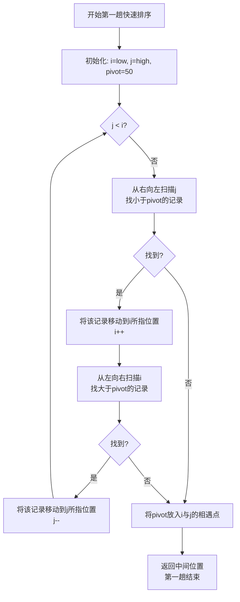
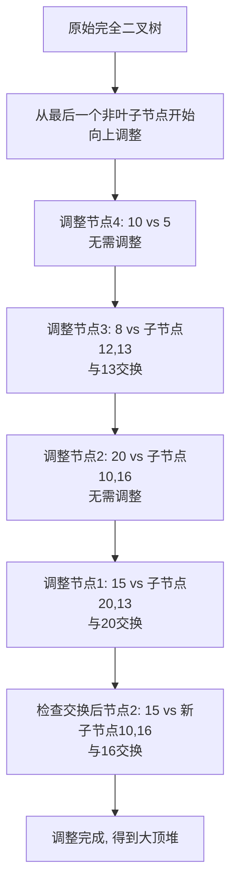

# mujin-blog
个人博客网站源码仓库

好的，我们来根据软考《软件设计师教程（第五版）》中关于排序的相关章节，系统地梳理其**重点**、**难点**与**考点**，并提供相应的考试例题和示意图。

排序是软件设计师考试中的核心基础知识，几乎每年必考。它不仅要求考生记忆，更要求理解和应用。

---

### 排序章节总览

排序算法主要分为两大类：
1.  **内部排序**：数据全部在内存中进行排序。
2.  **外部排序**：数据量太大，无法全部放入内存，需要在磁盘和内存中进行多次数据交换。

考试重点在**内部排序**。

### 一、重点、难点与考点分析

| 排序算法 | 核心思想 (重点) | 时间复杂度 (重点&难点) | 空间复杂度 (重点) | 稳定性 (重点&考点) | 常考要点 (考点) |
| :--- | :--- | :--- | :--- | :--- | :--- |
| **直接插入排序** | 将待排记录逐个插入到已排好序的有序序列中 | 最好: **O(n)** 平均/最坏: **O(n²)** | O(1) | **稳定** | 过程理解、比较次数、移动次数 |
| **希尔排序** | 分组插入排序，增量由大到小 | 依赖于增量序列，**约 O(n¹·³)** | O(1) | **不稳定** | 概念、是不稳定的插入排序 |
| **冒泡排序** | 两两比较，逆序则交换 | 最好: **O(n)** 平均/最坏: **O(n²)** | O(1) | **稳定** | 过程理解、趟数、比较次数 |
| **快速排序** | **分治法**。选取枢轴，将序列分成两部分 | 最好/平均: **O(nlog₂n)** 最坏: **O(n²)** | 平均: **O(log₂n)** 最坏: **O(n)** | **不稳定** | **递归过程、枢轴选择、时间复杂度分析、趟排序后的结果** |
| **简单选择排序** | 每趟从无序区选一个最小/大的放到有序区末尾 | **O(n²)** | O(1) | **不稳定** | 过程理解、比较次数 |
| **堆排序** | 将序列构建成**大顶堆**（升序）或小顶堆，交换堆顶和末尾元素，调整剩余为堆 | **O(nlog₂n)** | O(1) | **不稳定** | **建堆过程、调整过程、输出序列** |
| **归并排序** | **分治法**。将序列递归地分成子序列，然后合并有序子序列 | **O(nlog₂n)** | **O(n)** | **稳定** | **合并过程、空间复杂度** |
| **基数排序** | 按**关键字位**分配收集（个位->十位->百位） | **O(d(n+r))** (d:位数，r:基数) | **O(n+r)** | **稳定** | **过程理解、适用场景（关键字可拆分）** |

**难点总结**：
1.  **时间复杂度分析**：尤其是快速排序最坏情况的条件、堆排序的建堆复杂度。
2.  **递归过程的理解**：快速排序和归并排序的递归分治思想。
3.  **稳定性判断**：需要理解算法过程中是否会改变相同关键字的相对位置。
4.  **过程的中间状态**：给定一个序列，要求写出经过几趟排序后的结果（尤其是快排和堆排序）。

---

### 二、典型考试例题与解析

#### 例题1：快速排序（过程与结果）

**【例题】** 对记录序列 (50, 40, 95, 20, 15, 70, 60, 45, 80) 进行快速排序，以第一个关键字50为枢轴，则第一趟完成后序列为 ______。

**【答案】** (45, 40, 15, 20, **50**, 70, 60, 95, 80)

**【解析】** 这是快排最经典的考法。第一趟的目标是将所有比50小的移到左边，比50大的移到右边。
1.  设置指针 `i=low`, `j=high`, 枢轴 `pivot=50`。
2.  从右向左找比50小的数：`j`找到45（<50），将其移到 `i` 的位置。序列变为 (45, 40, 95, 20, 15, 70, 60, , 80)，`i` 右移一位。
3.  从左向右找比50大的数：`i`找到95（>50），将其移到 `j` 的位置。序列变为 (45, 40, , 20, 15, 70, 60, 95, 80)，`j` 左移一位。
4.  重复步骤2、3：`j`向左找到20（<50），移到 `i` 处 -> (45, 40, 20, , 15, 70, 60, 95, 80)，`i`右移。
    `i`向右找到70（>50），移到 `j` 处 -> (45, 40, 20, 15, , 70, 60, 95, 80)，`j`左移。
5.  当 `i` 和 `j` 相遇时，将枢轴50放入相遇点。得到最终序列 (45, 40, 20, 15, **50**, 70, 60, 95, 80)。

**快速排序单趟划分过程示意图 (Mermaid)**：

---

#### 例题2：堆排序（建堆与输出）

**【例题】** 对于关键字序列 (15, 20, 8, 10, 16, 7, 12, 13, 5)，将其构建成一个**大顶堆**，则初始大顶堆是 ______。

**【答案】** (20, 16, 12, 13, 15, 7, 8, 10, 5)

**【解析】** 堆排序的难点在于**建堆过程**。从最后一个**非终端结点**（`n/2`向下取整）开始，依次向前调整。
1.  序列长度n=9，从第4个结点（10）开始调整。
2.  **调整第4个结点(10)**: 其子节点是5。10>5，无需调整。序列无变化。
3.  **调整第3个结点(8)**: 其子节点是12, 13。与最大的子节点13交换。序列变为 (15, 20, **13**, 10, 16, 7, **8**, 12, 5)。
4.  **调整第2个结点(20)**: 其子节点是10, 16。20比16和10都大，无需调整。序列无变化。
5.  **调整第1个结点(15)**: 其子节点是20, 13。与最大的子节点20交换。交换后，15到了原20的位置，其新子节点为10, 16。再与最大的子节点16交换。最终序列即为答案。

**构建大顶堆调整过程示意图 (Mermaid)**：

---

#### 例题3：稳定性与时间复杂度（概念辨析）

**【例题】** 下列关于排序算法的叙述中，正确的是 ______。
A. 快速排序是一种稳定的排序算法
B. 堆排序的时间复杂度是 O(nlog₂n)，是一种交换排序
C. 归并排序需要额外的辅助空间，空间复杂度为 O(n)
D. 直接插入排序在最好情况下的时间复杂度为 O(n²)

**【答案】** C

**【解析】** 此题综合考查概念。
-   A错误：快排是**不稳定**的。
-   B错误：堆排序的时间复杂度正确，但它是**选择排序**的一种，而非交换排序。
-   C正确：归并排序在合并时需要另一个数组来暂存数据，其空间复杂度为 **O(n)**。
-   D错误：直接插入排序在最好情况（序列已有序）下，每趟只需比较一次不用移动，时间复杂度是 **O(n)**。

### 总结与备考建议

1.  **理解优于记忆**：不要死记硬背过程和结果，要理解每个算法的核心思想和实现步骤。
2.  **动手演练**：对于快排、堆排、归并等复杂算法，一定要亲手模拟几次排序过程，尤其是中间状态。
3.  **对比总结**：将算法按时间复杂度、稳定性等特征制成表格进行对比记忆，效率更高。
4.  **紧盯真题**：排序是高频考点，多做历年真题，熟悉出题角度和难度。

希望这份详细的梳理能帮助你更好地掌握排序这一重要章节！