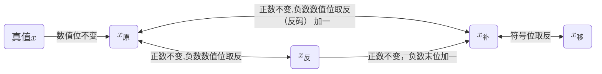

## 一、考纲要求


1. 进制的转换

- 二进制、十进制和十六进制常用的数制及其转换


2. 计算机内数据的表示

- 数的表示（源码、反码、补码，移码的表示,正式和实数的机内表示,精度和溢出）
- 非数值表示（字符和汉字表示、声音表示、图像表示）
- 校验方法和校验码（就校验码、海明校验码、循环冗余校验码）


3. 算数运算和逻辑运算

- 计算机总的二进制运算方法
- 逻辑代数的基本运算


4. 其他数学基础知识
5. 计算机系统组成、体系结构的分类及其特性

- CPU和存储器的组成、性能和基本工作原理
- 常用I/O谁败、同行设备的性能及其基本工作原理
- I/O接口的功能、类型和特性
- I/O控制方式（终端系统、DMA、I/O处理机方式）
- CISC/RISC、流水线操作、多处理机、并行处理


6. 存储系统

- 主存（Cache）存储系统的龚总原理
- 虚拟存储器的基本工作原理、多级存储体系
- RAID的类型和特性


7. 可靠性与系统性能评测的基础知识

- 诊断和容错
- 系统可靠性分析下评价
- 计算机系统性能评测方式

## 二、考点


1. 数值的表现形式及其转换
2. 计算机内数据的表示
3. 计算机系统组成
4. 指令系统
5. 输入输出技术
6. 存储系统
7. 总线系统
8. 磁盘阵列技术
9. 计算机可靠性

## 三、数值及其转换


1. 十进制-符号 `D` ：符号所在的未知反应权重,计数有 0~9,共10种符号,逢十进一,<mark>权重为（10）</mark>
2. 二进制-符号 `B` ：0,1 两种符号，逢二进一,<mark>权重为（2）</mark>
3. 八进制-符号 `O` ：0,,1,2,3,4,5,6,7八种符号，逢八进一,<mark>权重为（8）</mark>
4. 十六进制-符号`H` ：0,,1,2,3,4,5,6,7,8,9,A,B,C,D,E,F十六种符号，逢十六进一,<mark>权重为（16）</mark>  
   ::: danger 备注  
   权重为当前进制，方便后续转换成2进制 `10` 进制为 `10`，其他任意 `R` 进制的权重为 `R`  
   :::

### 3.1 任意进制到十进制的转换 {#3_1Transfer}

设当前有 $R$ 进制的数，数值为 $K_{n}$ 那么将此值转换成十进制 $L$  时对应写法为

::: center 公式

$L= K_{n}×R^{n-1}+·······+K_{1}×R^0$

:::

::: info 示例

- 有8位二进制数，不考虑符号位 $01010100B$ 转换成十进制  
  $0×2^{8-1}+1×2^{8-2}+0×2^{8-3}+1×2^{8-4}+0×2^{8-5}+1×2^{8-6}+0×2^{8-7}+0×2^{8-8} = 84$

- 可写成如下所示  
  $2^6+2^4+2^2 = 84$
  :::

### 3.2 十进制到任意进制的转换

十进制到任意进制的转换可以使用短除法，如下图所示 53 转换为二进制表示  


::: danger 备注  
设将要转换的进制为 $R$ 则只需要将短除法左边的 2 更改为 $R$ 即可，其余不变
:::

### 3.3 二进制到十进制的转换

二进制到十进制的转换遵从 [任意进制到十进制的转换](#3_1Transfer) 规则。

::: warning 常用二进制与十进制的值

| 2的次方数    | 二进制数          | 十进制数  |  
|----------|---------------|-------|
| $2^{-3}$ | 0.001         | 0.125 |
| $2^{-2}$ | 0.01          | 0.25  |
| $2^{-1}$ | 0.1           | 0.5   |
| $2^0$    | 1             | 1     |
| $2^1$    | 10            | 2     |
| $2^2$    | 100           | 4     |
| $2^3$    | 1000          | 8     |
| $2^4$    | 10000         | 16    |
| $2^5$    | 100000        | 32    |
| $2^6$    | 1000000       | 64    |
| $2^7$    | 10000000      | 128   |
| $2^8$    | 100000000     | 256   |
| $2^9$    | 1000000000    | 512   |
| $2^{10}$ | 10000000000   | 1024  |
| $2^{11}$ | 100000000000  | 2048  |
| $2^{12}$ | 1000000000000 | 4096  |

`二的多少次方在二进制中的表示就是在哪位上数值为 1 `

:::

### 3.4 二进制到十六进制的相互转换

二进制 -> 十六进制：四位二进制一组,每组转换成对应的16进制符号,不足四位小数点<mark>左边则左边补0</mark>，小数点<mark>
右边则右边补0</mark>

> [!INFO] 示例
> - 将二进制 `1111000010.01101B` 转换成十六进制  
    > $\frac{0011}{3}$ $\frac{1100}{C}$  $\frac{0010}{2}$ . $\frac{0110}{6}$ $\frac{1000}{8}$ = 3C2.68H

十六进制 -> 二进制：每一个十六进制的符号对应4位的二进制符号

> [!INFO] 示例
> - 将十六进制 `AB26.37H` 转换成二进制  
    > A -> 1010、B -> 1011、2 -> 0010、6 -> 0110 3 -> 0011 7 -> 0111  
    > 写做：1010 1011 0010 0110.0011 0111B

## 四、计算机内数据的表示

### 4.1 真值和机器数

- 真值：符合 `人类习惯` 的数字
- 机器数：各种数据在 `计算机` 中的表示形式称为机器数，特点是<mark>符号位使用 0 1 表示</mark>，即正负号数字化 `0 正 1 负`

> [!INFO] 示例
> +17 -> <font style="color:red">0</font> 10001 &emsp;&emsp;&emsp;&emsp; -17 -> <font style="color:red">1</font> 10001

### 4.1.1 机器数

```markmap
# 机器数
## 无符号数
- 无符号数表示正数,在机器中没有符号位
## 有符号数
- 源码
- 反码
- 补码
- 移码码
```

#### 4.1.1.1 有符号数

- 原码：用数值部分表示真值的绝对值,符号位 `"0/1"` 对应 `"正/负"`
- 反码：对于正数，其反码与其原码相同,对于负数在原码的基础上 `符号位` 不变，其余位 `按位取反`
- 补码：对于正数，其补码与其原码相同。对于负数，在反码的基础上加1注意进位
- 移码：在补码的基础上向右边移动一位
- 反码: 对于正数，其反码与其原码相同,对于负数在原码的基础上 `符号位` 不变，其余位 `按位取反`
- 补码：对于正数，其补码与其原码相同。对于负数，在反码的基础上加1注意进位
- 移码：在补码的基础上符号位取反, <font style="color:red">移码只能用来表示整数</font>

::: warning 正数表示范围


1. `n` 为机器字长, $x$ 当前正数所表示的值

- 原码: $-(2^{n-1}-1) ≤ x ≤ 2^{n-1}-1$ ,<font style="color:red">关于原点对称</font>
- 反码: $-(2^{n-1}-1) ≤ x ≤ 2^{n-1}-1$ ,<font style="color:red">关于原点对称</font>,与原码相同
- 补码: $-2^{n-1} ≤ x ≤ 2^{n-1}-1$ ,<font style="color:red">比原码多表示一个 $-2^{n-1}$</font>
- 移码: $-2^{n-1} ≤ x ≤ 2^{n-1}-1$ ,与补码相同


2. 若机器字长为 `8` 则原码、反码 、补码、移码对应的 `0` 的表现形式如下所示

- 原码: +0 -> 0000000 -0 -> 10000000
- 反码: +0 -> 0000000 -0 -> 11111111
- 补码: +0 -> 0000000 -0 -> 00000000
- 移码: +0 -> 1000000 -0 -> 10000000

<font style="color:red">补码和移码的 0 只有一种表现形式,其余皆有2中表现形式</font>


3. 若机器字长为 `8` , 写出当前数 `21D` 的正负原、反、补、移码

- 原码: +21D -> 0010101 -21D -> 1010101
- 反码: +21D -> 0010101 -21D -> 1101010
- 补码: +21D -> 0010101 -21D -> 1101011
- 移码: +21D -> 1010101 -21D -> 0101011


4. 小结

- 机器字长为 `n` 数值位数则位 `n-1`
- 符号位在最高位, `0` 表示正 `1` 表示负



:::

### 4.2 定点数和浮点数

#### 4.2.1 定点数

小数点位置固定不变的数。


1. 定点整数: 小数点的位置在机器数的最低数值位<font style="color:red">之后</font>; eg: 1.2 而不是 $0.12 × 10$
2. 定点小数(纯小数): 小数点的位置在机器数的最高数值位<font style="color:red">之前</font>; eg: 0.11

#### 4.2.2 浮点数

小数点位置不固定的数（能表示更大的数）;


1. 浮点数的表示格式: N (浮点数)  = M（尾数） × R (基数 可以为 2 ，8 ， 16) ^ E （阶数）,写作

::: center  
$N = M × R^E$
:::

::: danger 说明

| 阶符                          | 阶码  | 数符/尾符           |   | 　尾数 |
|-----------------------------|-----|-----------------|---|-----|
| 在转换时候出现 n的正负 依然遵循 正0 负1 的规律 | $E$ | 原本数据的正负 0 正 1 负 |   | $M$ |

- 阶码：决定浮点数所能表示的 `数值范围`
- 尾数：决定浮点数所能表示的 `数值精度`
- $R$ 位阶码（ `移码` 表示,包括一位阶符）, $M$ 位尾数（补码表示，包括一位数符），所能表示浮点数的数值范围为：

::: center  
最大正数: $+(1-2_{-M+1}) × 2_{2_{R-1}-1}$  
最小负数:  $-1 × 2_{2_{R-1}-1}$  
:::

##### 4.2.2.1 浮点数的运算


1. 阶码相同，尾数直接运算
2. 阶码不同，化成阶码相同（对阶<Badge text="注1" type="warning"/>），在用尾数直接运算。\
   <Badge text="注1" type="danger" />: 小阶——>大阶（小数点向左移动<——，尾数右移——>） —— 小阶到大阶丢失低位精度,
   eg：$1.2 × 10^2$——>$0.012 × 10^4$ 大阶到小阶则相反

##### 4.2.2.2 规格化浮点数

目的: 充分利用尾数来表示更多的有效数字。  
规格化: 将尾数的绝对值限定在区间：[0.5，1]。

#### 4.2.3 小结


1. 定点数

机器字长为 `n` 时各种码制表示带符号数的范围

|码制 |定点整数 |定点小数 |
|---|---|---|
|原码 |$-(2^{n-1}-1) ~ +(2^{n-1}-1)$ |$-(1-2^{-(n-1)}) ~ +(1-2^{-(n-1)})$ |
|反码 |$-(2^{n-1}-1) ~ +(2^{n-1}-1)$ |$-(1-2^{-(n-1)}) ~ +(1-2^{-(n-1)})$ |
|补码 |$-2^{n-1} ~ +(2^{n-1}-1)$ |$-1 ~ +(1-2^{-(n-1)})$ |
|移码 |$-2^{n-1} ~ +(2^{n-1}-1)$ |$-1 ~ +(1-2^{-(n-1)})$ |

> [!danger] 注意
> 当机器字长为n时，  
> 定点数的补码和移码可以表示: $2^n$ 个数  
> 定点数的原码和反码可以表示: $2^n-1$ 个数（因为：0的表示占用了2个编码）  
> 所以，定点数能表示的数值范围比较小，在运算中，容易溢出。

### 4.3 校验码

- 定义: 是计算机系统运行时，为确保数据在传递过程中正确无误所采用的方法，<font style="color:red">
  可用来检测传送的数据是否出错</font>
- 作用: 提高<font style="color:red">硬件电路的可靠性</font>，提高代码的<font style="color:red">
  校验能力（查错和纠错）</font>
- 基本思想
    - 把数据可能出现的编码分为两类（合法编码和错误编码），合法编码用于传送数据，错误编码是不允许在数据中出现的编码
    - <font style="color:red">合理地设计错误编码以及编码规则</font>，使得数据在传送中出现某种错误时就会变成错误编码，这样就可以检测出接收到的数据是否有错
- 码距: 是指一个编码系统中任意两个合法编码之间<font style="color:red">至少有多少个二进制位不同</font>
  ，也就是从一个合法编码变成另一个合法编码<font style="color:red">需要变换的二进制位数</font>

#### 4.3.1 校验码种类

- 奇偶校验码
    - 奇偶校验是一种简单有效的校验方法。这种方法通过在编码中增加<font style="color:red">一位校验位</font>来使编码中 `1`
      的个数为奇数（奇校验）或者为偶数（偶校验），从而使码距变为 `2`
    - 对于 `奇校验` ，只能检测代码中 `奇数` 位出错的编码，但 `不能发现偶数位`
      出错的情况。当合法编码中奇数位发生了错误，即编码中的1变成0或0变成1，则此编码中1的个数的奇偶性就发生了变化，从而可以发现错误
    - <font style="color:red">只能发现错误，而不能校正错误</font>
- 循环冗余校验码(CRC)
    - 广泛用于数据通信领域和磁介质中
    - 利用生成多项式 `K` 位信息码产生 `R` 个校验位来进行编码
    - 编码长度位 `K + R`
- 海明码
    - 在有效信息位中加入几个校验位形成海明码，使码距均匀地拉大(<font style="color:red">扩大码距</font>)
    - 把海明码的<font style="color:red">每个二进制位</font>分配到<font style="color:red">几个奇偶校验组</font>
      中，当某一位出错后，就会引发有关的几个校验位的值发生变化
    - 不但可以发现错误，还能<font style="color:red">指出错误</font>位置，为<font style="color:red">自动纠错</font>提出了依据
    - 数据位 `n` , 校验位 `k` 之间的计算公式为： $2^k - 1 ≥ n + k$
