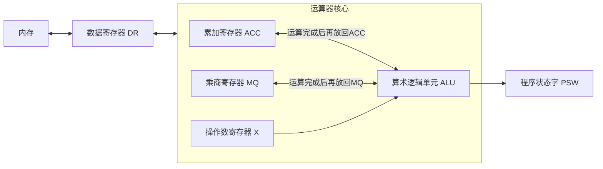

# 一、计算机系统的组成

## 1.1 冯诺依曼机

冯·诺伊曼结构（von Neumann architecture），也称冯·诺伊曼模型（Von Neumann model）或普林斯顿结构（Princeton architecture），是一种将程序指令存储器和数据存储器合并在一起的计算机设计概念结构。
依据冯·诺伊曼结构设计出的计算机称做冯.诺依曼计算机，又称存储程序计算机。

### 1.1.1 冯诺依曼机特点


1. 计算机由<font style="color:red">五大部件</font>组成，分别是：运算器、控制器、存储器、输入设备和输出设备。
2. 指令和数据以<font style="color:red">同等地位</font>存于存储器中，可按照地址寻访
3. 指定和数据使用二进制的形式表示
4. 指令由操作码和地址码组成
5. <font style="color:red">以运算器为中心</font>

结构图如下所示：

::: center


:::

### 1.1.2 存储器（主存储器）

- 主存储器主要由三大部分组成
  
  1. 存储体(Storage Body / Memory Bank)：数据的"仓库"
  2. 地址寄存器 (<font style="color:red">MAR</font>) 和地址译码驱动电路：寻址的"导航系统"
  3. 数据寄存器 (<font style="color:red">MDR</font>) 和读写电路：数据的“出入口和搬运工”

#### 1.1.2.1 存储体

存储体中重要概念：存储元(Storage Element)、存储单元(Storage Unit)、存储字(Storage Word)、存储字长(Storage Word Length)  

- 存储元 (Storage Element)：是构成存储体的<font style="color:red">最基本、最底层的物理单元</font>。例如，在DRAM芯片中，一个电容和一个晶体管共同构成一个存储元，<font style="color:red">用于存储1个bit</font>
- 存储单元 (Storage Unit)：是存储体中<font style="color:red">可被地址系统直接管理和访问的最小单位</font>。它由<font style="color:red">多个存储元组成</font>。
现代计算机中，<font style="color:red">8个存储元组成一个存储单元</font>（即1字节）。
- 存储字 (Storage Word)：是<font style="color:red">某个时刻</font>存储在一个存储单元里的<font style="color:red">数据内容</font>。它是存储单元所存储的<font style="color:red">值</font>。
- 存储字长 (Storage Word Length)：是存储体的一个<mark>设计特征</mark>，指每个<font style="color:red">存储单元能容纳的二进制位的长度</font>。

#### 1.1.2.2 数据寄存器(MDR)和地址寄存器(MAR)

它们是CPU与主存储器之间进行数据交互的<font style="color:red">**关键接口和缓冲枢纽**</font>。

| 寄存器 | 全称 | 功能                                                            | 方向 | 连接的CPU总线 |
| :--- | :--- |:--------------------------------------------------------------| :--- | :--- |
| **MAR** | Memory Address Register<br>（地址寄存器） | **存放**CPU要访问的<font style="color:red">**存储单元(主/内存)地址**</font>。 | **CPU → 主存** | **地址总线 (Address Bus)** |
| **MDR** | Memory Data Register<br>（数据寄存器） | **临时存放**要从主存**读出**或**写入**的**数据**。                             | **CPU ↔ 主存** | **数据总线 (Data Bus)** |


1. **地址寄存器 (MAR - Memory Address Register)**

   - **功能**：用于<font style="color:red">**暂时存放**</font>CPU通过**地址总线**发送过来的、想要访问的<font style="color:red">**内存地址**</font>。
   - **核心作用**：
     1.  **地址暂存与稳定**：CPU发送地址信号的时间很短，而内存的寻址操作（译码、驱动）需要一定的时间。MAR的作用就是**锁存并保持**这个地址信号，为内存内部的地址译码器提供稳定的输入，确保整个读/写操作期间地址不会改变。
     2.  **决定寻址范围**：MAR的**位数（宽度）** 直接决定了主存储器最大的可寻址空间。
         *   公式：<code>可寻址空间 = 2<sup>MAR位数</sup></code>
         *   例如：如果MAR是32位的，那么它可以存储2³²个不同的地址，对应最大4GB（2³² Bytes）的寻址空间。如果MAR是64位的，寻址空间则大得惊人（2⁶⁴ Bytes）。

   - **工作流程（以读数据为例）**
     1.  CPU想要读取地址为 `0x1234` 的数据。
     2.  CPU将地址 `0x1234` 通过 **地址总线** 送入 **MAR**。
     3.  MAR **锁存** 并 **输出** 这个地址给内存内部的 **地址译码器**。
     4.  地址译码器开始工作，根据该地址找到对应的物理存储单元。

---

2. **数据寄存器 (MDR - Memory Data Register)**

   - **功能与作用**
     *   **功能**：用于**暂时存放**CPU与主存储器之间待传输的**数据**。
     *   **核心作用**：
         1.  **数据缓冲与同步**：作为CPU数据总线和存储器内部数据线之间的**缓冲器**。CPU和内存的工作速度可能不同步，MDR在其中起到**速度匹配**和**数据暂存**的作用，防止数据丢失。
         2.  **双向数据传输**：
             *   **读操作时**：MDR存放从**存储体**中读出的数据，准备让CPU通过**数据总线**取走。
             *   **写操作时**：MDR存放CPU通过**数据总线**送来的、准备要**写入存储体**的数据。

   - **工作流程**
     *   **读操作**：
         1.  当地址译码器选中目标单元后，该单元的数据被读出。
         2.  读出的数据经过放大和整形，被送入**MDR**中暂存。
         3.  MDR将数据放到**数据总线**上，CPU再从总线上读取该数据。
     *   **写操作**：
         1.  CPU将要写入的数据通过**数据总线**送入**MDR**。
         2.  同时，CPU将目标地址通过地址总线送入MAR（找到要写入的位置）。
         3.  内存控制逻辑将MDR中的数据写入到由MAR地址选中的存储单元中。

>[!DANGER] 重要说明与现代计算机架构  
>  **位置归属**：在传统的<font style="color:red">冯·诺依曼架构</font>描述中，MAR和MDR被视为<font style="color:red">**主存储器**</font>的组成部分（即位于内存板上）。然而，在<font style="color:red">现代计算机架构中，为了追求极高的速度，**MAR和MDR通常被集成在CPU内部**</font>，成为CPU内存管理单元（MMU）或总线接口单元（BIU）的一部分。但它们的<font style="color:red">**功能完全没有改变**</font>，依然是CPU和主存之间的地址和数据接口。  
> <br/>
>  **与字长的关系**：
>  1. <font style="color:red">**MAR的位数**</font>决定了系统的**寻址能力**（是32位还是64位系统）。
>  2. **MDR**的位数通常与计算机的**字长**（Word Size）相关，但不一定相等。例如，一个64位CPU的MDR宽度可能是64位，这意味着它一次可以访问8个字节的数据（假设存储单元为8位）。但CPU仍然可以按字节、字、双字等方式来访问，底层硬件会进行转换。

### 1.1.3 运算器（Arithmetic Logic Unit, ALU）

用于执行<font style="color:red">**算术运算**</font>（加、减、乘、除等）和<font style="color:red">**逻辑运算**</font>（与、或、非等），是<font style="color:red">数据</font>处理的<font style="color:red">核心单元</font>。

#### 1.1.3.1 核心部件

- 核心部件总览

| 缩写      | 英文全称                               | 中文名称       | 核心功能                                                                                  |
|:--------|:-----------------------------------|:-----------|:--------------------------------------------------------------------------------------|
| **ACC** | Accumulator                        | **累加寄存器**  | 存放 <font style="color:red">**操作数**</font>或 <font style="color:red">**运算结果**</font>    |
| **MQ**  | Multiplier-Quotient Register       | **乘商寄存器**  | 在乘除运算中存放 <font style="color:red">**乘数**</font> 或 <font style="color:red">**商**</font> |
| **X**   | (General-purpose) Operand Register | **操作数寄存器** | 存放一个 <font style="color:red">**操作数**  </font>                                         |
| **ALU** | Arithmetic Logic Unit              | **算术逻辑单元** | 执行实际的 <font style="color:red">**算术和逻辑运算**</font>                                      |
| **DR**  | Data Register                      | **数据寄存器**  | 作为内存和运算器之间的 <font style="color:red">**数据缓冲**</font>                                   |
| **PSW** | Program Status Word                | **程序状态字**  | 存放运算结果的 <font style="color:red">**状态标志位** </font>                                     |

- 运算过程中的协作关系，尤其是ACC、MQ、X在乘法运算中的典型数据流：



---

- **各部件详细说明**

  1. <font class="blob-600" style="color:red">累加寄存器 - ACC</font>(Accumulator) 
     -   **功能**：这是运算器中<font style="color:red">**最关键**</font>的寄存器之一。它主要用于存放**被操作数**和**运算结果**。
     -   **工作方式**：
             *   在许多指令中，一个操作数默认来自ACC。
             *   ALU的运算结果也通常会<font style="color:red">**写回ACC**，覆盖旧值</font>， hence the name "累加" (Accumulate)。
     -   **示例**：执行 `ADD B` 指令，意味着 `(ACC) + (B) -> ACC`，将ACC中的值与B单元的值相加，结果存回ACC。

  2. <font class="blob-600" style="color:red">乘商寄存器 - MQ</font>(Multiplier-Quotient Register) - 
     -   **功能**：这是一个<font style="color:red">**专用寄存器**</font>，主要用于<font style="color:red">**乘法和除法**</font>操作。
     -   **工作方式**：  
         &emsp;**乘法时**：存放<font style="color:red">**乘数**</font>。运算结束后，存放结果的<font style="color:red">**低位**</font>部分（乘积可能很长，是操作数位数的两倍）。  
         &emsp;**除法时**：存放<font style="color:red">**商**</font>。除法运算后，<font style="color:red">ACC则存放**余数**</font>。
     -   **示例**：早期乘法指令 `MUL X`，可能意味着 `(ACC) × (MQ) -> ACC-MQ`，将ACC和MQ中的数相乘，<font style="color:red">结果的高位在ACC，低位在MQ</font>。

  3. <font class="blob-600" style="color:red">操作数寄存器 - X</font>(Operand Register)
     -   **功能**：这是一个<font style="color:red">通用的**操作数寄存器**</font>。
     -   **工作方式**：用于<font style="color:red">临时存放</font>另一个操作数。当需要从<font style="color:red">内存中</font>读取数据参与运算时，数据通常<font style="color:red">先送到X</font>寄存器，然后再由ALU与ACC中的数据进行运算。
     -   **示例**：执行 `SUB [1000H]` 指令，操作是：  
         &emsp;&emsp;1.  将内存地址1000H处的数据取到 **X** 寄存器。  
         &emsp;&emsp;2.  ALU执行 `(ACC) - (X)` 操作。  
         &emsp;&emsp;3.  结果送<font style="color:red">**ACC**</font>。

   4. <font class="blob-600" style="color:red">算术逻辑单元 - ALU</font>(Arithmetic Logic Unit)
      -   **功能**：这是运算器的<font style="color:red">**核心计算部件**</font>，是一个由组合逻辑电路（如加法器、移位器、逻辑门等）构成的部件，<font style="color:red">**本身不存储数据**</font>。
      -   **工作方式**：它从ACC、X、MQ等<font style="color:red">寄存器**获取操作数**</font>，根据控制单元（CU）发出的命令执行<font style="color:red">特定的算术运算</font>（加、减、乘、除）或逻辑运算（与、或、非、异或），然后将<font style="color:red">**结果输出**</font>到目标寄存器（如ACC、MQ），并<font style="color:red">设置PSW中的相应标志位</font>。

   5. <font class="blob-600" style="color:red">数据寄存器 - DR</font>(Data Register)
      -  **功能**：也称为MDR（Memory Data Register），它是<font style="color:red">**内存和运算器之间的缓冲器**</font>。
      -   **工作方式**：
          -   **读内存**：从内存读出的数据，首先被送入DR，然后再被移动到运算器所需的寄存器（如X、ACC）中。
          -   **写内存**：要写入内存的数据，也是先从运算器寄存器（如ACC）移动到DR，然后再从DR写入到指定内存地址。
      -   **目的**：协调CPU的高速和内存的相对低速，完成速度匹配。

   6. <font class="blob-600" style="color:red">程序状态字 - PSW</font>(Program Status Word)
      -   **功能**：这是一个按位定义的寄存器，每一位（或几位）代表一种<font style="color:red">**系统状态标志**</font>，主要由ALU运算结果设置。
      -   **核心标志位**：
          *   **CF (Carry Flag)**：**进位标志**。无符号数运算产生进位或借位时置1。
          *   **OF (Overflow Flag)**：**溢出标志**。有符号数运算结果超出表示范围时置1。
          *   **ZF (Zero Flag)**：**零标志**。运算结果为0时置1。
          *   **SF (Sign Flag)**：**符号标志**。运算结果为负时置1（即最高位为1）。
          *   **PF (Parity Flag)**：**奇偶标志**。结果中1的个数为偶数时置1。

---

- **协同工作示例：乘法运算** 计算 `5 * 3`。

  1.  **初始化**：
      *   将被乘数 `5` 放入 **ACC**。
      *   将乘数 `3` 放入 **MQ**。
      *   控制器发出乘法操作命令。

  2.  **执行运算**：
      *   **ALU** 从ACC和MQ中取出操作数，执行乘法操作。
      *   乘积 `15` 是一个比原操作数更长的数。
      *   结果的高位部分（本例中为`0`）放回 **ACC**。
      *   结果的低位部分（`15`）放入 **MQ**。
      *   **PSW** 中的标志位根据结果 `15` 被更新（例如ZF=0，SF=0，因为15非零且为正）。

  3.  **结果**：
      -   **ACC-MQ** 寄存器对共同构成了乘积结果。

### 1.1.4 冯诺依曼机小结

```markmap

# 五大部件

## 运算器(Arithmetic Logic Unit) → ALU
 ### 功能
 - 执行算术运算（加、减、乘、除等）和逻辑运算（与、或、非等），是数据处理的核心单元。
 
 ### 作用
 - 算术运算：如加、减、乘、除等基本数学运算。
 - 逻辑运算：如与、或、非、异或等比较和判断操作。
 - 核心地位：它是计算机真正进行“计算”的地方。所有程序中的计算和逻辑判断任务，最终都会分解为一个个简单的算术或逻辑操作，由运算器来完成。

## 控制器(Control Unit) → CU
 ### 功能
  - 它是整个计算机的指挥中心和神经中枢，负责协调和控制其他所有部件的工作。
 ### 作用
  - 取指令:从存储器中读取程序的下一条指令。
  - 译码：分析指令，弄清楚这条指令要求完成什么操作。
  - 执行：根据指令的含义，向相关的部件（如运算器、存储器、输入/输出设备）发出控制信号，命令它们执行相应的操作。
  - 周而复始：控制器通过重复“取指-译码-执行”这个过程，让计算机能够自动、连续地运行程序。

## 存储器(Memory)
 ### 功能
  - 用于存储程序和数据。
 ### 作用
  - 内存 (主存储器，如RAM)：直接与CPU交换数据，速度快但容量较小，断电后数据丢失。我们运行的程序和正在处理的数据都必须先加载到内存中，CPU才能进行处理。
  - 外存 (辅助存储器，如硬盘、SSD、U盘)：用于长期、大量地存储数据，速度较慢但容量大，断电后数据不丢失。操作系统、应用程序、文档、照片等都存储在这里。

## 输入设备(Input Devices)
 ### 功能
  - 用于向计算机输入（接收）外部信息和数据。
 ### 作用
  - 将信息转换成机器能够识别的形式（二进制），并送入存储器中

## 输出设备(Output Devices)
 ### 功能
  - 用于将计算机处理后的结果输出，呈现给用户。
 ### 作用
 - 将计算机内部的二进制数据转换成人或其他设备可以识别和接收的形式（图像、文字、音频、视频等）
```

> [!DANGER] 注意
>
> - 在现代计算机中通常将 `运算器` 和 `控制器` 集成在一块芯片上，称之为中央处理器，即 `CPU`
> - 这五大部件通过系统总线（Bus） 相互连接，进行数据和指令的传输，共同构成了一个能够自动、高速处理信息的完整系统。


