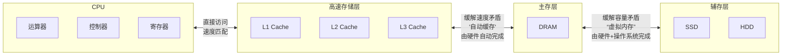
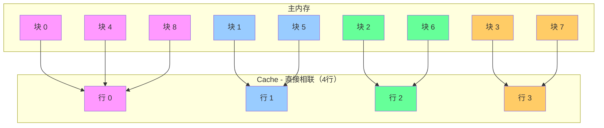
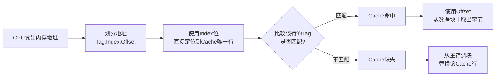
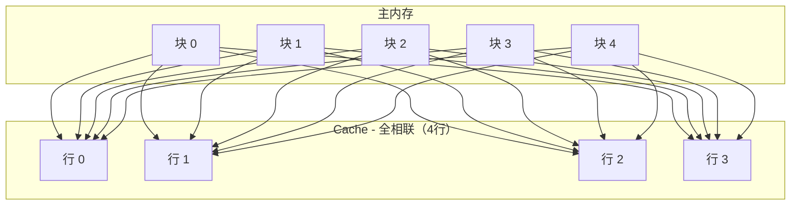
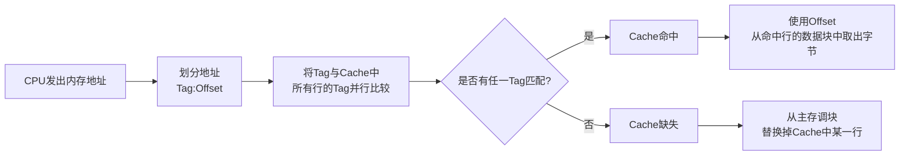
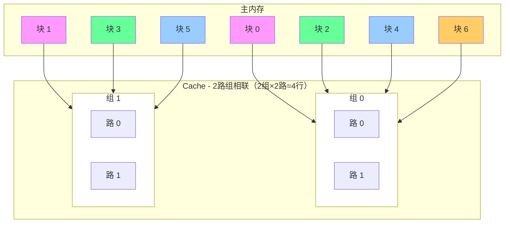
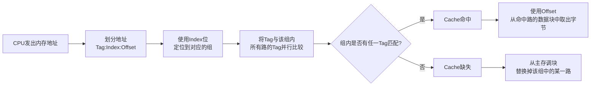

# 一、 存储系统

- 存储系统是计算机系统的核心组成部分，其设计直接决定了计算机的性能、成本和可靠性。

## 1.1 存储系统层次结构

- 层次结构金字塔

- 主存 → 辅存：实现了虚拟存储系统，解决了主存容量不够的问题
- Cache → 主存：解决了主存与CPU速度不匹配的问题 
- 调用关系图

- **特点**
  1. **自上而下（从CPU向外）**：
      - 速度越来越慢
      - 容量越来越大
      - 每位成本越来越低
      - 访问频率越来越低

  2. **层次结构**：
      - **高速存储**：寄存器、缓存（L1/L2/L3）- Cache
          - 离CPU最近，速度最快
          - 使用SRAM技术
      - **主存**：主存储器（RAM）
          - 使用DRAM技术
          - 易失性存储器
      - **辅存**：SSD、HDD、磁带等
          - 非易失性存储器
          - 用于长期存储

  3. **工作方式**：
      - 数据按照"局部性原理"在层次间移动
      - CPU首先在最高层（寄存器）寻找数据
      - 如果找不到（未命中），则依次向下一层查找
      - 数据从下层调入上层时，通常会预取周围的数据

## 1.2 存储系统分类

1. 按位置分：可分为内存和外存
   - 内存（主存）：位于主机板内，CPU可直接或通过总线直接访问，用来存储当前运行所需要的程序和数据，速度快、容量小，例：**内存条(Cache, DRAM), CPU内置缓存**。
   - 外存（辅存）：位于主机板外，通过接口连接，CPU通过I/O指令访问，用来存储当前不参与运行的数据，容量大但速度慢，例：**硬盘, U盘, 光盘, 移动硬盘**。

2. 按材料分：可分为半导体存储器、磁表面存储器、光存储器、其他新型存储器。
   -  半导体存储器：基于集成电路，速度快，体积小，根据
      所用元件又可分为双极型和MOS型，根据
      是否需要刷新又可分为动态型和静态型，例：**DRAM, SRAM, Flash, ROM**。
   - 磁存储器：利用磁化原理，使用磁介质做成，如磁芯、磁盘、磁泡、磁带等，非易失，容量大，速度慢，例：**硬盘(HDD/SSD), 磁带**。
   - 光存储器：利用激光读写，便携，成本低，速度慢，使用电学和机械部件构成，例：**DVD、CD、Blu-ray Disc**。

3. 按工作方式：可分为随机存取(读/写)-RAM和只读存储器，例：**DRAM(主存), SRAM(Cache)**
   - 随机存取(读/写)-RAM存储器：能读取也能写入数据的存储器，
     - 特点：可读可写，随机访问，易失性。
   - 只读存储器(ROM)：正常工作过程中只能读取的存储器。
     - 特点：正常只读，非易失性。
     - 细分(按写入/擦除方式)：
       - MASK ROM（掩模ROM）：内容在芯片生产时确定，完全不可更改,一般用于存放程序的BIOS和用于微程序控制。
       - PROM（可编程ROM）：允许用户用专用一次性写入，之后不可更改。
       - EPROM（可擦除PROM）：内容既可以读出也能写入，写入后还能进行修改，可用紫外线照射整片擦除。
       - EEPROM（电可擦除PROM）：与PROM相似，可用电信号进行擦除和编程，支持字节级擦写。
       - Flash Memory（闪存）：EEPROM的重要变种，以块为单位进行擦除和编程，容量大、成本低、擦除速度远快于EPROM。是U盘、SSD、SD卡的存储核心。

## 1.3 高速缓存(Cache)

- 高速缓存（Cache）是位于 CPU 和 主内存（DRAM） 之间的一个小型、高速的存储器。它的作用是存放CPU最近最可能访问的主内存数据的副本。
- 核心目的：解决 CPU 与主内存之间巨大的速度差异（称为“存储墙”）。CPU的速度比主存快几个数量级，如果没有Cache，CPU将花费大量时间等待数据从慢速的主存传来，造成性能浪费。
- Cache 的存在对程序员是透明的，其地址变换和数据块的替换算法均由硬件实现。
- Cache 通常被集成在 CPU 内以提高访问速度，主要特点是容量小、速度快、成本高。

### 1.3.1 Cache 的组成

一个典型的 Cache 主要由存储体（Cache Storage Array）、控制逻辑（Control Logic）、标签存储器（Tag RAM）组成

1. 存储体:
   - 这是 Cache 的主体，由高速的 SRAM（静态随机存储器） 构成，用于实际存储从主存复制过来的部分数据信息。
   - 它被划分为许多个缓存行（Cache Line） 或缓存块（Cache Block）。缓存行是 Cache 与主存之间数据传输的最小单位（通常为 32 或 64 字节），而不是单个字节或字。

2. 控制逻辑（Control Logic）：
   - 判断 CPU 要访问的信息是否在 Cache 存储器中，若在即为命中，不在则没有命中，这是 Cache 的“大脑”，负责管理所有操作。
   - 功能包括：
     - 地址比较：将 CPU 送来的地址与 Tag RAM 中的标签进行比较，判断命中与否。
     - 命中/缺失判断：根据比较结果产生命中或缺失信号。
     - 替换策略：当发生 Cache 缺失且 Cache 已满时，决定替换掉哪一行旧数据（如 LRU、FIFO、随机等算法）。
     - 写策略：控制写入操作（写直达或写回）。
     - 一致性维护：在多核处理器中，确保多个 Cache 之间的数据一致性（如 MESI 协议）。

3. 标签存储器（Tag RAM）：
   - 这是一个特殊的存储区，用于存放每个缓存行对应的主内存地址的高位部分，称为 标签（Tag）。
   - 作用：当 CPU 送来一个内存地址时，Cache 控制器会将该地址的高位与 Tag RAM 中存储的标签进行比较，以判断所请求的数据是否在 Cache 中（即是否命中）。

### 1.3.2 Cache 的三种地址映像

由于计算机都是按主存地址访问的，而应从 Cache 中读取信息，因此就需要地址映像，即
把主存中的地址映射成 Cache 存储器中的地址,地址映像有三种直接相连映像、全相连映像、组相连映像。

#### 1.3.2.1 直接相连映像

- **图示**

- **工作流程与查找过程**：

- **特点**：
  - 主存中的每一个块只能被放入 Cache 中唯一的一个特定行，位置是固定的。
  - 映射规则：`Cache 行号 = 主存块号 % Cache 总行数`。
  - 优点：硬件简单，查找速度快，地址变换简单（只需比较1个Tag）。
  - 缺点：灵活性差，冲突率高，即使Cache其他行空着，映射到同一行的块也会互相淘汰（例如上图中的块0、4、8竞争行0），造成“抖动”。

#### 1.3.2.2 全相连映像

- **图示**

- **工作流程与查找过程**：

- **特点**：
  - 主内存中的任何一块可以被放入 Cache 中的任意一个空行。
  - 地址变换时，将主存地址高位表示的主存块号与 Cache 中的块号进行比较，若相同则为命中。
  - 优点：冲突率最低，空间利用率最高， Cache 的位置不受限制，非常灵活。
  - 缺点：无法直接从主存的块号中直接获取 Cache 的块号，变换比较复杂，速度较慢，硬件极其复杂、成本高,功耗大，**仅用于小容量Cache（如TLB）**

#### 1.3.2.3 组相连映像

- **图示**

- **工作流程与查找过程**：

- **特点**：
  - 直接相联和全相联的折中方案，也是现代CPU最常用的方式。
  - 具体方法是将 Cache **先分成组在分块**,组间采用直接映像，组内采用全相连映像方式。
  - 优点：有效减少了冲突率，硬件复杂度又可接受，在成本和性能间取得最佳平衡。

#### 1.3.2.4 小结

| 特性        | **直接相联**                          | **全相联**                           | **组相联**                                  |
|:----------|:----------------------------------|:----------------------------------|:-----------------------------------------|
| **映射规则**  | 1块 → 1行                           | 1块 → 任意行                          | 1块 → 1组 → 组内任意行                          |
| **灵活度**   | 最低       | 最高       | 居中                                       |
| **冲突率**   | 最高       | 最低       | 较低                                       |
| **硬件复杂度** | 最低（比1次）  | 最高（比所有行） | 适中（比组内行）                                 |
| **查找速度**  | 最快       | 最慢       | 快                                        |
| **应用**    | 对速度要求极端处 | 小容量TLB等                           | 通用CPU Cache（主流） |

### 1.3.3 Cache 的性能分析

设 $H$ 为 Cache 的命中率， $t_c$ 为 Cache 的存取时间， $t_m$ 为主存的访问时间，则 Cache 的等效访问时间(平均访问时间 (AMAT)) $t_a$ 为

:::center  
$t_a = Ht_c+(1-H)t_m$  
::: 

使用 Cache 比不使用 Cache 的 CPU 访问时间的速度提升倍数(加速比) $R$  为

:::center  
$R = \frac{t_m}{t_a}$  
::: 

## 1.4 主存的扩展

### 1.4.1 核心概念

- **主存扩展**：当单个存储芯片的容量或数据位宽不能满足系统要求时，如何用多个芯片组合成一个符合要求的内存模块。
- **内存编址**：CPU如何通过**地址总线**发出的地址信号来唯一地访问内存中的每个存储单元。

这两者紧密相关：扩展方式决定了物理布局，而编址方式决定了CPU如何访问这个布局。

---

### 1.4.2 存储芯片的基本参数

在讨论扩展前，必须先了解存储芯片的表示方法：
- 芯片容量 = 单元数 × 数据位宽
- 常用表示法：**`M × N`**
  - `M`：芯片的存储单元个数（即地址线的寻址范围）。
  - `N`：每个存储单元的位数-（即数据线的位数）。

**举例**：
- **`8K × 8bit`** 芯片：有 8192 个单元，每个单元存储 8 位（1字节）数据。地址线需要 `log₂(8192) = 13` 根，数据线有 8 根。
- **`1K × 4bit`** 芯片：有 1024 个单元，每个单元存储 4 位数据。地址线需要 `log₂(1024) = 10` 根，数据线有 4 根。

---

### 1.4.3 主存扩展的三种方式

设有一片 `1k × 4位` 的存储芯片，如下图所示  

#### 1.4.3.1 位扩展（增加数据位宽）

- **目的**：增加存储字长（数据位宽），使其与 CPU 的数据总线宽度一致。
- **方法**：将多个芯片的地址线、片选线、读写控制线全部并联起来，而它们的数据线分别连接到数据总线的不同位上。
- **特点**：扩展后，单元数不变，数据位宽增加。所有芯片同时工作，共同组成一个完整的字。

**【示例】**

#### 1.4.3.2 字扩展（增加容量）

*   **目的**：增加存储单元的个数（容量）。
*   **方法**：将多个芯片的地址线、数据线、读写控制线全部并联起来。由片选信号（CS） 或地址译码器的输出信号来区分各个芯片的地址范围。
*   **特点**：扩展后，数据位宽不变，单元数增加。任何时候只有一个芯片被选中工作。

**【示例】**

#### 1.4.3.3 字位同时扩展（既增容量又增位宽）

*   **目的**：同时增加存储单元的个数和数据的位宽。这是最实际、最常见的情况。
*   **方法**：先进行位扩展，组成多个满足数据位宽要求的"芯片组"；再对这些"芯片组"进行字扩展。
*   **特点**：扩展后，单元数和数据位宽都增加。

### 1.4.4 小结

| 扩展方式       | 目的     | 连接特点            | 结果         |
|:-----------|:-------|:----------------|:-----------|
| **位扩展**    | 增加数据位宽 | 地址线、片选线并联；数据线分开 | 单元数不变，字长增加 |
| **字扩展**    | 增加容量   | 地址线、数据线并联；片选线分开 | 字长不变，单元数增加 |
| **字位同时扩展** | 两者都增加  | 先位扩，再字扩         | 单元数和字长都增加  |

### 1.4.5 内存地址的计算

#### 1.4.5.1 例题引入

已知内存地址从 `AC000H` 到 `C7FFFH` ，如果该内存按字（16bit）编址，
由28片存储器芯片构成，已知构成次内存的芯片每片有16K个存储单元。  
问：1、当前内存一共有多少K的地址单元？  
&emsp;&emsp;2、该芯片每个存储单元存储多少位？  

第一问：
1. 计算总地址单元数：**总单元数 = 结束地址 - 起始地址 + 1**，`C7FFFH - AC000H = 1C000H`
2. 转换成二进制：`0001 1100 0000 0000 0000` 二进制的单位为 `Byte`
3. 直接从二进制转换成 `K` 的单位， `1K = 1024B` 所以需要去除二进制后10位变成 `0001 1100 00`
4. 将二进制转换成 `十` 进制： $1110000 = 2^6+2^5+2^4 = 112$

**答案：当前内存一共 `112K` 个地址单元**  

第二问：  
1. 已知变量
  - **逻辑侧（CPU视角）**
    - 按字编址，**字长 $W$ = 16 bit**
    - 逻辑地址单元数 **$L$ = 112K Word**
    - $逻辑总容量 = L × W = 112K × 16 bit$
  - **物理侧（芯片视角）**：
    - 芯片数量 **$C_n$ = 28**片
    - 每片芯片的存储单元数 **$C_s$ = 16K**
    - 设：每个芯片存储单元存储的位数为 $N bit$
    - $物理总容量 = C_n × C_s × N = 28 × 16K × N bit$
    
2. 建立等式：逻辑总容量必须等于物理总容量  
   - 则有：逻辑地址单元数 × 字长 = 芯片数量 × 每片芯片单元数 × 每个单元位数
   - 带入设计变量： $L × W = C_n × C_s × N$
   - 带入已知量： `112K × 16bit = 28 × 16K × Nbit`
   - 约去单位 `K` 、 `bit` 和已知量 `16` 得 `112 = 28 × N`
   - 解得 $n = \frac{112}{28} = 4$

**答案：该芯片每个存储单元存储 `4` 位**

#### 1.4.5.2 验证与分析

- **物理总容量**：28片 × 16K单元/片 × 4bit/单元 = **28 × 16K × 4 bit**。
- **逻辑总容量**：112K字 × 16bit/字 = **112K × 16 bit**。
- **两者相等**：`28 × 16K × 4 = 112K × 16` → `28×4=112` 且 `16K=16K`，等式成立。

**技术含义**：
这意味着内存系统由 **28 片 16K×4bit 的芯片**构成。为了形成 **16bit** 的字长，需要进行**位扩展**。
- **位扩展分组**：字长16bit / 每片4bit = **4片/组**。
- **组数**：总芯片28片 / 每组4片 = **7组**。
- **字扩展**：每组芯片提供16K个存储单元（地址），共7组，正好构成 **7 × 16K = 112K** 的地址空间。

#### 1.4.5.3 最终答案与等式总结

1.  **地址单元数**：**112 K**
2.  **芯片每个存储单元位数**：**4 位**

**涉及到的等式**：
1.  `总地址单元数 = 结束地址 - 起始地址 + 1` -> `C7FFFH - AC000H + 1 = 1C000H = 114688 = 112K`
2.  核心等式：逻辑地址数 × 字长 = 总芯片数 × 每片单元数 × 每单元位数
3.  数值等式：112K × 16 = 28 × 16K × n
4.  解：n = (112K × 16) / (28 × 16K) = 112 / 28 = 4

