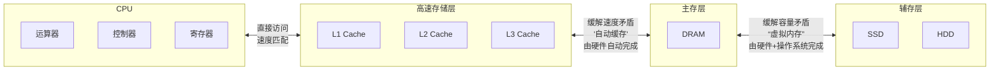

# 一、 存储系统

- 存储系统是计算机系统的核心组成部分，其设计直接决定了计算机的性能、成本和可靠性。

## 1.1 存储系统层次结构

- 层次结构金字塔

- 主存 → 辅存：实现了虚拟存储系统，解决了主存容量不够的问题
- Cache → 主存：解决了主存与CPU速度不匹配的问题 
- 调用关系图

- **特点**
  1. **自上而下（从CPU向外）**：
      - 速度越来越慢
      - 容量越来越大
      - 每位成本越来越低
      - 访问频率越来越低

  2. **层次结构**：
      - **高速存储**：寄存器、缓存（L1/L2/L3）- Cache
          - 离CPU最近，速度最快
          - 使用SRAM技术
      - **主存**：主存储器（RAM）
          - 使用DRAM技术
          - 易失性存储器
      - **辅存**：SSD、HDD、磁带等
          - 非易失性存储器
          - 用于长期存储

  3. **工作方式**：
      - 数据按照"局部性原理"在层次间移动
      - CPU首先在最高层（寄存器）寻找数据
      - 如果找不到（未命中），则依次向下一层查找
      - 数据从下层调入上层时，通常会预取周围的数据

## 1.2 存储系统分类

1. 按位置分：可分为内存和外存
   - 内存（主存）：用来存储当前运行所需要的程序和数据，速度快、容量小。
   - 外存（辅存）：用来存储当前不参与运行的数据，容量大但速度慢。