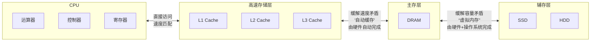
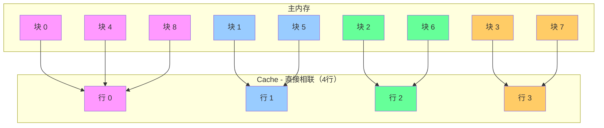
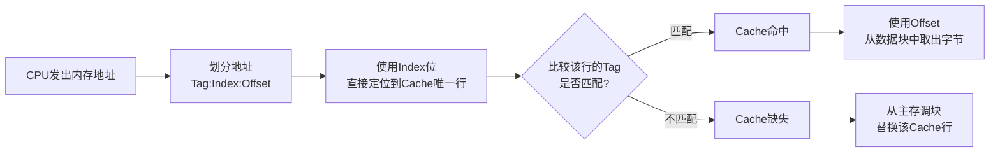
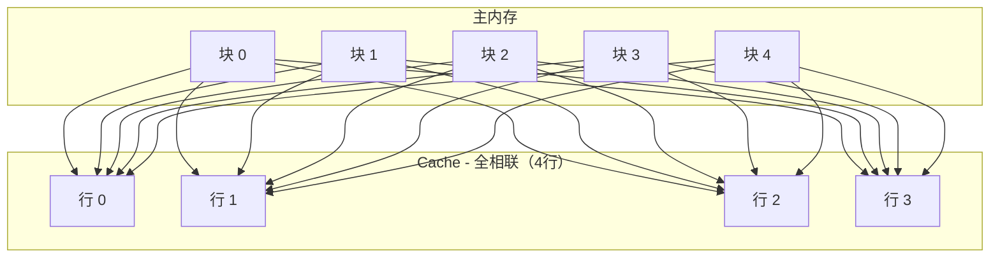
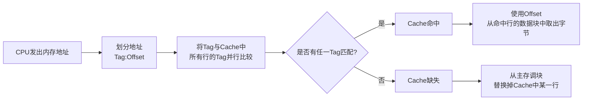
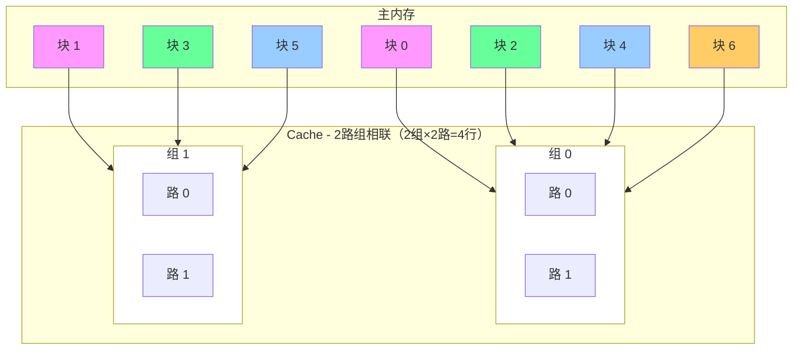
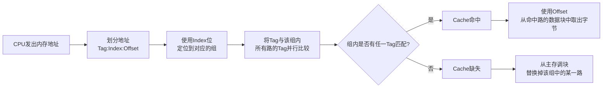

## 一、 存储系统

- 存储系统是计算机系统的核心组成部分，其设计直接决定了计算机的性能、成本和可靠性。

### 1.1 存储系统层次结构

- 层次结构金字塔

- 主存 → 辅存：实现了虚拟存储系统，解决了主存容量不够的问题
- Cache → 主存：解决了主存与CPU速度不匹配的问题 
- 调用关系图

- **特点**
  1. **自上而下（从CPU向外）**：
      - 速度越来越慢
      - 容量越来越大
      - 每位成本越来越低
      - 访问频率越来越低

  2. **层次结构**：
      - **高速存储**：寄存器、缓存（L1/L2/L3）- Cache
          - 离CPU最近，速度最快
          - 使用SRAM技术
      - **主存**：主存储器（RAM）
          - 使用DRAM技术
          - 易失性存储器
      - **辅存**：SSD、HDD、磁带等
          - 非易失性存储器
          - 用于长期存储

  3. **工作方式**：
      - 数据按照"局部性原理"在层次间移动
      - CPU首先在最高层（寄存器）寻找数据
      - 如果找不到（未命中），则依次向下一层查找
      - 数据从下层调入上层时，通常会预取周围的数据

### 1.2 存储系统分类

1. 按位置分：可分为内存和外存
   - 内存（主存）：位于主机板内，CPU可直接或通过总线直接访问，用来存储当前运行所需要的程序和数据，速度快、容量小，例：**内存条(Cache, DRAM), CPU内置缓存**。
   - 外存（辅存）：位于主机板外，通过接口连接，CPU通过I/O指令访问，用来存储当前不参与运行的数据，容量大但速度慢，例：**硬盘, U盘, 光盘, 移动硬盘**。

2. 按材料分：可分为半导体存储器、磁表面存储器、光存储器、其他新型存储器。
   -  半导体存储器：基于集成电路，速度快，体积小，根据
      所用元件又可分为双极型和MOS型，根据
      是否需要刷新又可分为动态型和静态型，例：**DRAM, SRAM, Flash, ROM**。
   - 磁存储器：利用磁化原理，使用磁介质做成，如磁芯、磁盘、磁泡、磁带等，非易失，容量大，速度慢，例：**硬盘(HDD/SSD), 磁带**。
   - 光存储器：利用激光读写，便携，成本低，速度慢，使用电学和机械部件构成，例：**DVD、CD、Blu-ray Disc**。

3. 按工作方式：可分为随机存取(读/写)-RAM和只读存储器，例：**DRAM(主存), SRAM(Cache)**
   - 随机存取(读/写)-RAM存储器：能读取也能写入数据的存储器，
     - 特点：可读可写，随机访问，易失性。
   - 只读存储器(ROM)：正常工作过程中只能读取的存储器。
     - 特点：正常只读，非易失性。
     - 细分(按写入/擦除方式)：
       - MASK ROM（掩模ROM）：内容在芯片生产时确定，完全不可更改,一般用于存放程序的BIOS和用于微程序控制。
       - PROM（可编程ROM）：允许用户用专用一次性写入，之后不可更改。
       - EPROM（可擦除PROM）：内容既可以读出也能写入，写入后还能进行修改，可用紫外线照射整片擦除。
       - EEPROM（电可擦除PROM）：与PROM相似，可用电信号进行擦除和编程，支持字节级擦写。
       - Flash Memory（闪存）：EEPROM的重要变种，以块为单位进行擦除和编程，容量大、成本低、擦除速度远快于EPROM。是U盘、SSD、SD卡的存储核心。

### 1.3 高速缓存(Cache)

- 高速缓存（Cache）是位于 CPU 和 主内存（DRAM） 之间的一个小型、高速的存储器。它的作用是存放CPU最近最可能访问的主内存数据的副本。
- 核心目的：解决 CPU 与主内存之间巨大的速度差异（称为“存储墙”）。CPU的速度比主存快几个数量级，如果没有Cache，CPU将花费大量时间等待数据从慢速的主存传来，造成性能浪费。
- Cache 的存在对程序员是透明的，其地址变换和数据块的替换算法均由硬件实现。
- Cache 通常被集成在 CPU 内以提高访问速度，主要特点是容量小、速度快、成本高。

#### 1.3.1 Cache 的组成

一个典型的 Cache 主要由存储体（Cache Storage Array）、控制逻辑（Control Logic）、标签存储器（Tag RAM）组成

1. 存储体:
   - 这是 Cache 的主体，由高速的 SRAM（静态随机存储器） 构成，用于实际存储从主存复制过来的部分数据信息。
   - 它被划分为许多个缓存行（Cache Line） 或缓存块（Cache Block）。缓存行是 Cache 与主存之间数据传输的最小单位（通常为 32 或 64 字节），而不是单个字节或字。

2. 控制逻辑（Control Logic）：
   - 判断 CPU 要访问的信息是否在 Cache 存储器中，若在即为命中，不在则没有命中，这是 Cache 的“大脑”，负责管理所有操作。
   - 功能包括：
     - 地址比较：将 CPU 送来的地址与 Tag RAM 中的标签进行比较，判断命中与否。
     - 命中/缺失判断：根据比较结果产生命中或缺失信号。
     - 替换策略：当发生 Cache 缺失且 Cache 已满时，决定替换掉哪一行旧数据（如 LRU、FIFO、随机等算法）。
     - 写策略：控制写入操作（写直达或写回）。
     - 一致性维护：在多核处理器中，确保多个 Cache 之间的数据一致性（如 MESI 协议）。

3. 标签存储器（Tag RAM）：
   - 这是一个特殊的存储区，用于存放每个缓存行对应的主内存地址的高位部分，称为 标签（Tag）。
   - 作用：当 CPU 送来一个内存地址时，Cache 控制器会将该地址的高位与 Tag RAM 中存储的标签进行比较，以判断所请求的数据是否在 Cache 中（即是否命中）。

#### 1.3.2 Cache 的三种地址映像

由于计算机都是按主存地址访问的，而应从 Cache 中读取信息，因此就需要地址映像，即
把主存中的地址映射成 Cache 存储器中的地址,地址映像有三种直接相连映像、全相连映像、组相连映像。

##### 1.3.2.1 直接相连映像

- **图示**

- **工作流程与查找过程**：

- **特点**：
  - 主存中的每一个块只能被放入 Cache 中唯一的一个特定行，位置是固定的。
  - 映射规则：`Cache 行号 = 主存块号 % Cache 总行数`。
  - 优点：硬件简单，查找速度快，地址变换简单（只需比较1个Tag）。
  - 缺点：灵活性差，冲突率高，即使Cache其他行空着，映射到同一行的块也会互相淘汰（例如上图中的块0、4、8竞争行0），造成“抖动”。

##### 1.3.2.2 全相连映像

- **图示**

- **工作流程与查找过程**：

- **特点**：
  - 主内存中的任何一块可以被放入 Cache 中的任意一个空行。
  - 地址变换时，将主存地址高位表示的主存块号与 Cache 中的块号进行比较，若相同则为命中。
  - 优点：冲突率最低，空间利用率最高， Cache 的位置不受限制，非常灵活。
  - 缺点：无法直接从主存的块号中直接获取 Cache 的块号，变换比较复杂，速度较慢，硬件极其复杂、成本高,功耗大，**仅用于小容量Cache（如TLB）**

##### 1.3.2.3 组相连映像

- **图示**

- **工作流程与查找过程**：

- **特点**：
  - 直接相联和全相联的折中方案，也是现代CPU最常用的方式。
  - 具体方法是将 Cache **先分成组在分块**,组间采用直接映像，组内采用全相连映像方式。
  - 优点：有效减少了冲突率，硬件复杂度又可接受，在成本和性能间取得最佳平衡。

##### 1.3.2.4 小结

| 特性        | **直接相联**                          | **全相联**                           | **组相联**                                  |
|:----------|:----------------------------------|:----------------------------------|:-----------------------------------------|
| **映射规则**  | 1块 → 1行                           | 1块 → 任意行                          | 1块 → 1组 → 组内任意行                          |
| **灵活度**   | 最低       | 最高       | 居中                                       |
| **冲突率**   | 最高       | 最低       | 较低                                       |
| **硬件复杂度** | 最低（比1次）  | 最高（比所有行） | 适中（比组内行）                                 |
| **查找速度**  | 最快       | 最慢       | 快                                        |
| **应用**    | 对速度要求极端处 | 小容量TLB等                           | 通用CPU Cache（主流） |

#### 1.3.3 Cache 的性能分析

设 $H$ 为 Cache 的命中率， $t_c$ 为 Cache 的存取时间， $t_m$ 为主存的访问时间，则 Cache 的等效访问时间(平均访问时间 (AMAT)) $t_a$ 为

:::center  
$t_a = Ht_c+(1-H)t_m$  
::: 

使用 Cache 比不使用 Cache 的 CPU 访问时间的速度提升倍数(加速比) $R$  为

:::center  
$R = \frac{t_m}{t_a}$  
::: 

### 1.4 主存的扩展

#### 1.4.1 核心概念

- **主存扩展**：当单个存储芯片的容量或数据位宽不能满足系统要求时，如何用多个芯片组合成一个符合要求的内存模块。
- **内存编址**：CPU如何通过**地址总线**发出的地址信号来唯一地访问内存中的每个存储单元。

这两者紧密相关：扩展方式决定了物理布局，而编址方式决定了CPU如何访问这个布局。

---

#### 1.4.2 存储芯片的基本参数

在讨论扩展前，必须先了解存储芯片的表示方法：
- 芯片容量 = 单元数 × 数据位宽
- 常用表示法：**`M × N`**
  - `M`：芯片的存储单元个数（即地址线的寻址范围）。
  - `N`：每个存储单元的位数-（即数据线的位数）。

**举例**：
- **`8K × 8bit`** 芯片：有 8192 个单元，每个单元存储 8 位（1字节）数据。地址线需要 `log₂(8192) = 13` 根，数据线有 8 根。
- **`1K × 4bit`** 芯片：有 1024 个单元，每个单元存储 4 位数据。地址线需要 `log₂(1024) = 10` 根，数据线有 4 根。

---

#### 1.4.3 主存扩展的三种方式

设有一片 `1k × 4位` 的存储芯片，如下图所示  

##### 1.4.3.1 位扩展（增加数据位宽）

- **目的**：增加存储字长（数据位宽），使其与 CPU 的数据总线宽度一致。
- **方法**：将多个芯片的地址线、片选线、读写控制线全部并联起来，而它们的数据线分别连接到数据总线的不同位上。
- **特点**：扩展后，单元数不变，数据位宽增加。所有芯片同时工作，共同组成一个完整的字。

**【示例】**

##### 1.4.3.2 字扩展（增加容量）

*   **目的**：增加存储单元的个数（容量）。
*   **方法**：将多个芯片的地址线、数据线、读写控制线全部并联起来。由片选信号（CS） 或地址译码器的输出信号来区分各个芯片的地址范围。
*   **特点**：扩展后，数据位宽不变，单元数增加。任何时候只有一个芯片被选中工作。

**【示例】**

##### 1.4.3.3 字位同时扩展（既增容量又增位宽）

*   **目的**：同时增加存储单元的个数和数据的位宽。这是最实际、最常见的情况。
*   **方法**：先进行位扩展，组成多个满足数据位宽要求的"芯片组"；再对这些"芯片组"进行字扩展。
*   **特点**：扩展后，单元数和数据位宽都增加。

#### 1.4.4 小结

| 扩展方式       | 目的     | 连接特点            | 结果         |
|:-----------|:-------|:----------------|:-----------|
| **位扩展**    | 增加数据位宽 | 地址线、片选线并联；数据线分开 | 单元数不变，字长增加 |
| **字扩展**    | 增加容量   | 地址线、数据线并联；片选线分开 | 字长不变，单元数增加 |
| **字位同时扩展** | 两者都增加  | 先位扩，再字扩         | 单元数和字长都增加  |

#### 1.4.5 内存地址的计算

##### 1.4.5.1 例题引入

已知内存地址从 `AC000H` 到 `C7FFFH` ，如果该内存按字（16bit）编址，
由28片存储器芯片构成，已知构成次内存的芯片每片有16K个存储单元。  
问：1、当前内存一共有多少K的地址单元？  
&emsp;&emsp;2、该芯片每个存储单元存储多少位？  

第一问：
1. 计算总地址单元数：**总单元数 = 结束地址 - 起始地址 + 1**，`C7FFFH - AC000H = 1C000H`
2. 转换成二进制：`0001 1100 0000 0000 0000` 二进制的单位为 `Byte`
3. 直接从二进制转换成 `K` 的单位， `1K = 1024B` 所以需要去除二进制后10位变成 `0001 1100 00`
4. 将二进制转换成 `十` 进制： $1110000 = 2^6+2^5+2^4 = 112$

**答案：当前内存一共 `112K` 个地址单元**  

第二问：  
1. 已知变量
  - **逻辑侧（CPU视角）**
    - 按字编址，**字长 $W$ = 16 bit**
    - 逻辑地址单元数 **$L$ = 112K Word**
    - $逻辑总容量 = L × W = 112K × 16 bit$
  - **物理侧（芯片视角）**：
    - 芯片数量 **$C_n$ = 28**片
    - 每片芯片的存储单元数 **$C_s$ = 16K**
    - 设：每个芯片存储单元存储的位数为 $N bit$
    - $物理总容量 = C_n × C_s × N = 28 × 16K × N bit$
    
2. 建立等式：逻辑总容量必须等于物理总容量  
   - 则有：逻辑地址单元数 × 字长 = 芯片数量 × 每片芯片单元数 × 每个单元位数
   - 带入设计变量： $L × W = C_n × C_s × N$
   - 带入已知量： `112K × 16bit = 28 × 16K × Nbit`
   - 约去单位 `K` 、 `bit` 和已知量 `16` 得 `112 = 28 × N`
   - 解得 $n = \frac{112}{28} = 4$

**答案：该芯片每个存储单元存储 `4` 位**

##### 1.4.5.2 验证与分析

- **物理总容量**：28片 × 16K单元/片 × 4bit/单元 = **28 × 16K × 4 bit**。
- **逻辑总容量**：112K字 × 16bit/字 = **112K × 16 bit**。
- **两者相等**：`28 × 16K × 4 = 112K × 16` → `28×4=112` 且 `16K=16K`，等式成立。

**技术含义**：
这意味着内存系统由 **28 片 16K×4bit 的芯片**构成。为了形成 **16bit** 的字长，需要进行**位扩展**。
- **位扩展分组**：字长16bit / 每片4bit = **4片/组**。
- **组数**：总芯片28片 / 每组4片 = **7组**。
- **字扩展**：每组芯片提供16K个存储单元（地址），共7组，正好构成 **7 × 16K = 112K** 的地址空间。

##### 1.4.5.3 最终答案与等式总结

1.  **地址单元数**：**112 K**
2.  **芯片每个存储单元位数**：**4 位**

**涉及到的等式**：
1.  `总地址单元数 = 结束地址 - 起始地址 + 1` -> `C7FFFH - AC000H + 1 = 1C000H = 114688 = 112K`
2.  核心等式：逻辑地址数 × 字长 = 总芯片数 × 每片单元数 × 每单元位数
3.  数值等式：112K × 16 = 28 × 16K × n
4.  解：n = (112K × 16) / (28 × 16K) = 112 / 28 = 4

## 二、 虚拟存储器

### 2.1 核心概念与定义

由 硬件（MMU）- (主存、辅存、存储管理单元) 和 操作系统（或存储管理软件） 共同实
现的，允 许程序可以像使用超大容量内存一样工作的技术。它通过自动地在主存（物理内存） 和 
辅存（通常是磁盘）之间交换数据，为每个进程提供了一个 巨大、统一、连续 的虚拟地址空间。
程序员使用该存储系统时，可以使用的存储空间远远大于主存的物理空间，实际上并不存在这么
大的主存，故称其为虚拟存储器。

- **核心思想**：局部性原理（时间局部性和空间局部性）。程序在某个时间段内，只会访问其全部数据中的一小部分。
- **特点**：虚拟存储器时存储系统既具有相当于外存的容量又有接近于主存的访问速度。

#### 2.1.1 虚拟存储器的四个主要特征

虚拟存储器通常被认为具有以下四个主要特征：

##### 2.1.1.1 多次性
*   含义：一个作业中的程序和数据无需在作业运行时一次性全部装入内存，而是允许被分成多次调入内存运行。
*   对比：传统存储管理要求作业在运行前必须将整个地址空间全部装入内存（一次性）。
*   意义：这是虚拟存储器得以实现的基础。正因为可以多次调入，才能运行比物理内存大得多的程序。

##### 2.1.1.2 对换性（交换性）
*   含义：无需在作业运行时常驻内存。允许在作业运行过程中，将暂时不用的程序或数据从内存换出到外存（交换区），以腾出空间；待需要时再换入内存。
*   对比：传统存储管理中，一旦作业装入内存，就一直驻留直到运行结束。
*   意义：通过在内存和外存之间“换入换出”，实现了在有限物理内存中“轮流”使用空间，从而在逻辑上扩展了内存容量。

##### 2.1.1.3 虚拟性
*   含义：从逻辑上扩充了内存的容量，使得用户看到的内存容量（虚拟地址空间）远大于实际的内存容量。
*   表现：用户编程时无需考虑物理内存的实际大小，感觉自己拥有一个巨大的、连续的线性地址空间。
*   意义：这是虚拟存储器技术追求的目标和最终呈现给用户的效果。

##### 2.1.1.4 离散性
*   含义：程序在内存中不必连续存放。无论是分页、分段、还是、段页式机制，程序在物理内存中都是分散在不同的区域。
*   对比：早期内存分配要求使用连续的空间。
*   意义：离散分配是实现多次性和对换性的物质基础。正因为可以离散分配，才无需一次性申请一大片连续空间，也才能更灵活地进行换入换出。

---

##### 2.1.1.5 最本质的特征

在以上四个特征中，**最本质的特征是虚拟性**。

##### 2.1.1.6 小结
- 离散分配是实现的基础。
- 多次装入是运行的方式。
- 对换是管理的手段。
- 虚拟性是最终的目标和呈现的本质特征。

---

### 2.2 为什么需要虚拟存储器？

1. 解决内存容量不足：让大型程序能在有限物理内存中运行。
2. 简化编程与链接：程序员无需关心数据的具体物理地址，编译器/链接器可以生成固定格式的目标代码。
3. 实现内存保护与共享：
   - 保护：每个进程拥有独立的虚拟地址空间，一个进程不能访问另一个进程的私有数据。
   - 共享：多个进程可以映射到相同的物理页，共享只读的代码和库（如C标准库），节省内存。

---

### 2.3 实现方式（主要是分页系统）

| 方式        | 核心思想                                                | 软考关注点                                                   |
|:----------|:----------------------------------------------------|:--------------------------------------------------------|
| **分页系统**  | 虚拟空间和物理空间都划分为固定大小的页（如4KB）。 | **重点！** 页表结构、地址转换、缺页中断、页面置换算法。 |
| **分段系统**  | 按程序逻辑模块（代码段、数据段、堆栈段）划分，段长可变。                        | 段表、地址转换、共享与保护更容易实现。            |
| **段页式系统** | 先分段，段内再分页。结合两者优点。          | 需要段表和页表共同完成地址转换。                                        |

---

### 2.4 请求分页系统的核心工作机制

#### 2.4.1 关键数据结构：页表（Page Table）

每个进程都有一个页表，存储在内存中。每个 **页表项（PTE）** 包含：

- **物理页框号（PFN）**：该虚拟页对应的物理页框号（如果存在）。
- **有效位/存在位**：1 表示该页已在内存中；0 表示不在内存中（缺页），此时其他位可供操作系统使用（如记录该页在磁盘上的位置）。
- **修改位（脏位）**：1 表示该页已被写入，被换出时需要写回磁盘；0 表示未被修改，换出时直接丢弃即可。
- **访问位**：1 表示该页近期被访问过，用于页面置换算法（如Clock算法）。
- **保护位**：指明该页的访问权限（读、写、执行）。

#### 2.4.2 核心流程：地址转换与缺页处理  
  
**CPU → 虚拟地址 → MMU（内存管理单元） → 物理地址**

1. **MMU** 提取虚拟地址中的 **虚拟页号（VPN）** 和 **页内偏移量**。
2. MMU以VPN为索引去查找 **页表**，找到对应的PTE。
3. 检查PTE的“有效位”：
   - **如果为1（命中）**：将PTE中的 **物理页框号（PFN）** 与虚拟地址中的 **页内偏移** 组合，得到 **物理地址**。随后访问该地址。
   - **如果为0（缺页）**：MMU触发一个 **缺页异常（Page Fault）**。

4. **处理缺页异常（操作系统接管）**：
   - 操作系统根据PTE中的信息，定位到该虚拟页在 **磁盘（交换空间）** 上的位置。
   - 从磁盘读入该页到一个 **空闲的物理页框** 中。
   - 如果 **没有空闲页框**，则根据 **页面置换算法** 选择一个“牺牲”页换出到磁盘。
     - 如果牺牲页的“修改位”为1，则需要先将其 **写回磁盘**。
   -更新页表：将新调入的页框号填入PTE，并将有效位置1。
   - 更新TLB（如果有）。
   - 重新执行 刚才引发缺页异常的那条指令。

#### 2.4.3 加速机构：快表（TLB）

- **是什么**：一块高速缓存，用于存放 **最近使用过的页表项**。
- **作用**：**极大减少访问内存中页表的次数**，从而加速地址转换过程。
- **工作流程（软考重点）**：MMU收到虚拟地址后，**先查TLB**。
  - **TLB命中**：直接得到物理页框号，无需访问内存中的页表。
  - **TLB缺失**：才去访问内存中的页表，并**将找到的PTE调入TLB**。

---

### 2.5 页面置换算法

当发生缺页且没有空闲物理页框时，需要选择一个页面换出。算法的好坏直接影响系统性能（缺页率）。

| 算法                | 思想                                              | 优点                                       | 缺点/现象                                                    |
|:------------------|:------------------------------------------------|:-----------------------------------------|:---------------------------------------------------------|
| **最佳(OPT)**       | 淘汰**将来最长时间内不再被访问**的页面。 | 缺页率最低，是理想标准。    | **无法实现**，用于评价其他算法。              |
| **先进先出(FIFO)**    | 淘汰**最先进入内存**的页面。       | 实现简单。                                    | **Belady异常**：分配的物理页框增加，缺页率反而升高。 |
| **最近最久未使用(LRU)**  | 淘汰**最长时间没有被访问**的页面。    | 性能接近OPT，效果好。                             | 实现开销大（需要硬件记录访问时间或维护栈）。          |
| **时钟(CLOCK/NRU)** | 循环扫描，检查访问位。访问位为1则置0并跳过；为0则淘汰。                   | **LRU的近似**，开销小。 | 性能不如LRU，但远好于FIFO。                                        |
| **最近未用(NFU)**     | 淘汰**访问次数最少**的页面。       |                                          | 实现复杂，不常用。                       |

**Belady异常**：是FIFO算法特有的现象，指分配的物理页框数增多，但缺页次数却不减反增。LRU和OPT算法不会出现此异常。

---

### 2.6 性能分析计算

#### 2.6.1 有效访问时间（EAT - Effective Access Time）

这是一个非常重要的计算考点。它计算了**考虑缺页情况后，一次内存访问的平均时间**。

**公式**： $EAT = (1 - p) × Ma + p × Mpf$

- $p$ ：**缺页率**（0 ≤ p ≤ 1）。
- $Ma$ ：**一次内存访问的时间**（假设访问页表也在内存中，且TLB缺失）。
    - 更精确的 $Ma$ 可以表示为：$Ma = (1 - t) × Tlb_time + t × (Tlb_time + Mem_time)$
    - $t$ ：TLB缺失率，`Tlb_time`：访问TLB时间，`Mem_time`：访问内存时间。通常简化为 $Ma$。
- $Mpf$：**处理一次缺页异常的平均时间**。
    - $Mpf$ = 缺页异常处理开销 + [页面换出时间（概率×）] + 从磁盘读入页面的时间 + 重启进程开销
    - 通常题目会直接给出 $Mpf$ 或其组成部分（如磁盘访问时间）。

>[!WARNING] 典型例题
> 假设内存访问时间为100ns，缺页处理时间为10ms（包括磁盘访问），缺页率为0.1%。求EAT。
>
> **解**：  
> `EAT = (1 - 0.001) × 100ns + 0.001 × 10,000,000ns`  
> &emsp;&ensp;&ensp;`= 0.999 × 100 + 0.001 × 10,000,000`  
> &emsp;&ensp;&ensp;`= 99.9 + 10,000`  
> &emsp;&ensp;&ensp;`≈ 10,100 ns`
>
> **结论**：即使缺页率只有0.1%，**有效访问时间也增加了约100倍**！这说明**缺页的代价是巨大的**，主要时间花在了磁盘I/O上。

## 三、磁盘存储器

### 3.1磁盘存储器基本结构

#### 3.1.1 主要组成部分
- **盘片**：多个圆形金属/玻璃片，表面涂有磁性材料用于存储数据。上下两面都可用（除非最外面）。
- **磁道**：每个盘面被划分为多个同心圆环，每个环是一个磁道。
- **扇区**：每个磁道被划分为若干弧段，每个弧段是一个扇区（通常大小为 512字节 或 4KB）。扇区是磁盘读写的最小单位。
- **柱面**：所有盘面上半径相同的磁道组成一个柱面。
- **磁头**：每个盘面都有一个对应的读写磁头，所有磁头同步移动。

#### 3.1.2 磁盘容量计算

**公式**：$磁盘总容量 = 磁头数 × 柱面数 × 每道扇区数 × 扇区大小$

- **磁头数** ≈ 盘面数
- **柱面数** = 每个盘面的磁道数

:::warning 【例题】
一个磁盘有 4 个盘片，6 个磁头，1000 个柱面，每个磁道有 50 个扇区，扇区大小为 512 B。求该磁盘容量。  
**解**：  
$容量 = 6 × 1000 × 50 × 512 B = 153,600,000 B ≈ 153.6 MB$
:::
---

### 3.2 磁盘访问时间（性能计算核心）

一次磁盘读写操作的时间由三部分组成：

#### 3.2.1 寻道时间（Seek Time）- $T_s$
- **定义**：磁头移动到目标磁道所需的时间。
- **计算**：通常题目会给出平均寻道时间（如 5ms, 9ms）。这是由磁盘厂商测定的。

#### 3.2.2 旋转延迟（Rotational Latency）- $T_r$
- **定义**：盘片旋转，将目标扇区转到磁头下方所需的时间。
- **计算**：平均旋转延迟为磁盘旋转半圈所需的时间。  
    $平均旋转延迟 = (1 / (转速 × 60)) × 0.5 × 1000 ms$  
    简化公式：$平均旋转延迟 = 60 × 1000 / (2 × RPM) = 30000 / RPM ms$
- **举例**：7200 RPM 的磁盘，平均旋转延迟 = 30000 / 7200 ≈ **4.17ms**。

#### 3.2.3 数据传输时间（Transfer Time）- $T_t$
*   **定义**：从磁盘读出或向磁盘写入数据所经历的时间。
*   **计算**：
    $T_t = (传输的字节数 / (每道字节数)) × 旋转一圈的时间$  
    $旋转一圈的时间 = 60 × 1000 / RPM ms$

**总平均访问时间（$T_a$）公式**：$T_a = T_s + T_r + T_t$

:::warning 【例题】
假设磁盘转速为 15000 RPM，平均寻道时间为 4ms，每条磁道有 500 个扇区，每个扇区 512B。现在要读取一个长度为 10个扇区 的文件，求平均访问时间。

**解**：  
1.  **平均寻道时间 $T_s$** = **4ms** (题目给定)  
2.  **平均旋转延迟 $T_r$** = 30000 / 15000 = **2ms** 
3.  **数据传输时间 $T_t$**：  
    - 旋转一圈时间 = 60 * 1000 / 15000 = **4ms**  
    - 每道容量 = 500扇区/道 × 512B/扇区  
    - 传输10个扇区数据所需时间 = (10 / 500) × 4ms = **0.08ms**  
4.  **总时间 $T_a$** = 4ms + 2ms + 0.08ms ≈ **6.08ms**  

**关键点**：   
1. 传输大量连续数据时，$T_t$ 占比大；传输小文件时，$T_s$ 和 $T_r$ 是主要开销。
2. 计算关键总结为：**数据存取时间 = 寻道时间 + 等待时间（平均定位时间 + 转动延迟）**
   - 寻道时间：指磁头移动到磁道所需时间 `4ms` 
   - 等待时间：等待读写扇区转动到磁头下方的时间+读取指定数据时间 `2ms`，`0.08ms`
:::
---

### 3.3 磁盘调度算法（软考重点）

当多个磁盘I/O请求在等待时，操作系统需要决定先处理哪个请求，目的是减少平均寻道时间。

| 算法                  | 策略                                                                                                   | 优点                                    | 缺点                                                                                     | 软考关注点                |
|:--------------------|:-----------------------------------------------------------------------------------------------------|:--------------------------------------|:---------------------------------------------------------------------------------------|:---------------------|
| **先来先服务(FCFS)**     | 按请求到达的顺序处理。                                                                                          | 公平，实现简单。                              | 性能差，平均寻道时间长。                                                  | 计算寻道距离。              |
| **最短寻道时间优先(SSTF)**  | 选择离当前磁道最近的请求。                                                               | 比FCFS性能好，平均寻道时间短。                     | 可能导致饥饿（Starvation），远离磁道的请求可能长期得不到服务。 | **常考**，计算寻道顺序和总寻道距离。 |
| **扫描算法(SCAN)/电梯算法** | 磁头在一个方向上移动，服务所有途中的请求，直到到达磁盘一端，然后反向移动。                                       | 不会饥饿，性能较好。   | 对最近扫描过的区域不公平。                                                                          | **必考**，计算寻道顺序。       |
| **循环扫描算法(C-SCAN)**  | 类似SCAN，但只在一个方向上服务（如从内到外）。到达一端后立即快速返回到起点（不服务），重新开始。 | 提供了更均匀的等待时间。 | 返回空程浪费时间。                                                                              | **常考**，与SCAN对比。      |
| **LOOK 与 C-LOOK**   | SCAN和C-SCAN的改进无需到达磁盘端点，只需到达最远的一个请求磁道就反向或返回。        | 减少了不必要的寻道时间。                          |                                                                                        | 现代磁盘常用算法。            |

:::warning 【例题】
假设磁盘磁道序列为 0 - 199。当前磁头在 100 号磁道。请求队列为：23, 89, 132, 25, 140, 50。分别计算SSTF、SCAN算法的磁头移动顺序和总寻道距离（磁道数）。

**解**：
- **SSTF**：  
  - 顺序：100 -> 89 -> 50 -> 25 -> 23 -> 132 -> 140  
  - 距离：|100-89|=11 + |89-50|=39 + ...  **（计算总和）**  
- **SCAN (假设初始方向向外/增大)**：  
  - 顺序：100 -> 132 -> 140 -> (到199) -> 89 -> 50 -> 25 -> 23  
- 距离：|100-132|=32 + |132-140|=8 + |140-199|=59 + |199-89|=110 + ... **（计算总和）**  
:::
---

### 3.4 独立磁盘冗余阵列（RAID）

RAID 通过将多个磁盘组合起来，提供更高的性能、容量和可靠性。

| RAID级别     | 名称                                          | 关键技术                                                                                                          | 优点                                                   | 缺点                                                                                      | 应用场景                                                | 最小磁盘数 | 容量利用率 (n为磁盘数)    | 容错能力 (允许故障盘数) |
|:-----------|:--------------------------------------------|:--------------------------------------------------------------------------------------------------------------|:-----------------------------------------------------|:----------------------------------------------------------------------------------------|:----------------------------------------------------|:------|:-----------------|:--------------|
| **RAID 0** | **条带化**                                     | 数据被分块后，交替（条带化）写入所有磁盘。                                                                                         | **读写速度最快**（并行操作），100%存储空间利用率。                        | **无任何冗余**，**可靠性最低**。任一磁盘失效，所有数据丢失。                             | 视频编辑、游戏缓存、临时数据处理、只读操作                               | 2     | `n / n` (100%)   | 0             |
| **RAID 1** | **镜像**                                      | 数据被**完全复制**（镜像）到另一块磁盘。                                                               | **读写性能提升**（读可并行），**可靠性极高**（允许n-1块盘故障）。               | **成本最高**，存储空间利用率仅50%。                                          | 操作系统盘、数据库日志文件、关键小规模存储                               | 2     | `n / 2` (50%)    | `n - 1`       |
| **RAID 2** | **位级条带化与海明码**      | 数据按**位**分割，使用**海明码**进行纠错（非简单奇偶校验）。                          | 理论上的冗余设计，可纠错。                                        | **已彻底淘汰**。设计复杂，需要同步主轴电机，校验盘开销极大，成本高昂。 | 无现代应用场景。                                            | 3     | 可变 (低于`(n-1)/n`) | 1 (可纠错)       |
| **RAID 3** | **字节级条带化与专用奇偶校验**  | 数据按**字节**分割，使用一块**专用磁盘**存放**奇偶校验**信息。                                                | 读写**大文件**时连续传输性能高。                                   | **校验盘是严重的写性能瓶颈**，**已较少使用**。小文件性能差。                             | 大型顺序数据访问（如视频编辑、流媒体）                                 | 3     | `(n - 1) / n`    | 1             |
| **RAID 4** | **块级条带化与专用奇偶校验**   | 数据按**块**分割，使用一块**专用磁盘**存放**奇偶校验**信息。                                                 | 读写**小文件**性能优于RAID 3。                                 | **校验盘是致命的写性能瓶颈**，**已较少使用**。重建校验盘压力大。                           | 早期网络附加存储（NAS）                                       | 3     | `(n - 1) / n`    | 1             |
| **RAID 5** | **块级条带化与分布式奇偶校验**  | 数据与**奇偶校验信息**以块为单位**交叉（分布式）** 存储在所有磁盘上。                                              | **完美平衡了性能、容量和可靠性**。读性能优异，空间利用率高。                     | **写性能有损失**（存在“写惩罚”，需计算和更新奇偶校验）。重建时间长。                          | **最通用的企业级方案**（文件服务器、应用服务器） | 3     | `(n - 1) / n`    | 1             |
| **RAID 6** | **块级条带化与双分布式奇偶校验** | 类似RAID 5，但使用两种不同的算法生成**两个独立的校验块**。 | **极高的可靠性**，**允许任意两块磁盘同时故障** | **写性能损失更大**（更高的“写惩罚”），成本更高，实现更复杂。                                                       | 对数据安全性要求极高的场景（金融、档案、医疗）    | 4     | `(n - 2) / n`    | 2             |

#### 3.4.1 关键概念详解

1.  **条带化 (Striping)**：
    - **目的**：提高性能。将数据分块后并发写入多个磁盘，充分利用总线的带宽。
    - **级别**：RAID 0（仅条带）、RAID 2/3/4/5/6（条带 + 校验）。

2.  **镜像 (Mirroring)**：
    - **目的**：提供冗余和高可靠性。数据完全复制，写操作性能会略有下降（需写两次），但读操作性能会提升（可从任意副本读取）。
    - **级别**：RAID 1。

3.  **奇偶校验 (Parity)**：
    - **目的**：以较低的存储空间开销（仅一块盘的容量）提供数据冗余。
    - **原理**：通过异或（XOR）运算计算出冗余信息。如果一块磁盘失效，可以用剩余数据和奇偶校验信息推算出丢失的数据。
    - **“写惩罚”**：只有RAID 5/6的存在。一次小的随机写操作在RAID 5中需要 **4次I/O**（读旧数据、读旧校验、写新数据、写新校验），在RAID 6中需要 **6次I/O**，导致写性能下降。

4.  **专用 vs 分布式校验**：
    - **专用校验 (RAID 3/4)**：校验信息集中存放在一块磁盘上。该磁盘称为**校验盘**，极易成为性能瓶颈且故障风险集中。
    - **分布式校验 (RAID 5/6)**：校验信息均匀分布在所有磁盘上，消除了校验盘瓶颈，负载更均衡。

#### 3.4.1 组合RAID级别 (Nested RAID)

- **RAID 10 (先镜后条)**：
  - **技术**：先做RAID 1镜像对，再对多个镜像对做RAID 0条带化。
  - **优点**：兼具RAID 1的高可靠性和RAID 0的高性能。允许每个镜像组坏一块盘。
  - **缺点**：成本高，容量利用率50%。
  - **应用**：数据库、高性能应用服务器。
  
- **RAID 01 (先条后镜)**：
  - **技术**：先做RAID 0条带组，再对整个条带组做RAID 1镜像。
  - **缺点**：可靠性低于RAID 10（如果一个条带组中坏一块盘，整个条带组失效，系统将降级运行在单个镜像上）。
  - **应用**：**较少使用**。

---

### 3.5 总结：软考备考要点

1.  **计算**：必须熟练掌握**磁盘容量**和**平均访问时间**的计算公式。
2.  **算法**：必须掌握 **SSTF、SCAN、C-SCAN** 磁盘调度算法的思想，能模拟调度过程并计算总寻道距离。
3.  **对比**：理解并对比不同**RAID级别**的特征、优缺点和适用场景。
4.  **概念**：理解磁盘的基本结构（磁道、扇区、柱面）。
5.  区分各级别RAID的特点和优缺点。
6. **计算有效容量**：
   - RAID 0: **总容量 = 最小磁盘容量 × 磁盘数**
   - RAID 1: **总容量 = 最小磁盘容量**
   - RAID 5: **总容量 = 最小磁盘容量 × (磁盘数 - 1)**
   - RAID 10: **总容量 = 最小磁盘容量 × (磁盘数 / 2)**
