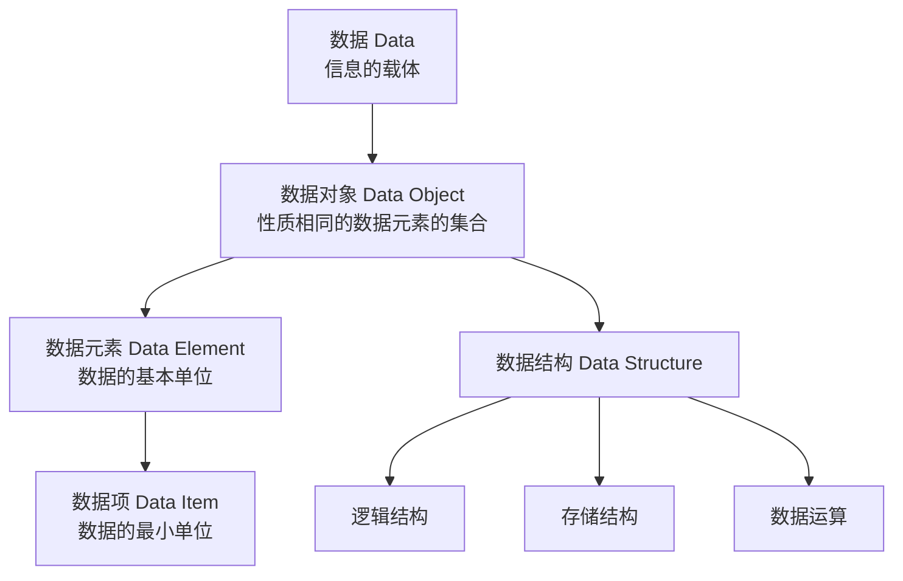
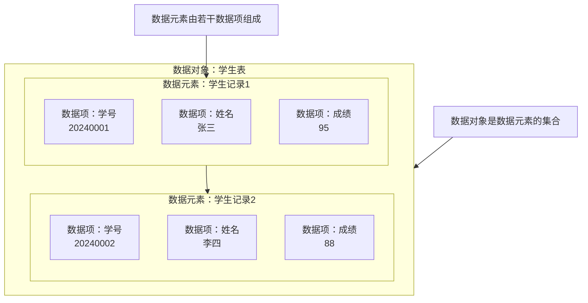

## 一、数据结构

### 1.1 数据结构的基本概念

数据结构是计算机<font color='red'>存储、组织数据的方式</font>，它决定了数据的逻辑关系、物理存储方式以及相应的操作（算法）效率。

### 1.2 核心概念分解

1.  <font color='red'>数据 (Data)</font>
    - 定义：所有能输入到计算机中被计算机识别并被处理的<font color='red'>符号集合</font>，是<font color='red'>信息的载体</font>，<font color='red'>是计算机程序加工的原料</font>。
    - 例如：数字、字符、图像、声音等。

2.  <font color='red'>数据项 (Data Item)</font>
    - 定义：构成数据的、<font color='red'>不可分割的最小单位</font>。
    - 例如：一个学生的“学号”（2024001）就是一个数据项。

3.  <font color='red'>数据元素 (Data Element)</font>
    - 定义：组成数据的<font color='red'>基本单位</font>，通常由<font color='red'>若干个数据项</font>组成。在<font color='red'>程序中</font>通常作为一个整体进行考虑和处理。
    - 例如：一个学生的完整信息（包括学号、姓名、成绩等多个数据项）就是一个数据元素。

4.  <font color='red'>数据对象 (Data Object)</font>
    - 定义：<font color='red'>性质相同</font>的数据元素的集合。它是数据的子集。
    - 例如：所有“学生记录”构成一个数据对象；所有“整数”也是一个数据对象。

5.  <font color='red'>数据结构 (Data Structure)</font>
    - 定义：相互之间存在一种或多种<font color='red'>特定关系</font>的数据元素的集合。它包含三个紧密相关的方面，称为<font color='red'>数据结构的三要素</font>：
      - <font color='red'>逻辑结构</font>：数据元素之间的<font color='red'>抽象关系，与计算机存储无关</font>。
      - <font color='red'>存储结构（物理结构）</font>：逻辑结构在计算机<font color='red'>内存中的具体实现方式</font>。
      - <font color='red'>数据运算</font>：对数据实施的<font color='red'>操作</font>（如插入、删除、查找、排序、遍历）。

### 1.3 概念关系示意图


#### 1.3.1 所有概念关系示意图



#### 1.3.2 数据元素、数据项、数据对象 - 示例



#### 1.3.3 数据结构三要素
数据结构的内涵主要体现在其<font color='red'>逻辑结构</font>和<font color='red'>存储结构</font>上。下图展示了常见的分类：

```markmap
# 数据结构(Data Structure)三要素
## 逻辑结构
 ### 集合
  #### 概念
   - 各个元素同属一个集合，<font color='red'>没有其他关系</font>
  #### 举例
   - java中的 List 集合
 ### 线性结构
  #### 概念
   - 数据元素之间是<font color='red'>一对一</font>的关系，除了第一个元素，所有的元素都有唯一一个前驱，除最后一个元素外，所有的元素都有一个唯一的后驱
  #### 举例
   - 线性表，数组，栈，队列，串 
 ### 树形结构
  #### 概念
   - 数据元素之间是<font color='red'>一对多</font>的关系
  #### 举例
   - 二叉树、B树
 ### 图结构（网状结构）
  - 数据元素之间是<font color='red'>多对多</font>的关系
  
## 存储结构(物理结构)
 ### 顺序存储结构
  #### 概念
   - 把逻辑上相邻的元素存储在物理位置上也相邻的存储单元中
  #### 举例
   - 数组
 ### 链式存储结构
  #### 概念
   - 逻辑上相邻的元素在物理上<font color='red'>可以不相邻</font>
  #### 举例
   - java 中的 LinkedList
 ### 索引存储结构
  #### 概念
   - 在存储元素信息的同时，还附加索引表
  #### 举例
   - 数据库中的索引
 ### 散列存储结构
  #### 概念
   - 根据元素的<font color='red'>关键字</font>直接计算出<font color='red'>该元素的存储地址</font>，又称 Hash 存储
  #### 举例
   - java 中的 Map
## 数据的运算

```

### 1.4 小结

| 概念       | 定义                                   | 比喻                     |
|:---------|:-------------------------------------|:-----------------------|
| **数据**   | 信息的载体                                | 所有的建筑材料（水泥、砖、钢筋）       |
| **数据项**  | 数据的<font color='red'>最小单位</font>     | 一块砖、一根钢筋               |
| **数据元素** | 数据的<font color='red'>基本单位</font>     | 一堵墙、一个房梁（由砖和钢筋组成）      |
| **数据对象** | <font color='red'>相同性质数据元素的集合</font> | 所有的墙                   |
| **数据结构** | <font color='red'>数据元素+关系+操作</font>  | 整个房屋的设计图（包括结构、材料和建造方法） |
| **逻辑结构** | 数据元素的<font color='red'>抽象关系</font>   | 设计图上的房间布局关系            |
| **存储结构** | 逻辑结构在<font color='red'>内存的实现</font>  | 按照设计图，用具体材料把房子盖起来      |

