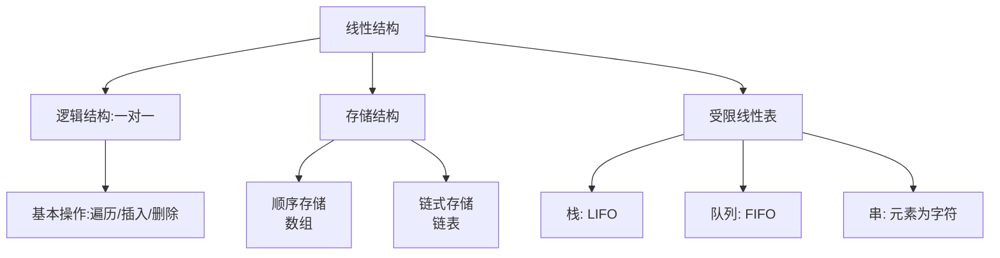

## 一、线性结构概述

1.  **概念**：线性结构是一种数据元素之间存在<font color='red'>一对一</font>线性关系的数据结构。即所有数据元素排列成一个线性序列（除了第一个和最后一个元素外，每个元素都有唯一的前驱和后继）。
2.  **共同逻辑特征**：
    - 存在一个<font color='red'>唯一的称为"第一个"</font>的数据元素（<font color='red'>表头</font>）。
    - 存在一个<font color='red'>唯一的称为"最后一个"</font>的数据元素（<font color='red'>表尾</font>）。
    - 除<font color='red'>表尾</font>外，每个元素都有唯一的<font color='red'>后继</font>。
    - 除<font color='red'>表头</font>外，每个元素都有唯一的<font color='red'>前驱</font>。
3.  **常见类型**：<font color='red'>线性表、栈、队列、串、数组</font>。

线性结构的逻辑视图及其主要分类：



## 二、线性表 (Linear List)

### 2.1 概念
<font color='red'>最常用且最简单</font>的线性结构，是具有<font color='red'>相同数据类型</font>的 `n` 个数据元素的<font color='red'>有限序列</font>。

### 2.2 存储结构

#### 2.2.1 顺序存储（顺序表）
- **概念**：用一组<font color='red'>地址连续</font>的存储单元<font color='red'>依次存储</font>线性表中的数据元素。通常用<font color='red'>数组</font>实现。
- **特点**：
  - **随机存取**：通过<font color='red'>首地址和元素序号</font>（下标）可在 `O(1)` 时间内找到指定元素。
  - **存储密度高**：只<font color='red'>存储数据元素本身</font>，无需额外空间。
  - **插入删除效率低**：平均需要移动 half of the table 的元素，时间复杂度为 `O(n)`。

:::danger **需要注意的问题**  
1. 元素地址计算：假设首地址是 `LOC(A)`，每个元素占用 `L` 个存储单元，则第 `i` 个元素的地址为：$LOC(A) + (i-1) × L$
:::


#### 2.2.2 链式存储（链表）
- **概念**：用一组<font color='red'>任意的存储单元</font>存储数据元素，通过<font color='red'>指针</font>来表示元素之间的逻辑关系。
- **特点**：
  - **非随机存取**：查找第 `i` 个元素需要<font color='red'>从头指针开始顺序</font>访问，时间复杂度为 `O(n)`。
  - **存储密度较低**：需要<font color='red'>额外空间存储指针</font>。
  - **插入删除效率高**：只需<font color='red'>修改指针</font>，时间复杂度为 `O(1)`（已知操作位置时）。
- **核心考点与计算**：
  - **链表操作**：下午题重点！**单链表的插入、删除**是高频考点。必须掌握指针修改的顺序，否则会导致链表断裂。
        - **s->next = p->next; p->next = s;**  // 将s结点插入到p之后
        - **q = p->next; p->next = q->next; free(q);** // 删除p的后继结点
  - **常见链表类型**：
        - **单链表**、**双链表**（可向前后遍历）、**循环链表**（尾指针指向头结点）。


:::danger **需要注意的问题**
1. 常见的链表类型：<font color='red'>单链表</font>、<font color='red'>双链表</font>（可向前后遍历）、<font color='red'>循环链表</font>（尾指针指向头结点）。
2. 头结点: 链表中引入的一个<font color='red'>不存储数据的结点</font>，其 `next` 指向<font color='red'>第一个数据结点</font>。作用是<font color='red'>简化插入/删除</font>操作，统一空表和非空表的处理。
3. 链表操作: 链表的插入、删除操作的流程,<font color='red'>所有的链表插入、删除操作，都需要将指定的节点的 `next` 先行操作，否则会丢失子链</font>。
    - <font color='red' class='blob-600'>单链</font>的插入操作 - (**在节点 `p` 之后插入新节点 `s`**)
      1. 核心代码
    
        ```c
          s->next = p->next; // 步骤1：新节点s指向p的后继
          p->next = s;       // 步骤2：节点p指向新节点s
        ```
      2. 图示
    
      ```mermaid
       flowchart TD
       subgraph "插入后"
       direction LR
       A4[P] --> S4[S]
       S4[S] --> B4[Next]
       B4[Next] --> C4[...]
       end
      
       subgraph "步骤2: p->next = s"
       direction LR
       A3[P] --> S3[S]
       S3[S] --> B3[Next]
       B3[Next] --> C3[...]
       end
      subgraph "步骤1: s->next = p->next"
       direction LR
       A2[P] --> B2[Next]
       B2[Next] --> C2[...]
       S2[S] --> B2
       end
       
       subgraph "插入前"
       direction LR
       A1[P] --> B1[Next]
       B1[Next] --> C1[...]
       end
      ```
    - <font color='red' class='blob-600'>单链</font>的删除操作 - (**删除节点  `p` 的后继节点 `q`**)
      1. 核心代码
      ```c
      q = p->next;        // 首先找到要删除的节点q
      p->next = q->next;  // 将p的next指针指向q的后继
      free(q);            // 最后释放q的内存
      ```
      2. 图示  
      
      ```mermaid
        flowchart TD

        subgraph "删除后 (并free(q))"
        direction LR
        A3[P] --> C3[Next]
        C3[Next] --> D3[...]
        B3[Q] -.->|已释放| C3
        end
        subgraph "步骤: p->next = q->next"
        direction LR
        A2[P] --> C2[Next]
        B2[Q] --> C2[Next]
        C2[Next] --> D2[...]
        end

        subgraph "删除前"
        direction LR
        A1[P] --> B1[Q]
        B1[Q] --> C1[Next]
        C1[Next] --> D1[...]
        end
      ```
   - <font color='red' class='blob-600'>双链</font>的插入操作 - (**在节点 `p` 之后插入新节点 `s`**)
     1. 核心代码
     
     ```c
      // 1. 处理s的前驱和后继指针
      s->prev = p;
      s->next = p->next;

      // 2. 处理原p的后继节点的前驱指针
      if (p->next != NULL) {
          p->next->prev = s;
      }

      // 3. 处理p的后继指针
      p->next = s; 
     ```
     2. 示意图
     
     ```mermaid
        flowchart TD
        subgraph "步骤3: 更新p的next指针"
        direction LR
        A3[P] --> B3[S]
        B3[S] --> C3[Next]
        A3 <--> B3
        B3 <--> C3
        C3 <--> D3[...]
        end

        subgraph "步骤1/2: 链接s的指针并更新Next节点的prev"
        direction LR
        A2[P] <--> B2[S]
        B2[S] <--> C2[Next]
        A2 <-->|p->next->prev = s| C2
        C2[Next] <--> D2[...]
        end

        subgraph "插入前"
        direction LR
        A1[P] <--> B1[Next]
        B1[Next] <--> C1[...]
        end
     ```
      
   - <font color='red' class='blob-600'>双链</font>的删除操作-**(删除节点 `p`)**
     1. 核心代码
     
     ```c
     // 1. 让p的前驱节点绕过p，直接指向p的后继节点
     if (p->prev != NULL) {
         p->prev->next = p->next;
     }

     // 2. 让p的后继节点绕过p，直接指向p的前驱节点
     if (p->next != NULL) {
         p->next->prev = p->prev;
     }

     // 3. 释放节点p
     free(p);
     ```     

     2. 示意图
     
      ```mermaid
        flowchart TD
        subgraph "删除后 (并free(p))"
            direction LR
            A4[Prev] <--> C4[Next]
            C4[Next] <--> D4[...]
            B4[P] -.->|已释放| C4
        end

        subgraph "步骤2: p->next->prev = p->prev"
            direction LR
            A3[Prev] <--> C3[Next]
            B3[P] <--> C3[Next]
            A3 --> C3
        end

        subgraph "步骤1: p->prev->next = p->next"
            direction LR
            A2[Prev] --> C2[Next]
            B2[P] <--> C2[Next]
            A2 <--> B2
        end

        subgraph "删除前"
        direction LR    
        A1[Prev] <--> B1[P]
        B1[P] <--> C1[Next]
        C1[Next] <--> D1[...]
        end

      ```
      
   - <font color='red' class='blob-600'>循环链表</font>: 循环链表的操作<font color='red'>与单链表/双链表基本相同</font>，唯一区别在于<font color='red'>表尾的指针指向表头</font>，形成一个环。因此，在操作时需要特别<font color='red'>注意维护这个"环"的完整性</font>，避免出现断裂。
     1. 插入操作示意图

      ```mermaid
        flowchart LR
       subgraph "循环双链表插入"
       direction LR
       Head1[Head] <--> A1[...] <--> Tail1[Tail] <--> Head1
            Head2[Head] <--> S2[S] <--> A2[...] <--> Tail2[Tail] <--> Head2
       end

      ```    

4. **循环链表注意事项**：
   1. **空链表处理**：如果链表<font color='red'>为空</font>，新插入的节点其 `next` (和 `prev`) 指针<font color='red'>必须指向自己</font>。
   2. **头尾操作**：在<font color='red'>头部或尾部</font>插入/删除节点时，需要更新尾节点的 `next` 指针和头节点的 prev `指针`，以确保循环的完整性。
   3. **遍历终止条件**：遍历循环链表时，判断条件不再是 `p != NULL`，而是 `p != head` (从头部开始遍历时)。


:::


### 2.3 顺序表 vs. 链表 对比

| 特性       | 顺序表                                                           | 链表                                                             |
|:---------|:--------------------------------------------------------------|:---------------------------------------------------------------|
| **存储空间** | 静态分配（通常）                                                      | 动态分配                                                           |
| **存储密度** | 高（=1）                                                         | 低（<1）                                                          |
| **存取方式** | 随机存取                                                          | 顺序存取                                                           |
| **插入删除** | `O(n)`                                                        | `O(1)`（<font color='red'>已知位置</font>）                          |
| **查找元素** | `O(1)`                                                        | `O(n)`                                                         |
| **适用场景** | 表长<font color='red'>固定</font>、<font color='red'>查询多增删少</font> | 表长<font color='red'>变化大</font>、<font color='red'>增删多查询少</font> |

## 三、栈 (Stack) & 队列 (Queue)

栈和队列是<font color='red'>操作受限</font>的线性表，限制了<font color='red'>插入和删除</font>的位置。

### 3.1 栈 (Stack) - LIFO (Last In First Out / 先进后出)

- **概念**：只允许在<font color='red'>表尾</font>（栈顶，Top）进行插入（Push）和删除（Pop）操作的<font color='red'>线性表</font>。
- **考点**：
  - **栈的数学性质**：`n` 个不同元素入栈，出栈序列的个数为 **卡特兰数(Catalan number)**: $C_n = \frac{1}{n+1}C_{2n}^{n} = \frac{(2n)!}{(n+1)!n!}$。
  - **应用场景**：
    1. <font class='blob-600' color='red'>函数调用</font>：系统调用栈，存储返回地址、实参、局部变量。
    2. <font class='blob-600' color='red'>表达式求值</font>：中缀转后缀（<font color='red'>逆波兰</font>），后缀表达式求值。
    3. <font class='blob-600' color='red'>括号匹配</font>：遇到<font color='red'>左括号入栈</font>，遇到<font color='red'>右括号出栈检查</font>。
    4. <font class='blob-600' color='red'>递归转非递归</font>。
- **存储实现**：既可以用<font class='blob-600' color='red'>顺序存储</font>（数组）实现，也可以用<font class='blob-600' color='red'>链式存储</font>（链表）实现。

### 3.2 队列 (Queue) - FIFO (First In First Out / 先进先出)

- **概念**：只允许在<font color='red'>表尾</font>（队尾，Rear）进行<font color='red'>插入</font>（Enqueue），在<font color='red'>表头</font>（队头，Front）进行<font color='red'>删除</font>（Dequeue）的<font color='red'>线性表</font>。
- **考点**：
  - **<font color='red'>顺序存储的坑</font>**："假溢出"——队列中有空位，但 rear 指针已到数组末尾。
  - **<font color='red'>循环队列</font>**：解决假溢出的方法。把数组设想成一个环。
  - **核心计算**：`front` 队头指针，`rear` 队尾指针， `QueueSize` 队列数组的总长度（即可用的最大存储空间数，包括要牺牲的那个单元）
    - **最大可存元素数**: `QueueSize - 1`
    - **<font color='red'>队空条件</font>**：`front == rear`
    - **<font color='red'>队满条件</font>**：`(rear + 1) % QueueSize == front`，这是牺牲一个单元的判断法，最常用，`% QueueSize` 是为了实现指针的循环（回绕），当 rear 指向数组最后一个位置时，rear + 1 会通过取模运算变成 0。
    - **<font color='red'>队列长度(有效元素的个数)</font>**：`rear` 和 `front` 之间有效元素的个数 `(rear - front + QueueSize) % QueueSize`。
  - **应用场景**：操作系统中的<font color='red'>作业调度、消息队列、树的层次遍历</font>。
- **特殊队列**：
    - **<font color='red'>双端队列</font>**：<font color='red'>两端都可以进行插入和删除</font>。
    - **<font color='red'>链队列</font>**：用链表实现的队列，<font color='red'>不存在假溢出</font>问题。

:::danger **需要注意的问题**  
1. 假溢出：假溢出是<font color='red'>顺序队列</font>（用数组实现的队列）在<font color='red'>持续进行入队和出队操作</font>后，出现的一种队列中有<font color='red'>空闲空间</font>，但<font color='red'>新元素却无法入队</font>的现象。
    - 示意图
      
      ```mermaid
        flowchart LR
         Start[顺序队列假溢出过程]
      
         Start --> Step1
      
         subgraph Step1 [初始空态]
         direction LR
         F1[Front: 0]
         R1[Rear: 0]
         subgraph Array1 [数组状态]
         idx0_1[0: 空]
         idx1_1[1: 空]
         idx2_1[2: 空]
         idx3_1[3: 空]
         idx4_1[4: 空]
         end
         Cond1[队空条件: Front == Rear]
         end
      
         Step1 -- "执行入队(A,B,C,D,E)" --> Step2
      
         subgraph Step2 [队列已满]
         direction LR
         F2[Front: 0]
         R2[Rear: 4]
         subgraph Array2 [数组状态]
         idx0_2[0: A]
         idx1_2[1: B]
         idx2_2[2: C]
         idx3_2[3: D]
         idx4_2[4: E]
         end
         Cond2[队满: Rear == 数组最后位置]
         end
      
         Step2 -- "执行出队(A,B)" --> Step3
      
         subgraph Step3 [出现空闲空间]
         direction LR
         F3[Front: 2]
         R3[Rear: 4]
         subgraph Array3 [数组状态]
         idx0_3[0: 空<br>已出队]
         idx1_3[1: 空<br>已出队]
         idx2_3[2: C]
         idx3_3[3: D]
         idx4_3[4: E]
         end
         Cond3[现象: 数组前端有空闲单元<br>但Rear仍在末尾]
         end
      
         Step3 -- "尝试入队(F)" --> Step4
      
         subgraph Step4 [假溢出发生]
         direction LR
         F4[Front: 2]
         R4[Rear: 4]
         subgraph Array4 [数组状态]
         idx0_4[0: 空]
         idx1_4[1: 空]
         idx2_4[2: C]
         idx3_4[3: D]
         idx4_4[4: E]
         end
         Cond4[结果: Rear+1 >= 数组长度<br>系统报告“溢出”错误<br>尽管前端仍有空间]
         end
      
         Step4 --> Conclusion[结论: 这就是“假溢出”<br>解决方案: 使用循环队列]
      ```
    
    - 解决方法: 使用循环队列  
:::

## 四、串 (String)

- **概念**：由零个或多个<font color='red'>字符</font>组成的有限序列，是一种<font color='red'>特殊的线性表</font>（数据元素仅为字符）。

- **特殊定义**：
  1. 空串：长度为 `0` 的串，<font color='red'>不包含任何字符</font>
  2. 空格串：长度不为 `0` ，<font color='red'>包含空格字符</font>
  3. 字串：由串种任意长度的连续字符构成的序列。子串在主串中的位置为子串<font color='red'>第一次出现</font>在主串中时，<font color='red'>第一个字符</font>出现在主串中的位置
  4. 串相等：指两个<font color='red'>串相等</font>，且<font color='red'>对应位置上的字符也相同</font>
  5. 串比较：两个串比较大小时，以字符的 <font color='red'>ASCII</font> 码值作为依据，比较操作从两个串的<font color='red'>第一个开始</font>，字符的 <font color='red'>ASCII 码值大所在的串大</font>，若串<font color='red'>长度不一致，则长者为大</font>

- **串操作**：
  1. 基本操作：串最核心、最基本的操作，是定义串逻辑结构的基础。

    | 操作名称                             | 操作描述（基于教材常用定义）                                                        | 示例（设 `S = "abc"`, `T = "def"`）                   |
    |:---------------------------------|:----------------------------------------------------------------------|:-------------------------------------------------|
    | **StrAssign(&T, chars)**         | **<font color='red'>串赋值</font>**：生成一个其值等于chars的串T。                    | `StrAssign(S, "Hello")` => `S = "Hello"`         |
    | **StrCopy(&T, S)**               | **<font color='red'>串拷贝</font>**：由串S复制得串T。                            | `StrCopy(T, S)` => `T = "abc"`                   |
    | **StrEmpty(S)**                  | **<font color='red'>判空</font>**：若S为空串，则返回TRUE，否则返回FALSE。              | `StrEmpty(S)` => `FALSE`                         |
    | **StrCompare(S, T)**             | **<font color='red'>串比较</font>**：若S>T，则返回值>0；若S=T，则返回值=0；若S<T，则返回值<0。 | `StrCompare("abc", "abd")` => `< 0`              |
    | **StrLength(S)**                 | **求<font color='red'>串长</font>**：返回S的元素个数，即串的长度。                      | `StrLength(S)` => `3`                            |
    | **ClearString(&S)**              | **<font color='red'>清空串</font>**：将S清为空串。                              | `ClearString(S)` => `S = ""`                     |
    | **Concat(&T, S1, S2)**           | **<font color='red'>串联接</font>**：用T返回由S1和S2联接而成的新串。                   | `Concat(U, S, T)` => `U = "abcdef"`              |
    | **SubString(&Sub, S, pos, len)** | **<font color='red'>求子串</font>**：用Sub返回串S的第pos个字符起长度为len的子串。          | `SubString(Sub, "Hello", 2, 3)` => `Sub = "ell"` |

  3. 串的模式匹配操作:串操作中<font color='red'>最重要、最核心</font>的部分

    | 操作名称                      | 算法描述                                                                                                            | 特点与时间复杂度                                                                                                         | 软考重要性                    |
    |:--------------------------|:----------------------------------------------------------------------------------------------------------------|:-----------------------------------------------------------------------------------------------------------------|:-------------------------|
    | **Index(S, T, pos)**      | **<font color='red'>定位操作</font>**：若主串S中存在与串T值相同的子串，则返回它在主串S中第pos个字符之后<font color='red'>第一次出现的位置</font>；否则函数值为0。 | **<font color='red'>抽象操作</font>**，是模式匹配的目标。                                                                      | **必考**                   |
    | **朴素匹配(BF算法)**            | 从主串的每一个位置开始，逐个字符与模式串进行比较，<font color='red'>失败则回溯主串指针</font>。                                                    | **<font color='red'>思路简单</font>**，但**<font color='red'>效率低</font>**。最坏时间复杂度 **<font color='red'>O(n*m)</font>**。 | 要求会模拟过程                  |
    | **KMP算法**                 | 利用已匹配的信息，保持<font color='red'>主串指针不回溯</font>，仅移动模式串。**<font color='red'>核心是next数组</font>**。                      | **<font color='red'>效率高</font>**，平均时间复杂度 **O(n+m)**。                                                             | **重中之重**，必考next数组计算和匹配过程 |
    | **Next(T, next[])**       | 求模式串T的next数组。`next[j]` 表示当 `T[j]` 失配时，j应该回溯到的位置。                                                                | KMP算法的预处理步骤，时间复杂度 **O(m)**。                                                                                      | **下午题核心考点**，必须手工熟练计算     |
    | **NextVal(T, nextval[])** | 对next数组的优化，解决模式串中连续相同字符导致的冗余回溯。                                                                                 | 比next数组更高效，但预处理稍复杂。                                                                                              | 常考，理解其优化思想               |

  4. 其他重要操作：这些操作在很多高级语言中作为标准库函数提供，但其思想需要理解。

    | 操作名称（或常用函数名）                | 操作描述                                                     |
    |:----------------------------|:---------------------------------------------------------|
    | **StrInsert(&S, pos, T)**   | **插入**：在串S的第<font color='red'>pos个字符之前</font>插入串T。       |
    | **StrDelete(&S, pos, len)** | **删除**：从串S中删除第<font color='red'>pos个字符起长度为len</font>的子串。 |
    | **Replace(&S, T, V)**       | **替换**：用V替换主串S中出现的所有与T相等的不重叠子串。                          |
    | **StrSplit(S, delim)**      | **分割**：根据分隔符delim将串S分割成一个子串数组。                           |
    | **Index/LastIndexOf(ch)**   | **字符查找**：返回某个字符在串中第一次/最后一次出现的位置。                         |

- **考点**：
  - **模式匹配算法**：确定一个子串（模式串）在主串中的位置。
  - **<font color='red'>BF算法</font>**（朴素匹配）：简单但效率低，最坏时间复杂度 `O(n*m)`。
  - **<font color='red'>KMP算法</font>**：
    - **核心思想**：当匹配失败时，利用已经部分匹配这个有效信息，保持主串指针不回溯，只将模式串向后“滑动”尽可能远的一段距离后继续比较。
    - **需要计算**：**<font color='red'>next数组</font>**（用于告诉模式串在<font color='red'>匹配失败时应该回溯到哪个位置</font>）。
    - **算法复杂度**：`O(n+m)`。 

:::danger **需要注意的问题**  
1. 计算 next 数组：设模式串 `abcabed` 求模式串的 next 数组
   - `next(0)` 为标志位，当模式串发生不匹配时，且获取到需要移动到 `0` 位时，需要将主串的指针和模式串的指针都执行 `++` 操作。
   - 对于任意模式串都可以写成 `next(1)`、`next(2)` 都可以直接写成 `next(1) = 0`、`next(2) = 1`
   - 计算 next 数组时将模式串的第一个数到第 `n` 个数记作 `1 , 2 , 3 .......... , n` 
   - `i` 为主串指针，`j` 为模式串指针
       ```
       next数组：
        | next(0) | next(1) | next(2) | next(3) | next(4) | next(5) | next(6) | next(7) |
         -------------------------------------------------------------------------------
        |---------|    0    |   1     |    ?    |    ?    |    ?    |    ?    |    ?    |
      
       推算 next(3) 
        
               i                                      i                         i  
               ↓                                      ↓                         ↓
       ? a b | ? ? ? ? ?    第三位发生了不匹配  ? a b | ? ? ? ? ? ?       ? a b | ? ? ? ? ? ?   
         a b | c a b e d    ---------------->     a | b c a b e d             | a b c a b e d         next(3) = 1
       ↓ ↓ ↓ | ↓ ↓ ↓ ↓ ↓                        ↓ ↓ | ↓ ↓ ↓ ↓ ↓ ↓           ↓ | ↓ ↓ ↓ ↓ ↓ ↓ ↓   
       0 1 2 | 3 4 5 6 7                        0 1 | 2 3 4 5 6 7           0 | 1 2 3 4 5 6 7    
               ↑                                      ↑                         ↑
               j                                      j                         j
     
       推算 next(4) next(5) next(6) next(7) 与此类似
       ```
   - **结论**：<font color='red'>已不匹配的位置处作为分割</font>，模式串一次次后移，<font color='red'>直到分割线前方的数据能和主串对上或者模式串全部越
   过分割线</font>此时 `j` 指向的模式串编号是几对应 next(?) 就为多少

:::

## 五、数组 (Array) & 矩阵

- **概念**：线性表的推广，其<font color='red'>元素本身也是一个数据结构</font>。
- **考点**：
  - **<font color='red'>数组地址计算</font>**：对于 `m` 行 `n` 列的二维数组 `A[m][n]`。
    - **<font color='red'>按行优先存储</font>**：`LOC(A[i][j]) = LOC(A[0][0]) + (i * n + j) * L`
    - **<font color='red'>按列优先存储</font>**：`LOC(A[i][j]) = LOC(A[0][0]) + (j * m + i) * L`
  - **特殊矩阵的压缩存储**：为了节省空间，对规律性强的矩阵（对称矩阵、三角矩阵、对角矩阵）进行压缩存储。
    - **核心**：<font color='red'>下标变换</font>。给出原矩阵下标 `(i, j)`，能计算出在一维压缩数组中的位置 `k`；反之亦然。（选择题）

## 六、小结

1.  **理解本质**：理解每种结构的特点和适用场景，特别是栈和队列的LIFO/FIFO特性。
2.  **掌握计算**：
    - <font color='red'>顺序表地址计算</font>。
    - **<font color='red'>循环队列的队空、队满判断和指针移动</font>**。
    - <font color='red'>数组地址计算</font>。
    - **<font color='red'>KMP的next数组</font>**。
3.  **精通操作**：
    - **链表的插入删除**（指针修改顺序）。
    - **栈在表达式求值中的应用**（中缀转后缀算法）。