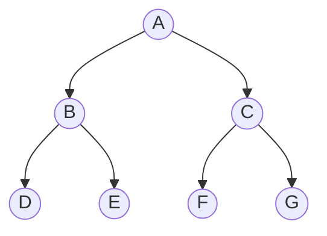

## 一、基本概念

- 非线性结构的特点是数据元素之间存在<font color='red'>一对多或多对多</font>的关系。
- 非线性结构的主要分类、核心考点及它们之间的逻辑关系如下图：

    ```markmap
    # 非线性结构
    ## 树与二叉树 (1:n)
    ### 基本概念
    #### 术语: 度/深度/路径
    #### 性质: n₀ = n₂ + 1
    ### 存储与遍历
    #### 存储: 顺序/链式
    #### 遍历: 先/中/后/层序
    ### 特殊树
    #### 哈夫曼树 (编码/WPL)
    #### 二叉排序树-BST (查找/增/删)
    #### 平衡二叉树-AVL (平衡调整)
    ### 树/森林与二叉树的转换
    #### 核心: 左孩子右兄弟
    ## 图结构 (m:n)
    ### 基本概念
    #### 分类: 有/无向/网
    #### 术语: 度/连通/生成树
    ### 存储结构
    #### 邻接矩阵 (稠密图)
    #### 邻接表 (稀疏图)
    ### 遍历
    #### DFS (深度优先)
    #### BFS (广度优先)
    ### 经典应用
    #### 最小生成树<br>(Prim, Kruskal)
    #### 最短路径<br>(Dijkstra, Floyd)
    #### 拓扑排序 (AOV网)
    #### 关键路径 (AOE网)
    ```

## 二、树

树形结构是重要的非线性结构，用于表示数据元素之间的层次关系。

### 2.1 树的定义
树是 `n(n≥0)` 个结点的有限集。当 `n=0` 时，称为空树。对于非空树( `n>0` )，有且仅有一个特定的称为<font color='red'>根</font>的结点，其余结点可分为 `m(m≥0)` 个互不相交的有限集，每个集合本身又是一棵树，称为根的<font color='red'>子树</font>。


### 2.2 基本术语

- **结点的度**：结点拥有的<font color='red'>子树数</font>
- **树的度**：树内<font color='red'>各结点的度的最大值</font>
- **叶子结点**：<font color='red'>度为0</font>的结点（终端结点）
- **分支结点**：<font color='red'>度不为0</font>的结点（非终端结点）
- **孩子结点**：一个<font color='red'>结点的子树的根</font>称为该结点的孩子
- **双亲结点**：<font color='red'>一个结点是其所有子树根的双亲</font>
- **兄弟结点**：同一双亲的孩子之间<font color='red'>互称兄弟</font>
- **结点的层次**：根为第一层，其孩子为第二层，以此类推
- **树的深度**：树中<font color='red'>结点的最大层次</font>
- **有序树**：树中结点的<font color='red'>各子树从左到右有次序（不能互换）</font>
- **无序树**：树中结点的<font color='red'>各子树无次序（可以互换）</font>
- **森林**：m(m≥0)棵互<font color='red'>不相交的树的集合</font>

### 2.3 树的遍历

定义一棵<font color='red'>二叉树</font>，节点值为 `A、B、C、D、E、F、G`，结构如下：
- 根节点：`A`
- A的左子树：以 `B` 为根，`B` 的左子树是 `D` ，`B` 的右子树是 `E`
- A的右子树：以 `C` 为根，`C` 的左子树是 `F` ，`C` 的右子树是 `G`

- 示例树图示



#### 2.3.1 深度优先遍历（DFS）
深度优先遍历优先沿<font color='red'>一条路径遍历至最深层</font>，再<font color='red'>回溯遍历</font>其他路径，核心分为3种：<font color='red'>前序、中序、后序</font>（"序"指<font color='red'>根节点的访问顺序</font>）。

#### 2.3.1.1 前序遍历（根→左→右）

- **遍历规则**: 
  1. 先访问<font color='red'>根节点</font>；
  2. 递归遍历根节点的<font color='red'>左子树</font>（按前序规则）；
  3. 递归遍历根节点的<font color='red'>右子树</font>（按前序规则）。

- **示例树遍历过程**
  - 根A → 左子树（B）→ 根B → 左子树（D）→ 根D（无左右子树）→ 回溯B的右子树（E）→ 根E（无左右子树）→ <font color='red'>回溯A的右子树</font>（C）→ 根C → 左子树（F）→ 根F → 回溯C的右子树（G）→ 根G
  - **前序结果**：A → B → D → E → C → F → G

- 遍历路径（红色箭头为访问顺序）

    ```mermaid
    graph TD
        A((A)) -->|1| B((B))
        A((A)) -->|5| C((C))
        B((B)) -->|2| D((D))
        B((B)) -->|3| E((E))
        C((C)) -->|6| F((F))
        C((C)) -->|7| G((G))
        style A fill:#f9d,stroke:#333
        style B fill:#f9d,stroke:#333
        style D fill:#f9d,stroke:#333
        style E fill:#f9d,stroke:#333
        style C fill:#f9d,stroke:#333
        style F fill:#f9d,stroke:#333
        style G fill:#f9d,stroke:#333
    ```


#### 2.3.1.2 中序遍历（左→根→右）

- **遍历规则**:
  1. 递归遍历根节点的<font color='red'>左子树</font>（按中序规则）；
  2. 访问<font color='red'>根节点</font>；
  3. 递归遍历根节点的<font color='red'>右子树</font>（按中序规则）。

- **示例树遍历过程**
  - A的左子树（B）→ B的左子树（D）→ 根D → 回溯访问B → B的右子树（E）→ 根E → 回溯访问A → A的右子树（C）→ C的左子树（F）→ 根F → 回溯访问C → C的右子树（G）→ 根G
  - **中序结果**：D → B → E → A → F → C → G

- **遍历路径**

    ```mermaid
    graph TD
        A((A)) -->|4| B((B))
        A((A)) -->|5| C((C))
        B((B)) -->|1| D((D))
        B((B)) -->|3| E((E))
        C((C)) -->|6| F((F))
        C((C)) -->|8| G((G))
        style D fill:#9df,stroke:#333
        style B fill:#9df,stroke:#333
        style E fill:#9df,stroke:#333
        style A fill:#9df,stroke:#333
        style F fill:#9df,stroke:#333
        style C fill:#9df,stroke:#333
        style G fill:#9df,stroke:#333
    ```


##### 2.3.1.3 后序遍历（左→右→根）

- **遍历规则**:
  1. 递归遍历根节点的<font color='red'>左子树</font>（按后序规则）；
  2. 递归遍历根节点的<font color='red'>右子树</font>（按后序规则）；
  3. 访问<font color='red'>根节点</font>。

- **示例树遍历过程**
  - A的左子树（B）→ B的左子树（D）→ 根D → B的右子树（E）→ 根E → 回溯访问B → A的右子树（C）→ C的左子树（F）→ 根F → C的右子树（G）→ 根G → 回溯访问C → 回溯访问A
  - **后序结果**：D → E → B → F → G → C → A

- **遍历路径**

    ```mermaid
    graph TD
        A((A)) -->|7| B((B))
        A((A)) -->|6| C((C))
        B((B)) -->|1| D((D))
        B((B)) -->|2| E((E))
        C((C)) -->|3| F((F))
        C((C)) -->|4| G((G))
        style D fill:#df9,stroke:#333
        style E fill:#df9,stroke:#333
        style B fill:#df9,stroke:#333
        style F fill:#df9,stroke:#333
        style G fill:#df9,stroke:#333
        style C fill:#df9,stroke:#333
        style A fill:#df9,stroke:#333
    ```


#### 2.3.2 广度优先遍历（BFS）
广度优先遍历（又称<font color='red'>层次遍历</font>）按<font color='red'>树的层级顺序</font>访问节点，<font color='red'>先访问根节点</font>（第1层），再访问第2层所有节点，依次向下，<font color='red'>核心用队列</font>实现（先进先出）。

- **遍历规则**:
  1. 将根节点入队；
  2. 出队一个节点，访问它；
  3. 若该节点有左子节点，入队；若有右子节点，入队；
  4. 重复步骤2-3，直到队列为空。
  5. 一层一层，<font color='red'>先上后下，先左后右</font>

- **示例树遍历过程**
  - 队列初始：[A] → 出队A（访问）→ 入队B、C → 队列：[B,C]
  - 出队B（访问）→ 入队D、E → 队列：[C,D,E]
  - 出队C（访问）→ 入队F、G → 队列：[D,E,F,G]
  - 出队D（访问）→ 无子女 → 队列：[E,F,G]
  - 出队E（访问）→ 无子女 → 队列：[F,G]
  - 出队F（访问）→ 无子女 → 队列：[G]
  - 出队G（访问）→ 无子女 → 队空
  - **层次遍历结果**：A → B → C → D → E → F → G

- **遍历路径**

    ```mermaid
    graph TD
        A((A)) -->|1| B((B))
        A((A)) -->|2| C((C))
        B((B)) -->|3| D((D))
        B((B)) -->|4| E((E))
        C((C)) -->|5| F((F))
        C((C)) -->|6| G((G))
        style A fill:#f5a,stroke:#333
        style B fill:#f5a,stroke:#333
        style C fill:#f5a,stroke:#333
        style D fill:#f5a,stroke:#333
        style E fill:#f5a,stroke:#333
        style F fill:#f5a,stroke:#333
        style G fill:#f5a,stroke:#333
    ```


:::warning 软考真题解析（2023年软件设计师上午题）

**一、题干**  
某二叉树的中序遍历序列为 `a b c d e f`，后序遍历序列为 `a c e f d b`，则该二叉树的前序遍历序列为（ ）。  

A. b d a c e f    
B. b d a c f e    
C. b a d f c e     
D. b a d c f e

**二、解题步骤（核心：由中序+后序推前序）**

1. **确定根节点**：后序遍历最后一个节点是根节点 → 根为 `b`；  

2. **划分左右子树（中序）**：中序序列中，根 `b` 左侧是左子树（`a`），右侧是右子树（`c d e f`）；  

3. **递归分析右子树**：  
    - 右子树的后序序列：后序中根 `b` 之前的右侧部分（`c e f d`）→ 右子树的根是 `d`（后序最后一个）；  
    - 右子树的中序序列：`c d e f` → 根 `d` 左侧是左子树（`c`），右侧是右子树（`e f`）；  
   
4. **分析最右侧子树**：  
    - 该子树的后序序列：`e f` → 根是 `f`；  
    - 该子树的中序序列：`e f` → 根 `f` 左侧是左子树（`e`），右侧无；  
   
5. **还原二叉树**（Mermaid图示）：  

   ```mermaid
   graph TD
       b((b)) --> a((a))
       b((b)) --> d((d))
       d((d)) --> c((c))
       d((d)) --> f((f))
       f((f)) --> e((e))
   ```
   
6. **求前序遍历**（根→左→右）：`b → a → d → c → f → e` → 对应选项 D。 
  
:::

#### 2.3.3、核心考点总结

| 遍历类型 | 核心规则  | 实现方式 | 软考高频场景       |
|------|-------|------|--------------|
| 前序遍历 | 根→左→右 | 递归/栈 | 构建二叉树、复制树    |
| 中序遍历 | 左→根→右 | 递归/栈 | 与后序/前序结合推树结构 |
| 后序遍历 | 左→右→根 | 递归/栈 | 销毁树、计算树的高度   |
| 层次遍历 | 按层级访问 | 队列   | 求树的宽度、层序处理   |

## 三、 二叉树

- 二叉树是n(n≥0)个结点的有限集合，该集合或者为空集（空二叉树），或者由一个根结点和两棵互不相交的、分别称为根结点的左子树和右子树的二叉树组成。
- 每个节点最多有两棵子树，且子树有左右之分。

### 3.1 二叉树的性质

1. 在二叉树的第 `i` 层上至多有 <font color='red'>$2^{i-1}$</font> 个结点(i≥1)
2. 深度为 `k` 的二叉树<font color='red'>至多</font>有 <font color='red'>$2^k - 1$</font> 个结点(k≥1)
3. **<font color='red'>重要性质</font>**：对任何一棵二叉树 `T` ，如果其终端结点数为 `n₀` ，度为2的结点数为 `n₂`，则 `n₀ = n₂ + 1`

:::warning **证明过程**  
设二叉树中结点总数为 $n$ ，度为 `1` 的结点数为 $n_1$ ，度为 `2` 的节点数为 $n_2$，  
1. 则有<Badge text="公式1" type="warning"/>  ：
  
$$n = n_0 + n_1 + n_2$$  

2. 再看二叉树中的分支数: 除根结点外，每个结点都有一个分支进入，设 `B` 为分支总数，则:  
  
$$n = B + 1$$   

由于这些分支都是由度为 `1` 或 `2` 的结点射出的，所以有：
  
$$B = n_1 + 2n_2$$  
  
所以得到<Badge text="公式2" type="warning"/>：  
 
$$n = n_1 + 2n_2 + 1$$  

由<Badge text="公式1" type="danger"/>  和<Badge text="公式2" type="danger"/> 得：

$$n_0 + n_1 + n_2 = n_1 + 2n_2 + 1$$  

最终得到 

$$n_0 = n_2 + 1$$

:::

4. 具有 `n` 个结点的<font color='red'>完全二叉树</font>的深度为:  $log_2n + 1$
5. 对<font color='red'>完全二叉树按层编号</font>，则<font color='red'>对任意结点</font> `i` (1≤i≤n)有：
    - 如果 `i=1` ，则结点i是二叉树的根，无双亲
    - 如果 `i>1` ，则其双亲是结点 `i/2` 
    - 如果 `2i>n` ，则结点 `i` 无左孩子；否则其左孩子是结点 `2i` 
    - 如果 `2i+1>n` ，则结点 `i` 无右孩子；否则其右孩子是结点 `2i+1`
   
### 3.2 特殊二叉树

构造特殊的二叉树，常见的有<font color='red'>满二叉树、完全二叉树、二叉排序树、平衡二叉树、线索二叉树、哈夫曼树(最优二叉树)、B树和B+树</font>

#### 3.2.1 满二叉树 (Full Binary Tree)

- **定义**：一棵深度为 `k` 且具有 <font color='red'>$2^k - 1$</font> 个结点的二叉树。
- **特点**：
    1.  每一层上的结点数都达到<font color='red'>最大值</font>。
    2.  <font color='red'>所有叶子结点</font>都出现在<font color='red'>最底层</font>。
    3.  <font color='red'>不存在度为 `1` 的</font>结点（每个结点要么有 `0` 个孩子，要么有 `2` 个孩子）。
- **示意图**：
    ```
             1
           /   \
          2     3
         / \   / \
        4   5 6   7    // 深度3，结点数7 = 2^3 - 1
    ```

#### 3.2.2 完全二叉树 (Complete Binary Tree)

- **定义**：深度为 `k` 的，有 `n` 个结点的二叉树，当且仅当其每一个结点都与深度为 `k` 的<font color='red'>满二叉树中编号从 1 到 n 的结点一一对应</font>时，称为完全二叉树。
- **特点**：
    1.  叶子结点只能出现在<font color='red'>最下两层</font>。
    2.  最下层的叶子结点都<font color='red'>依次排列在该层最左边</font>的位置。
    3.  如果有度为 1 的结点，只可能有一个，且该结点<font color='red'>只有左孩子</font>。
    4.  同样结点的二叉树，<font color='red'>完全二叉树的深度最小</font>。
    5.  是<font color='red'>堆结构</font>的实现基础。
- **示意图**：
    ```
             1
           /   \
          2     3
         / \   /
        4   5 6        // 编号与满二叉树的前6个编号一致。
                       // 结点6是最后一个结点，对应满二叉树中编号6的位置。
    ```
- **与非完全二叉树的区别**：
    ``` 
         1
       /   \
      2     3
     / \     \
    4   5     6    // 这不是完全二叉树，因为结点3没有左孩子，
                   // 但却有右孩子，破坏了 【依次排列在最左边】 的规则。
    ```

#### 3.2.3 二叉排序树 (Binary Sort Tree, BST)

- **定义**：一棵空树，或者是具有如下性质的二叉树：
    1.  若它的左子树不空，则<font color='red'>左子树上所有结点的值均小于</font>它的根结点的值。
    2.  若它的右子树不空，则<font color='red'>右子树上所有结点的值均大于</font>它的根结点的值。
    3.  它的<font color='red'>左、右子树也分别为二叉排序树</font>。
  
- **特点**：
    1.  **<font color='red'>中序遍历</font>**二叉排序树，会得到一个**<font color='red'>递增的有序序列</font>**。
    2.  查找、插入、删除的时间复杂度**<font color='red'>取决于树的形态</font>**。最好为 `O(log n)`（形态比较平衡），最坏为 `O(n)`（退化成单支树）。

- **示意图**：
    ```
        4
       / \
      2   6
     / \ / \
    1  3 5  7     // 对于任意结点，左小右大。
                  // 中序遍历（左 -> 根 -> 右）：1, 2, 3, 4, 5, 6, 7
    ```

#### 3.2.4 平衡二叉树 (Balanced Binary Tree, AVL Tree)
  
- **定义**：首先<font color='red'>是二叉排序树</font>，并且任何结点的<font color='red'>左右子树的高度差的绝对值不超过 1</font>（即平衡因子 `BF ∈ {-1, 0, 1}`）。
  
- **特点**：
    1.  是<font color='red'>二叉排序树的高效形态</font>，保证了查找、插入、删除的时间复杂度为 <font color='red'>$O(log n)$</font>。
    2.  在插入和删除操作后，需要通过<font color='red'>**旋转**</font>（LL, RR, LR, RL）来重新平衡树。
  
- **示意图（平衡 vs 不平衡）**：
    ```
    // 平衡的AVL树                            // 不平衡的BST（不是AVL树）
        5                                      3
       / \                                    /
      2   7                                  2
     / \ /                                  /
    1  4 6                                 1
    (BF: 左子树高和右子树高绝对值不超过1)    (BF: 根节点左子树高和右子树高绝对值超过 1 为 2，违反平衡)
    ```


#### 3.2.5 哈夫曼树 (Huffman Tree) / 最优二叉树

- **定义**：给定 `n` 个权值作为 `n` 个叶子结点，构造一棵二叉树，若该树的<font color='red'>带权路径长度 (WPL) 达到最小</font>，则称为最优二叉树，也称哈夫曼树。

- **相关概念**：
    *   **路径长度**：路径上的分支数目。
    *   **结点的带权路径长度**：结点的权值 * 其路径长度。
    *   **树的带权路径长度 (WPL)**：树中<font color='red'>所有叶子结点</font>的带权路径长度之和。

- **特点**：
    1.  <font color='red'>权值越大的结点离根越近</font>。
    2.  <font color='red'>不存在度为 1 的结点</font>（即哈夫曼树也是正则二叉树）。
    3.  用于<font color='red'>哈夫曼编码</font>，是一种高效的数据压缩算法。

- **示意图**（权值：A=5, B=15, C=40, D=30, E=10）：
    ``` 
             [100]
            /    \ 
        (40)C    [60]       
                /    \ 
              [30]    (30)D    
              /   \ 
            [15]   (15)B 
           /   \    
        (5)A (10)E  
    ```
  - WPL：20 + 40 + 45 + 60 + 40 = 205
    - A(5): 路径长度4 → 5×4 = 20
    - E(10): 路径长度4 → 10×4 = 40
    - B(15): 路径长度3 → 15×3 = 45
    - D(30): 路径长度2 → 30×2 = 60
    - C(40): 路径长度1 → 40×1 = 40
    

---

#### 3.2.6 线索二叉树 (Threaded Binary Tree)

- **定义**：对二叉树<font color='red'>以某种次序</font>进行<font color='red'>遍历并将其空指针域加以利用</font>。如果某个结点的<font color='red'>左孩子为空，则将其左指针指向前驱</font>结点；如果<font color='red'>右孩子为空，则将其右指针指向后继</font>结点。这种附加的指针称为<font color='red'>"线索"</font>。
 
- **特点**：
    1.  充分利用空指针域（`n` 个结点的二叉树有 `n+1` 个空指针域）。
    2.  无需<font color='red'>递归或栈</font>即可实现二叉树的中序、先序等遍历，提高了效率。
    3.  便于查找结点的前驱和后继。

- **示意图（中序线索化）**：
    ```
            // 普通二叉树         // 中序线索二叉树 (虚线为线索)
            1                   1
           / \                 / \ 
          2   3               2   3
         / \                 / \
        4   5               4   5
        // 中序: 4,2,5,1,3   // 4的右指针指向2 (后继)
                             // 5的右指针指向1 (后继)
                             // 3的左指针指向1 (前驱? 需看具体实现)，右指针为空
    ```


## 三、图

图是一种比树更复杂的非线性结构，表示多对多的关系。

### 1. 基本概念
*   **分类**：有向图、无向图、网（带权图）。
*   **术语**：顶点、边、弧、度、入度、出度、路径、回路、连通图、强连通图、生成树。

### 2. 存储结构
*   **邻接矩阵**：
    *   用一个一维数组存储顶点信息，用一个二维数组（矩阵）存储边/弧的信息。
    *   **特点**：适合表示**稠密图**，可以快速判断两点间是否有边。但占用空间大 (`O(n^2)`)。
*   **邻接表**：
    *   为每个顶点建立一个单链表，链表中存放与该顶点邻接的顶点。
    *   **特点**：适合表示**稀疏图**，节省空间。但判断两点间是否有边效率低。
*   **考点**：给定一个图，会画出其邻接矩阵和邻接表。

### 3. 图的遍历
*   **深度优先搜索（DFS）**：类似于树的先序遍历。“一路走到黑”，使用**栈**（递归）实现。
*   **广度优先搜索（BFS）**：类似于树的层次遍历。“一圈一圈地扩散”，使用**队列**实现。
*   **考点**：给定一个图，写出其DFS和BFS序列。

### 4. 图的应用（**下午题大题高频考点**）
1.  **最小生成树（MST）**：一个连通图的生成树中，**边的权值之和最小**的那棵生成树。
    *   **Prim算法**：从点出发，每次选择与当前树相连的权值最小的边对应的顶点加入。适合**稠密图**。
    *   **Kruskal算法**：从边出发，每次选择权值最小的边，若不构成环则加入。适合**稀疏图**。
    *   **考点**：手工模拟两种算法的构造过程。

2.  **最短路径**
    *   **Dijkstra算法**：求**单源**最短路径（从一个点到其余各点的最短路径）。**不能处理负权边**。
    *   **Floyd算法**：求**每一对**顶点之间的最短路径。基于动态规划。

3.  **拓扑排序**
    *   **应用**：针对**有向无环图（DAG）**，用于表示活动之间的先后次序（AOV网）。
    *   **过程**：选择一个无前驱的顶点输出，并删除其所有出边，重复此过程。
    *   **考点**：写出一个AOV网的拓扑排序序列（通常结果不唯一）。

4.  **关键路径**
    *   **应用**：在带权的**有向无环图（AOE网）** 中，表示活动的持续时间，用于估算工程的最短工期。
    *   **关键路径**：从源点到汇点的**最长路径**，路径上的活动称为**关键活动**。
    *   **计算**：涉及**事件最早/最晚发生时间**、**活动最早/最晚开始时间**。
    *   **考点**：计算关键路径，找出关键活动。

## 总结与备考策略

1.  **树与二叉树**：基础，必须牢牢掌握性质、遍历及其应用（哈夫曼编码、BST）。
2.  **图**：难点和大题出题点。重中之重是**遍历**、**最小生成树**、**最短路径**和**关键路径**。必须能手推算法过程。
3.  **学习方法**：
    *   **多画图**：对于树和图，动手画图是理解的最好方式。
    *   **模拟过程**：对于算法（如平衡调整、Prim、Dijkstra），一定要一步步手工模拟，理解其思想。
    *   **刷真题**：历年下午题的大题基本都出自这些非线性结构，通过真题来熟悉题型和解题步骤。