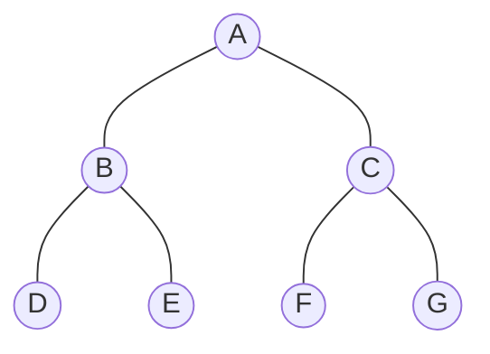
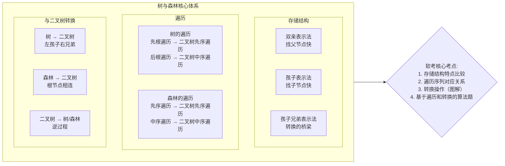
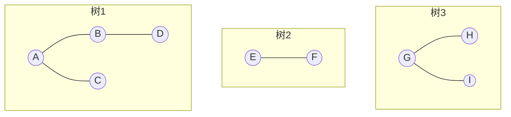
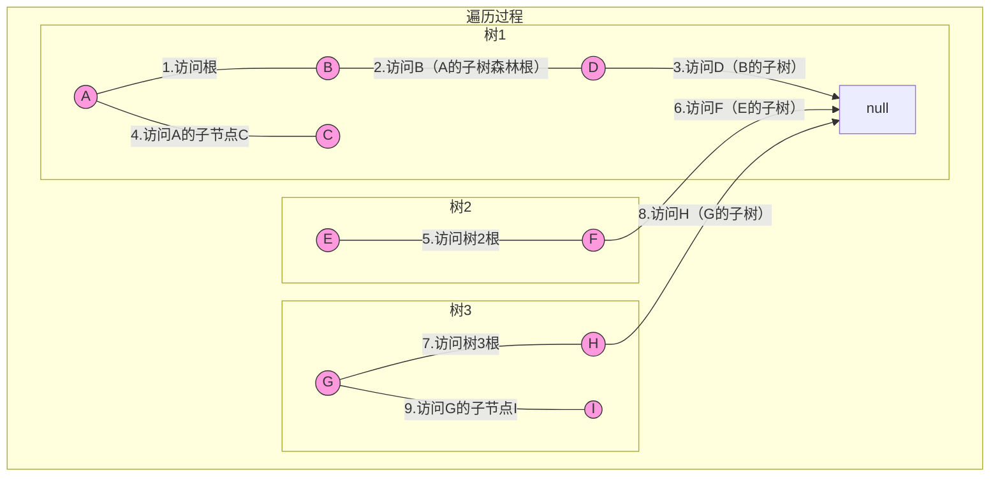
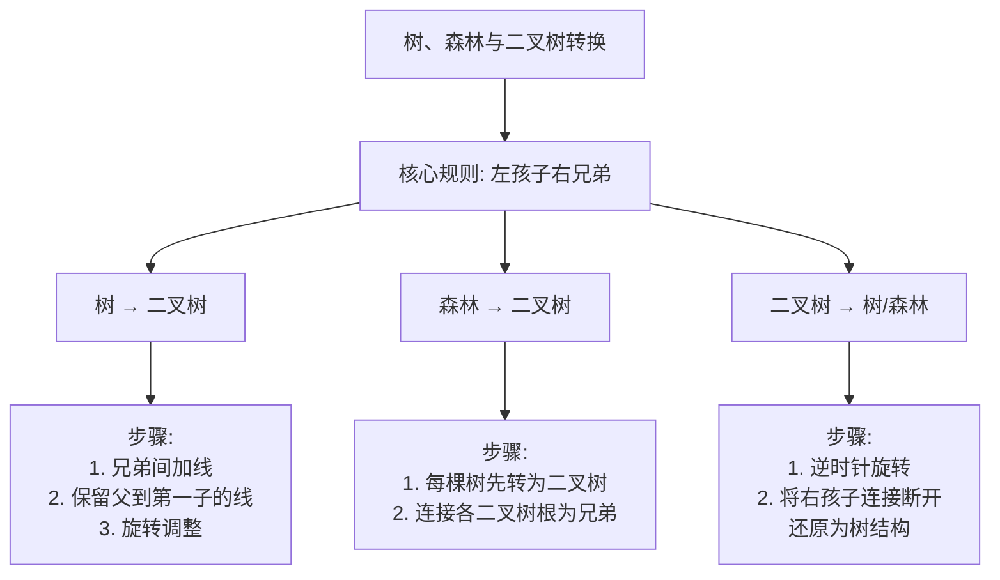

树形结构是重要的非线性结构，用于表示数据元素之间的层次关系。

## 一、 树的定义
树是 `n(n≥0)` 个结点的有限集。当 `n=0` 时，称为空树。对于非空树( `n>0` )，有且仅有一个特定的称为<font color='red'>根</font>的结点，其余结点可分为 `m(m≥0)` 个互不相交的有限集，每个集合本身又是一棵树，称为根的<font color='red'>子树</font>。


## 二、 基本术语

- **结点的度**：结点拥有的<font color='red'>子树数</font>
- **树的度**：树内<font color='red'>各结点的度的最大值</font>
- **叶子结点**：<font color='red'>度为0</font>的结点（终端结点）
- **分支结点**：<font color='red'>度不为0</font>的结点（非终端结点）
- **孩子结点**：一个<font color='red'>结点的子树的根</font>称为该结点的孩子
- **双亲结点**：<font color='red'>一个结点是其所有子树根的双亲</font>
- **兄弟结点**：同一双亲的孩子之间<font color='red'>互称兄弟</font>
- **结点的层次**：根为第一层，其孩子为第二层，以此类推
- **树的深度**：树中<font color='red'>结点的最大层次</font>
- **有序树**：树中结点的<font color='red'>各子树从左到右有次序（不能互换）</font>
- **无序树**：树中结点的<font color='red'>各子树无次序（可以互换）</font>
- **森林**：m(m≥0)棵互<font color='red'>不相交的树的集合</font>

## 三、二叉树

- 二叉树是n(n≥0)个结点的有限集合，该集合或者为空集（空二叉树），或者由一个根结点和两棵互不相交的、分别称为根结点的左子树和右子树的二叉树组成。
- 每个节点最多有两棵子树，且子树有左右之分。

### 3.1 二叉树的性质

1. 在二叉树的第 `i` 层上至多有 <font color='red'>$2^{i-1}$</font> 个结点(i≥1)
2. 深度为 `k` 的二叉树<font color='red'>至多</font>有 <font color='red'>$2^k - 1$</font> 个结点(k≥1)
3. **<font color='red'>重要性质</font>**：对任何一棵二叉树 `T` ，如果其终端结点数为 `n₀` ，度为2的结点数为 `n₂`，则 `n₀ = n₂ + 1`

:::warning **证明过程**  
设二叉树中结点总数为 $n$ ，度为 `1` 的结点数为 $n_1$ ，度为 `2` 的节点数为 $n_2$，
1. 则有<Badge text="公式1" type="warning"/>  ：

$$n = n_0 + n_1 + n_2$$

2. 再看二叉树中的分支数: 除根结点外，每个结点都有一个分支进入，设 `B` 为分支总数，则:

$$n = B + 1$$

由于这些分支都是由度为 `1` 或 `2` 的结点射出的，所以有：

$$B = n_1 + 2n_2$$

所以得到<Badge text="公式2" type="warning"/>：

$$n = n_1 + 2n_2 + 1$$

由<Badge text="公式1" type="danger"/>  和<Badge text="公式2" type="danger"/> 得：

$$n_0 + n_1 + n_2 = n_1 + 2n_2 + 1$$

最终得到

$$n_0 = n_2 + 1$$

:::

4. 具有 `n` 个结点的<font color='red'>完全二叉树</font>的深度为:  $log_2n + 1$
5. 对<font color='red'>完全二叉树按层编号</font>，则<font color='red'>对任意结点</font> `i` (1≤i≤n)有：
    - 如果 `i=1` ，则结点i是二叉树的根，无双亲
    - 如果 `i>1` ，则其双亲是结点 `i/2`
    - 如果 `2i>n` ，则结点 `i` 无左孩子；否则其左孩子是结点 `2i`
    - 如果 `2i+1>n` ，则结点 `i` 无右孩子；否则其右孩子是结点 `2i+1`

###  3.2 二叉树的遍历

定义一棵<font color='red'>二叉树</font>，节点值为 `A、B、C、D、E、F、G`，结构如下：
- 根节点：`A`
- A的左子树：以 `B` 为根，`B` 的左子树是 `D` ，`B` 的右子树是 `E`
- A的右子树：以 `C` 为根，`C` 的左子树是 `F` ，`C` 的右子树是 `G`

- 示例树图示



#### 3.2.1 深度优先遍历（DFS）
深度优先遍历优先沿<font color='red'>一条路径遍历至最深层</font>，再<font color='red'>回溯遍历</font>其他路径，核心分为3种：<font color='red'>前序、中序、后序</font>（"序"指<font color='red'>根节点的访问顺序</font>）。

##### 3.2.1.1 前序遍历（根→左→右）

- **遍历规则**:
    1. 先访问<font color='red'>根节点</font>；
    2. 递归遍历根节点的<font color='red'>左子树</font>（按前序规则）；
    3. 递归遍历根节点的<font color='red'>右子树</font>（按前序规则）。

- **示例树遍历过程**
    - 根A → 左子树（B）→ 根B → 左子树（D）→ 根D（无左右子树）→ 回溯B的右子树（E）→ 根E（无左右子树）→ <font color='red'>回溯A的右子树</font>（C）→ 根C → 左子树（F）→ 根F → 回溯C的右子树（G）→ 根G
    - **前序结果**：A → B → D → E → C → F → G

- 遍历路径（红色箭头为访问顺序）

    ```mermaid
    graph TD
        A((A)) ---|1| B((B))
        A((A)) ---|5| C((C))
        B((B)) ---|2| D((D))
        B((B)) ---|3| E((E))
        C((C)) ---|6| F((F))
        C((C)) ---|7| G((G))
        style A fill:#f9d,stroke:#333
        style B fill:#f9d,stroke:#333
        style D fill:#f9d,stroke:#333
        style E fill:#f9d,stroke:#333
        style C fill:#f9d,stroke:#333
        style F fill:#f9d,stroke:#333
        style G fill:#f9d,stroke:#333
    ```


##### 3.2.1.2 中序遍历（左→根→右）

- **遍历规则**:
    1. 递归遍历根节点的<font color='red'>左子树</font>（按中序规则）；
    2. 访问<font color='red'>根节点</font>；
    3. 递归遍历根节点的<font color='red'>右子树</font>（按中序规则）。

- **示例树遍历过程**
    - A的左子树（B）→ B的左子树（D）→ 根D → 回溯访问B → B的右子树（E）→ 根E → 回溯访问A → A的右子树（C）→ C的左子树（F）→ 根F → 回溯访问C → C的右子树（G）→ 根G
    - **中序结果**：D → B → E → A → F → C → G

- **遍历路径**

    ```mermaid
    graph TD
        A((A)) ---|4| B((B))
        A((A)) ---|5| C((C))
        B((B)) ---|1| D((D))
        B((B)) ---|3| E((E))
        C((C)) ---|6| F((F))
        C((C)) ---|8| G((G))
        style D fill:#9df,stroke:#333
        style B fill:#9df,stroke:#333
        style E fill:#9df,stroke:#333
        style A fill:#9df,stroke:#333
        style F fill:#9df,stroke:#333
        style C fill:#9df,stroke:#333
        style G fill:#9df,stroke:#333
    ```


##### 3.2.1.3 后序遍历（左→右→根）

- **遍历规则**:
    1. 递归遍历根节点的<font color='red'>左子树</font>（按后序规则）；
    2. 递归遍历根节点的<font color='red'>右子树</font>（按后序规则）；
    3. 访问<font color='red'>根节点</font>。

- **示例树遍历过程**
    - A的左子树（B）→ B的左子树（D）→ 根D → B的右子树（E）→ 根E → 回溯访问B → A的右子树（C）→ C的左子树（F）→ 根F → C的右子树（G）→ 根G → 回溯访问C → 回溯访问A
    - **后序结果**：D → E → B → F → G → C → A

- **遍历路径**

    ```mermaid
    graph TD
        A((A)) ---|7| B((B))
        A((A)) ---|6| C((C))
        B((B)) ---|1| D((D))
        B((B)) ---|2| E((E))
        C((C)) ---|3| F((F))
        C((C)) ---|4| G((G))
        style D fill:#df9,stroke:#333
        style E fill:#df9,stroke:#333
        style B fill:#df9,stroke:#333
        style F fill:#df9,stroke:#333
        style G fill:#df9,stroke:#333
        style C fill:#df9,stroke:#333
        style A fill:#df9,stroke:#333
    ```


#### 3.2.2 广度优先遍历（BFS）
广度优先遍历（又称<font color='red'>层次遍历</font>）按<font color='red'>树的层级顺序</font>访问节点，<font color='red'>先访问根节点</font>（第1层），再访问第2层所有节点，依次向下，<font color='red'>核心用队列</font>实现（先进先出）。

- **遍历规则**:
    1. 将根节点入队；
    2. 出队一个节点，访问它；
    3. 若该节点有左子节点，入队；若有右子节点，入队；
    4. 重复步骤2-3，直到队列为空。
    5. 一层一层，<font color='red'>先上后下，先左后右</font>

- **示例树遍历过程**
    - 队列初始：[A] → 出队A（访问）→ 入队B、C → 队列：[B,C]
    - 出队B（访问）→ 入队D、E → 队列：[C,D,E]
    - 出队C（访问）→ 入队F、G → 队列：[D,E,F,G]
    - 出队D（访问）→ 无子女 → 队列：[E,F,G]
    - 出队E（访问）→ 无子女 → 队列：[F,G]
    - 出队F（访问）→ 无子女 → 队列：[G]
    - 出队G（访问）→ 无子女 → 队空
    - **层次遍历结果**：A → B → C → D → E → F → G

- **遍历路径**

    ```mermaid
    graph TD
        A((A)) ---|1| B((B))
        A((A)) ---|2| C((C))
        B((B)) ---|3| D((D))
        B((B)) ---|4| E((E))
        C((C)) ---|5| F((F))
        C((C)) ---|6| G((G))
        style A fill:#f5a,stroke:#333
        style B fill:#f5a,stroke:#333
        style C fill:#f5a,stroke:#333
        style D fill:#f5a,stroke:#333
        style E fill:#f5a,stroke:#333
        style F fill:#f5a,stroke:#333
        style G fill:#f5a,stroke:#333
    ```


:::warning 软考真题解析（2023年软件设计师上午题）

**一、题干**  
某二叉树的中序遍历序列为 `a b c d e f`，后序遍历序列为 `a c e f d b`，则该二叉树的前序遍历序列为（ ）。

A. b d a c e f    
B. b d a c f e    
C. b a d f c e     
D. b a d c f e

**二、解题步骤（核心：由中序+后序推前序）**

1. **确定根节点**：后序遍历最后一个节点是根节点 → 根为 `b`；

2. **划分左右子树（中序）**：中序序列中，根 `b` 左侧是左子树（`a`），右侧是右子树（`c d e f`）；

3. **递归分析右子树**：
    - 右子树的后序序列：后序中根 `b` 之前的右侧部分（`c e f d`）→ 右子树的根是 `d`（后序最后一个）；
    - 右子树的中序序列：`c d e f` → 根 `d` 左侧是左子树（`c`），右侧是右子树（`e f`）；

4. **分析最右侧子树**：
    - 该子树的后序序列：`e f` → 根是 `f`；
    - 该子树的中序序列：`e f` → 根 `f` 左侧是左子树（`e`），右侧无；

5. **还原二叉树**（Mermaid图示）：

   ```mermaid
   graph TD
       b((b)) --- a((a))
       b((b)) --- d((d))
       d((d)) --- c((c))
       d((d)) --- f((f))
       f((f)) --- e((e))
   ```

6. **求前序遍历**（根→左→右）：`b → a → d → c → f → e` → 对应选项 D。

:::

#### 3.2.3、核心考点总结

| 遍历类型 | 核心规则  | 实现方式 | 软考高频场景       |
|------|-------|------|--------------|
| 前序遍历 | 根→左→右 | 递归/栈 | 构建二叉树、复制树    |
| 中序遍历 | 左→根→右 | 递归/栈 | 与后序/前序结合推树结构 |
| 后序遍历 | 左→右→根 | 递归/栈 | 销毁树、计算树的高度   |
| 层次遍历 | 按层级访问 | 队列   | 求树的宽度、层序处理   |


### 3.3 特殊二叉树

构造特殊的二叉树，常见的有<font color='red'>满二叉树、完全二叉树、二叉排序树、平衡二叉树、线索二叉树、哈夫曼树(最优二叉树)、B树和B+树</font>

#### 3.3.1 满二叉树 (Full Binary Tree)

- **定义**：一棵深度为 `k` 且具有 <font color='red'>$2^k - 1$</font> 个结点的二叉树。
- **特点**：
    1.  每一层上的结点数都达到<font color='red'>最大值</font>。
    2.  <font color='red'>所有叶子结点</font>都出现在<font color='red'>最底层</font>。
    3.  <font color='red'>不存在度为 `1` 的</font>结点（每个结点要么有 `0` 个孩子，要么有 `2` 个孩子）。
- **示意图**：
    ```
             1
           /   \
          2     3
         / \   / \
        4   5 6   7    // 深度3，结点数7 = 2^3 - 1
    ```

#### 3.3.2 完全二叉树 (Complete Binary Tree)

- **定义**：深度为 `k` 的，有 `n` 个结点的二叉树，当且仅当其每一个结点都与深度为 `k` 的<font color='red'>满二叉树中编号从 1 到 n 的结点一一对应</font>时，称为完全二叉树。
- **特点**：
    1.  叶子结点只能出现在<font color='red'>最下两层</font>。
    2.  最下层的叶子结点都<font color='red'>依次排列在该层最左边</font>的位置。
    3.  如果有度为 1 的结点，只可能有一个，且该结点<font color='red'>只有左孩子</font>。
    4.  同样结点的二叉树，<font color='red'>完全二叉树的深度最小</font>。
    5.  是<font color='red'>堆结构</font>的实现基础。
- **示意图**：
    ```
             1
           /   \
          2     3
         / \   /
        4   5 6        // 编号与满二叉树的前6个编号一致。
                       // 结点6是最后一个结点，对应满二叉树中编号6的位置。
    ```
- **与非完全二叉树的区别**：
    ``` 
         1
       /   \
      2     3
     / \     \
    4   5     6    // 这不是完全二叉树，因为结点3没有左孩子，
                   // 但却有右孩子，破坏了 【依次排列在最左边】 的规则。
    ```

#### 3.3.3 二叉排序树 (Binary Sort Tree, BST)

- **定义**：一棵空树，或者是具有如下性质的二叉树：
    1.  若它的左子树不空，则<font color='red'>左子树上所有结点的值均小于</font>它的根结点的值。
    2.  若它的右子树不空，则<font color='red'>右子树上所有结点的值均大于</font>它的根结点的值。
    3.  它的<font color='red'>左、右子树也分别为二叉排序树</font>。

- **特点**：
    1.  **<font color='red'>中序遍历</font>**二叉排序树，会得到一个**<font color='red'>递增的有序序列</font>**。
    2.  查找、插入、删除的时间复杂度**<font color='red'>取决于树的形态</font>**。最好为 `O(log n)`（形态比较平衡），最坏为 `O(n)`（退化成单支树）。

- **示意图**：
    ```
        4
       / \
      2   6
     / \ / \
    1  3 5  7     // 对于任意结点，左小右大。
                  // 中序遍历（左 -> 根 -> 右）：1, 2, 3, 4, 5, 6, 7
    ```

#### 3.3.4 平衡二叉树 (Balanced Binary Tree, AVL Tree)

- **定义**：首先<font color='red'>是二叉排序树</font>，并且任何结点的<font color='red'>左右子树的高度差的绝对值不超过 1</font>（即平衡因子 `BF ∈ {-1, 0, 1}`）。

- **特点**：
    1.  是<font color='red'>二叉排序树的高效形态</font>，保证了查找、插入、删除的时间复杂度为 <font color='red'>$O(log n)$</font>。
    2.  在插入和删除操作后，需要通过<font color='red'>**旋转**</font>（LL, RR, LR, RL）来重新平衡树。

- **示意图（平衡 vs 不平衡）**：
    ```
    // 平衡的AVL树                            // 不平衡的BST（不是AVL树）
        5                                      3
       / \                                    /
      2   7                                  2
     / \ /                                  /
    1  4 6                                 1
    (BF: 左子树高和右子树高绝对值不超过1)    (BF: 根节点左子树高和右子树高绝对值超过 1 为 2，违反平衡)
    ```


#### 3.3.5 哈夫曼树 (Huffman Tree) / 最优二叉树

- **定义**：给定 `n` 个权值作为 `n` 个叶子结点，构造一棵二叉树，若该树的<font color='red'>带权路径长度 (WPL) 达到最小</font>，则称为最优二叉树，也称哈夫曼树。

- **相关概念**：
    *   **路径长度**：路径上的分支数目。
    *   **结点的带权路径长度**：结点的权值 * 其路径长度。
    *   **树的带权路径长度 (WPL)**：树中<font color='red'>所有叶子结点</font>的带权路径长度之和。

- **特点**：
    1.  <font color='red'>权值越大的结点离根越近</font>。
    2.  <font color='red'>不存在度为 1 的结点</font>（即哈夫曼树也是正则二叉树）。
    3.  用于<font color='red'>哈夫曼编码</font>，是一种高效的数据压缩算法。

- **示意图**（权值：A=5, B=15, C=40, D=30, E=10）：
    ``` 
             [100]
            /    \ 
        (40)C    [60]       
                /    \ 
              [30]    (30)D    
              /   \ 
            [15]   (15)B 
           /   \    
        (5)A (10)E  
    ```
    - WPL：20 + 40 + 45 + 60 + 40 = 205
        - A(5): 路径长度4 → 5×4 = 20
        - E(10): 路径长度4 → 10×4 = 40
        - B(15): 路径长度3 → 15×3 = 45
        - D(30): 路径长度2 → 30×2 = 60
        - C(40): 路径长度1 → 40×1 = 40


---

#### 3.3.6 线索二叉树 (Threaded Binary Tree)

- **定义**：对二叉树<font color='red'>以某种次序</font>进行<font color='red'>遍历并将其空指针域加以利用</font>。如果某个结点的<font color='red'>左孩子为空，则将其左指针指向前驱</font>结点；如果<font color='red'>右孩子为空，则将其右指针指向后继</font>结点。这种附加的指针称为<font color='red'>"线索"</font>。

- **特点**：
    1.  充分利用空指针域（`n` 个结点的二叉树有 `n+1` 个空指针域）。
    2.  无需<font color='red'>递归或栈</font>即可实现二叉树的中序、先序等遍历，提高了效率。
    3.  便于查找结点的前驱和后继。

- **示意图（中序线索化）**：
    ```
            // 普通二叉树         // 中序线索二叉树 (虚线为线索)
            1                   1
           / \                 / \ 
          2   3               2   3
         / \                 / \
        4   5               4   5
        // 中序: 4,2,5,1,3   // 4的右指针指向2 (后继)
                             // 5的右指针指向1 (后继)
                             // 3的左指针指向1 (前驱 需看具体实现)，右指针为空
    ```


## 五、树和森林

树和森林的核心知识点、相互关系及转换规则如下所示



### 5.1 树的存储结构

常用的树的存储有<font color='red'>双亲表示法</font>、<font color='red'>孩子表示法</font>和<font color='red'>孩子兄弟</font>表示法。

#### 5.1.1 树的双亲表示法

1. **方法**：该表示法用一组地址连续的单元存储树的结点，并在每个结点中附设一个指示器（指针），指出其<font color='red'>双亲结点在该存储结构中的位置</font>(即结点所在<font color='red'>数组元素的下标</font>)，根节点的 `parent` 为 `-1`。
2. **优点**：这种表示法对于求<font color='red'>指定结点的双亲和祖先</font>都十分<font color='red'>方便</font>，时间复杂度： `O(1)`
3. **缺点**：但对于求<font color='red'>指定结点的孩子及后代</font>则需要遍历整个数组，时间复杂度： `O(n)` ， `n` 为树中节点总数
4. 示意图：

    ```mermaid
    flowchart TD
    subgraph S1 [逻辑上的树结构]
        A1((A)) --- B1((B))
        A1 --- C1((C))
        B1 --- D1((D))
        B1 --- E1((E))
        C1 --- F1((F))
        E1 --- G1((G))
        E1 --- H1((H))
    end

    S1 -- 转换为双亲表示法 --> S2

    subgraph S2 [物理存储: 数组结构]
        subgraph Header
            R[根节点索引: 0]
            N[节点总数: 8]
        end

        subgraph Array[存储数组 nodes]
            Index0["nodes[0]<br>data: 'A'<br>parent: -1"]
            Index1["nodes[1]<br>data: 'B'<br>parent: 0"]
            Index2["nodes[2]<br>data: 'C'<br>parent: 0"]
            Index3["nodes[3]<br>data: 'D'<br>parent: 1"]
            Index4["nodes[4]<br>data: 'E'<br>parent: 1"]
            Index5["nodes[5]<br>data: 'F'<br>parent: 2"]
            Index6["nodes[6]<br>data: 'G'<br>parent: 4"]
            Index7["nodes[7]<br>data: 'H'<br>parent: 4"]
        end
    end

    %% 连接逻辑节点和其在数组中的位置
    A1 -.-> Index0
    B1 -.-> Index1
    C1 -.-> Index2
    D1 -.-> Index3
    E1 -.-> Index4
    F1 -.-> Index5
    G1 -.-> Index6
    H1 -.-> Index7
    ```


#### 5.1.2 树的孩子表示法

1. **方法**：该表示法在存储结构中用指针指示出<font color='red'>结点的每个孩子</font>,为树中每个<font color='red'>结点的孩子</font>建立一个<font color='red'>链表</font>,即令每个结点的<font color='red'>所有孩子结点构成一个用单链表</font>表示的线性表,则`n` 个结点的树具有 `n`个单链表。将这个单链表的<font color='red'>头指针又排成一个线性表</font>。
2. **优点**：查找<font color='red'>指定节点</font>的<font color='red'>所有孩子效率极高</font>。只需遍历该节点的孩子链表即可。
3. **缺点**：查找<font color='red'>指定节点</font>的<font color='red'>父节点效率很低</font>。必须遍历所有头节点的孩子链表，时间复杂度为 `O(n)` ， `n` 为树中节点总数。
4. 示意图：
    
    ```mermaid
    flowchart TD
    subgraph S1 [逻辑上的树结构]
        R1((R)) --- A1((A))
        R1 --- B1((B))
        R1 --- C1((C))
        A1 --- D1((D))
        A1 --- E1((E))
        C1 --- F1((F))
    end

    S1 -- 转换为孩子表示法 --> S2

    subgraph S2 [物理存储: 孩子表示法]
        subgraph HeaderArray[头节点数组]
            H0["data: 'R'<br>firstChild: →"]
            H1["data: 'A'<br>firstChild: →"]
            H2["data: 'B'<br>firstChild: □"]
            H3["data: 'C'<br>firstChild: →"]
            H4["data: 'D'<br>firstChild: □"]
            H5["data: 'E'<br>firstChild: □"]
            H6["data: 'F'<br>firstChild: □"]
        end

        subgraph ChildLinkList[孩子链表]
            N0["child: 1 (A)<br>next: →"]
            N1["child: 2 (B)<br>next: →"]
            N2["child: 3 (C)<br>next: □"]
            N3["child: 4 (D)<br>next: →"]
            N4["child: 5 (E)<br>next: □"]
            N5["child: 6 (F)<br>next: □"]
        end
    end

    %% 连接头节点到孩子链表
    H0 --- N0
    N0 --- N1
    N1 --- N2
    H1 --- N3
    N3 --- N4
    H3 --- N5

    %% 说明
    N2 -.->|NULL| NULL1[□: 表示NULL空指针]
    ```

#### 5.1.3 树的孩子兄弟表示法

1. **方法**：孩子兄弟表示法又称为<font color='red'>二叉链表表示法</font>,它在链表的结点中<font color='red'>设置两个指针</font>域分别指向该结点的<font color='red'>第一个孩子</font>和<font color='red'>下一个兄弟</font>。

4. **优点**：
   1. <font color='red'>实现简单，结构统一</font>：所有结点类型相同，操作方便。
   2. <font color='red'>节省空间</font>：无论结点的度是多少，每个结点都只有两个指针域，空间利用率高。
   3. <font color='red'>转换桥梁</font>：这是最重要的优点。它可以将任何复杂的树或森林转换为唯一的二叉树形态，从而能利用二叉树成熟的理论和算法来处理树和森林。

4. **缺点**：
   1. <font color='red'>查找父结点困难</font>：从当前结点出发<font color='red'>无法直接找到其父结点</font>，只能从<font color='red'>根开始遍历查找</font>（除非额外添加一个 parent 指针域）。
   2. <font color='red'>查找指定排名的孩子慢</font>：如果要找某个结点的第 `k` 个孩子，必须从第一个孩子开始，通过 `nextSibling` 指针遍历 `k-1` 次才能找到。

5. **示意图**：

    ```mermaid
    flowchart LR
    subgraph S1 [普通树逻辑结构]
        R1((R)) --- A1((A))
        R1 --- B1((B))
        R1 --- C1((C))
        A1 --- D1((D))
        A1 --- E1((E))
        C1 --- F1((F))
    end

    S1 -- 应用“左孩子右兄弟”规则转换 --> S2

    subgraph S2 [正确的孩子兄弟表示法]
        R2((R)) --- A2((A))
        R2 -.- R2_n[NULL]
        A2 --- D2((D))
        A2 --- B2((B))

        B2 --- C2((C))
        C2 --- F2((F))
        C2 -.- C2_n[NULL]

        D2 --- E2((E))
        D2 -.- D2_n[NULL]
        E2 -.- E2_n[NULL]
        F2 -.- F2_n[NULL]
        B2 -.- B2_n[NULL]

        linkStyle 7 stroke:red,stroke-width:2px
        linkStyle 9 stroke:red,stroke-width:2px
        linkStyle 10 stroke:blue,stroke-width:2px
        linkStyle 11 stroke:blue,stroke-width:2px
        linkStyle 12 stroke:red,stroke-width:2px
        linkStyle 14 stroke:blue,stroke-width:2px

        Note1[蓝色连线: nextSibling指针<br>红色连线: firstChild指针]
    end
    ```

6. **查找时间复杂度分析**

在孩子兄弟表示法中，查找操作的时间复杂度取决于具体的查找类型：

| 查找操作                | 时间复杂度                             | 原因分析                                              |
|:--------------------|:----------------------------------|:--------------------------------------------------|
| **查找结点 X 的第一个孩子**   | **<font color='red'>O(1)</font>** | 通过 `X->firstChild` 指针可直接访问。                       |
| **查找结点 X 的下一个兄弟**   | **<font color='red'>O(1)</font>** | 通过 `X->nextSibling` 指针可直接访问。                      |
| **查找结点 X 的第 k 个孩子** | **<font color='red'>O(k)</font>** | 必须从 `firstChild` 开始，依次访问 `nextSibling` 共 `k-1` 次。 |
| **查找结点 X 的父结点**     | **<font color='red'>O(n)</font>** | **最坏情况**下需要从根结点开始遍历整棵树才能确定父结点。                    |


### 5.2 树和森林的遍历

#### 5.2.1 树的遍历

由于树中的每个节点可以有多个子树，因此遍历树的方法有<font color='red'>两种</font>，即<font color='red'>先根遍历和后根遍历</font>（二叉树有三种）

1. **树的先根遍历**：<font color='red'>先访问树的根节点</font>，然后依次先根遍历各棵子树，对于先根遍历可参照<font color='red'>二叉树的先序遍历</font>。
2. **树的后根遍历**：<font color='red'>先依次遍历各棵子树</font>，然后访问树根节点，对于后根遍历可参照<font color='red'>二叉树的中序遍历</font>

#### 5.2.2 森林的遍历

按照森林和树的相互递归定义，可得出森林有两种遍历方式

1. **先序遍历森林**(先访根，再访子，最后访邻树)：若森林非空，先访问森林中<font color='red'>第一棵树的根结点</font>，最后在<font color='red'>先序</font>遍历<font color='red'>第一棵树中根节点的子树森林</font>，再<font color='red'>先序遍历</font>除去第一棵树之后剩余的树构成的森林。
2. **中序遍历森林**(先访子，再访根，最后访邻树)：若森林非空，先<font color='red'>中序遍历森林中第一棵树</font>的根结点的子树森林，再访问<font color='red'>第一棵树的根结点</font>，最后<font color='red'>中序遍历</font>除去第一棵树之后<font color='red'>剩余的树构成的森林</font>。

#### 5.2.2.1 遍历示意图

- 有以下森林



- **先序遍历**：A → B → D → C → E → F → G → H → I




- **中序遍历**：结果 D → B → A → C → F → E → H → G → I
  
    ```mermaid
     graph TD
    %% 树1
    subgraph 树1
        A((A)) --- B((B))
        A((A)) --- C((C))
        B((B)) --- D((D))
        D((D)) -->|1.遍历B的子树D| null
        B((B)) ---|2.访问B（子树遍历后）| A((A))
        A((A)) ---|3.访问A（子树遍历后）| C((C))
        C((C)) -->|4.访问C（A的子树）| null
    end
    %% 树2
    subgraph 树2
        E((E)) --- F((F))
        F((F)) -->|5.遍历E的子树F| null
        E((E)) -->|6.访问E（子树遍历后）| null
    end
    %% 树3
    subgraph 树3
        G((G)) --- H((H))
        G((G)) --- I((I))
        H((H)) -->|7.遍历G的子树H| null
        G((G)) ---|8.访问G（子树遍历后）| I((I))
        I((I)) -->|9.访问I（G的子树）| null
    end
    style D fill:#9df,stroke:#333
    style B fill:#9df,stroke:#333
    style A fill:#9df,stroke:#333
    style C fill:#9df,stroke:#333
    style F fill:#9df,stroke:#333
    style E fill:#9df,stroke:#333
    style H fill:#9df,stroke:#333
    style G fill:#9df,stroke:#333
    style I fill:#9df,stroke:#333
    ```


#### 5.2.2.2 核心概念总结说明

1. **先序遍历森林**的规则：
    - 访问森林中第一棵树的根结点
    - 先序遍历第一棵树中根结点的子树森林
    - 先序遍历除去第一棵树之后剩余的树构成的森林

2. **中序遍历森林**的规则：
    - 中序遍历森林中第一棵树的根结点的子树森林
    - 访问第一棵树的根结点
    - 中序遍历除去第一棵树之后剩余的树构成的森林

3. **重要特性**：
    - 森林的先序遍历序列与其对应二叉树的先序遍历序列相同
    - 森林的中序遍历序列与其对应二叉树的中序遍历序列相同


### 5.3 树、森林和二叉树之间的相互转换

- 树、森林和二叉树之间可以进行<font color='red'>互相转换</font>，即任何一个森林或者一个树都可以表现为一棵二叉树，而任何一个二叉树也能对应到一个森林或者一棵树。
- 树、森转换成二叉树：利用<font color='red'>树的孩子兄弟表示法</font>，可导出树和二叉树的对应关系，一棵树可以转换成唯一的一棵二叉树。
- 二叉树转换成森林、树：一棵二叉树可以转换成<font color='red'>唯一</font>的一棵树或者森林

#### 5.3.1 核心转换规则



#### 5.3.2 树 → 二叉树

- **转换步骤**：左孩子，右兄弟，<font color='red'>将兄弟节点作为右子树的节点</font>。
  1. 在所有兄弟节点之间加一条连线。
  2. 对每个节点，只保留它与第一个孩子的连线，删除它与其他孩子的连线。
  3. （可选）以树的根节点为轴心，将整棵树顺时针旋转一定角度，使其层次结构更清晰。

- **示例**：

  - **有以下树**：

    ```mermaid
    graph TD
        A((A)) --- B((B))
        A((A)) --- C((C))
        A((A)) --- D((D))
        B((B)) --- E((E))
        B((B)) --- F((F))
    ```

  - **转换过程**： `null` 为空节点，不指向任何数据

    ```mermaid
    flowchart LR
        subgraph S1[第一步：兄弟间加线]
            direction TB
            A1((A)) --- B1((B))
            A1 --- C1((C))
            A1 --- D1((D))
            B1 --- E1((E))
            B1 --- F1((F))
            %% 兄弟连线
            B1 -.-> C1
            C1 -.-> D1
            E1 -.-> F1
        end
    
        S1 -- 第二步：去线保留父与第一子 --> S2
    
        subgraph S2[第二步：保留父到第一子的线]
            direction TB
            A2((A)) --- B2((B))
            B2 --- E2((E))
            B2 -.-> F2((F))
            C2((C)) -.-> D2((D))
            E2 -.-> F2
    
            linkStyle 3 stroke-dasharray: 5 5
            linkStyle 4 stroke-dasharray: 5 5
            linkStyle 5 stroke-dasharray: 5 5
        end
    
        S2 -- 第三步：旋转调整 --- S3
    
        subgraph S3[第三步：得到二叉树形态]
            direction TB
            A3((A)) --- B3((B))
            A3((A)) --- null0((null))
            B3 --- E3((E))
            B3 --- C3((C))
            C3 --- null1((null))
            C3 --- D3((D))
            E3 --- null((null))
            E3 --- F3((F))
    
            linkStyle 6 stroke:blue,stroke-width:2px
            linkStyle 7 stroke:red,stroke-width:2px
            linkStyle 8 stroke:red,stroke-width:2px
            linkStyle 9 stroke:red,stroke-width:2px
        end
    ```

  - **最终二叉树结构**： `null` 为空节点，不指向任何数据

      ```mermaid
      graph TD
          A3((A)) --- B3((B))
          A3((A)) --- null0((null))
          B3 --- E3((E))
          B3 --- C3((C))
          C3 --- null1((null))
          C3 --- D3((D))
          E3 --- null((null))
          E3 --- F3((F))
        
      ```


#### 5.3.2 森林 → 二叉树

- **转换步骤**：
  1. 将森林中的<font color='red'>每棵树分别转换为二叉树</font>（方法同上）。
  2. 从<font color='red'>第一棵二叉树开始</font>，将其<font color='red'>根节点作为最终二叉树的根</font>。
  3. 将第二棵二叉树的根作为<font color='red'>第一棵二叉树根的右兄弟</font>（即作为其右指针）。
  4. 将第三棵二叉树的根作为<font color='red'>第二棵二叉树根的右兄弟</font>，以此类推。

- **示例**：

  - **有以下森林**：

      ```mermaid
      graph TD
    subgraph S2[树2]
            direction TB
            D((D)) --- E((E))
            D((D)) --- F((F))
        end
        subgraph S1[树1]
            direction TB
            A((A)) --- B((B))
            A((A)) --- C((C))
        end
      ```
    
    - **转换过程**： `null` 为空节点，不指向任何数据
      ```mermaid
      flowchart LR
          subgraph S1[第一步：每棵树转为二叉树]
            direction TB
                A1((A)) --- B1((B))
                A1 --- C1((C))
        
                D1((D)) --- E1((E))
                D1 --- F1((F))
          end

          S1 -- 第二步：连接各二叉树根节点 --> S2
    
          subgraph S2[第二步：连接成一颗二叉树]
              direction TB
              A2((A)) --- B2((B))
              A2 --- D2((D))
              B2 --- C2((C))
              D2 --- E2((E))
              D2 --- F2((F))
    
              linkStyle 4 stroke:red,stroke-width:2px
          end
      ```
    - **最终二叉树结构**： `null` 为空节点，不指向任何数据
      ```mermaid
        graph TD
            A((A)) --- B((B))
            A((A)) --- D((D))
            B --- null0((null))
            B --- C((C))
            D --- E((E))
            D --- F((F))
        ```

#### 5.3.3 二叉树 → 树/森林

- **转换步骤**：
  1. 若某结点 X 是其双亲的左孩子，则 X 的所有右链上的结点都是其兄弟，也是其双亲的孩子。
  2. 将这些右指针连接起来。
  3. 去掉所有结点与右孩子的原始连接（即原二叉树中表示“兄弟关系”的右指针），恢复为树的结构。
  4. 将二叉树的根节点，以及其右链上的所有节点（即原森林中各树的根），分离为多棵树，形成森林。

- **示例**：
  - **有以下二叉树**：

    ```mermaid
    graph TD
        A((A)) ---B((B))
        A ---E((E))
        B ---C((C))
        B ---D((D))
        E ---F((F))
        E ---G((G))
        G ---H((H))
        G ---null((null))
    ```
    
    1. **确定孩子兄弟关系**：
    ```mermaid
    graph TD
        A((A)) ---|左子树（孩子）| B((B))
        A ---|右子树（兄弟）| E((E))
        B ---|左子树（孩子）| C((C))
        B ---|右子树（兄弟）| D((D))
        E ---|左子树（孩子）| F((F))
        E ---|右子树（兄弟）| G((G))
        G ---|左子树（孩子）| H((H))
        G ---null((null))
    ```
  
    2. **确定第一棵树**：第一棵树为根节点的左子树
    ```mermaid
    graph TD
        A((A)) ---B((B))
        A --- D((D))
        B ---C((C))
        B ---null((null))
    ```
    3. **确定第二棵树**：第二棵树为根节点的右子树的节点加当前节点的左子树节点
    ```mermaid
    graph TD
        E((E)) ---F((F))
        E((E)) ---null((null))
    ```
    2. **确定第三棵树**：第三棵树为根节点的右子树节点的右子树节点加左子树节点
    ```mermaid
    graph TD
        G((G)) ---H((H))
        G((G)) ---null((null))
    ```
  - **转换结果**：
  ```mermaid
    graph TD
    subgraph S3[树3]
        direction TB
        G((G)) ---H((H))
        G((G)) ---null2((null))
    end
    subgraph S2[树2]
        direction TB
        E((E)) ---F((F))
        E((E)) ---null1((null))
    end
    subgraph S1[树1]
        direction TB
        A((A)) ---B((B))
        A --- D((D))
        B ---C((C))
        B ---null((null))
    end
  ```