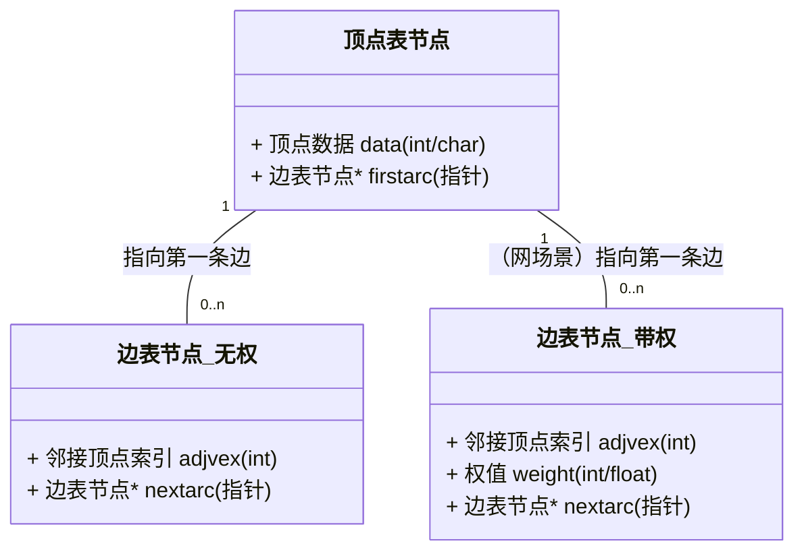
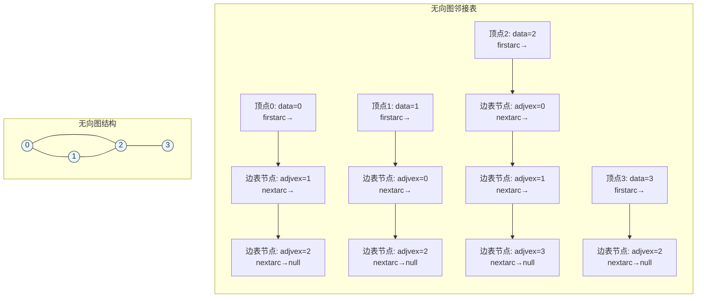
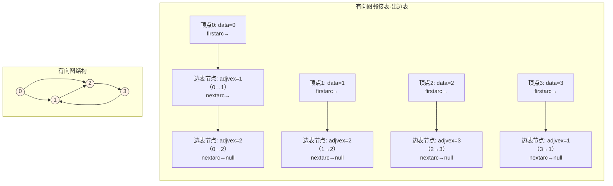
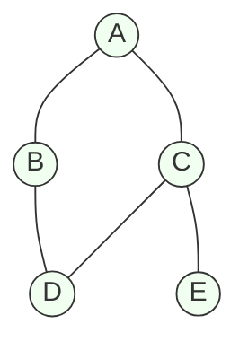
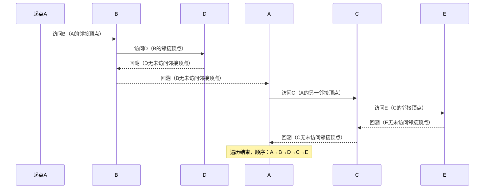
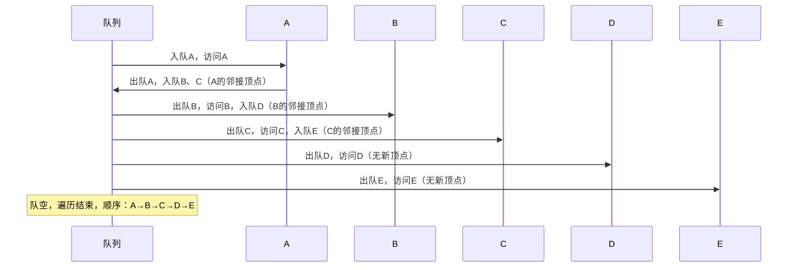
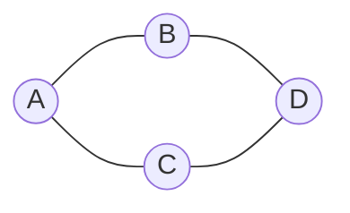

图是比树结构更复杂的一种数据结构，表示<font color='red'>多对多的关系</font>。 在线性结构中,除首结点没有前驱、末尾结点没有后继外,一个结点只有唯一的一个直接前驱和唯一的一个直接后继。 在树结构中,除根结点没有前驱结点外,其余的每个结点只有唯一的一个前驱(双亲)结点和多个后继(子树)结点。 在图中,<font color='red'>任意两个结点</font>之间<font color='red'>都可能有直接的关系</font>,所以图中一个结点的<font color='red'>前驱结点和后继结点的数目</font>是<font color='red'>没有限制的</font>。

## 一、图的定义与存储

### 1.1 图的定义

图 `G` 是由集合 `V` 和 `E` 构成的二元组, 记作 $G = (V,E)$, 其中, `V` 是图中顶点的非空有限集合,
`E` 是图中边的有限集合。从数据结构的逻辑关系角度来看,图中任一顶点都有可能与其他顶点
有关系,而图中<font color='red'>所有顶点都有可能与某一顶点</font>有关系。在图中,<font color='red'>数据元素用顶点</font>表示,数据<font color='red'>元
素之间的关系用边</font>表示。

#### 1.1.1 重要概念

1. **顶点（Vertex）**：图中的<font color='red'>数据元素</font>，也称为"节点"。
2. **边（Edge）**：图中顶点之间的<font color='red'>逻辑关系</font>。边<font color='red'>可以是无方向的，也可以是有方向的</font>。
3. **无向图（Undirected Graph）**：<font color='red'>边没有方向</font>。若顶点 `V1` 到 `V2` 有一条边，则可以从 `V1` 到 `V2`，也可以从 `V2` 到 `V1`。边用 `(V1, V2)` 表示。
   - **度（Degree）**：与顶点相关联的边的数量。
   - 边无箭头，仅表示 “关联关系”，无方向属性；
   - 无向图的邻接矩阵<font color='red'>一定对称</font>（若 $A[i][j] = 1$，则 $A[j][i] = 1$)
4. **有向图（Directed Graph / Digraph）**：<font color='red'>有方向</font>。从 `V1` 指向 `V2` 的边（箭头），只能从 `V1` 到 `V2`，<font color='red'>不能反向</font>。边用 `<V1, V2>` 表示。
    - **入度（In-degree）**：与顶点相关联的边的数量。
    - **出度（Out-degree）**：从该顶点指出的边的数量。
    - 有向图的<font color='red'>邻接矩阵通常不对称</font>。
    - 边的方向决定 “路径的单向性”。
5. **权（Weight）**：边可以<font color='red'>有一个数值</font>，用来表示<font color='red'>从一个顶点到另一个顶点的距离、耗费等</font>信息。带权的图称为<font color='red'>网图（Net Graph）</font>。
6. **完全图**：任意两个顶点之间都存在一条边的图。
   - **无向完全图**：有 `n` 个顶点的无向完全图，其边的总数为 <mark>$n(n-1)/2$</mark>。
   - **有向完全图**：有 `n` 个顶点的有向完全图，其边的总数为 <mark>$n(n-1)$</mark>（因为每个顶点都向其他所有顶点发出边，且是双向的）。
   - 完全图是<font color='red'>边数最多</font>的图结构。
   - **示意图**：
    ```mermaid
    graph TD
        subgraph S1[无向完全图]
            direction LR
            A((A)) --- B((B))
            A --- C((C))
            A --- D((D))
            B --- C
            B --- D
            C --- D
            style A fill:#fff2e6,stroke:#333
            style B fill:#fff2e6,stroke:#333
            style C fill:#fff2e6,stroke:#333
            style D fill:#fff2e6,stroke:#333
        end
        subgraph S2[有向完全图]
            direction LR
            A1((A)) --> B1((B))  
            B1 --> A1((A))        
            A1 --> C1((C))        
            C1 --> A1((A))        
            B1 --> C1((C))        
            C1 --> B1((B))        
            style A1 fill:#fff2e6,stroke:#333
            style B1 fill:#fff2e6,stroke:#333
            style C1 fill:#fff2e6,stroke:#333

        end
    ```
7. **连通图与连通分量**：在<font color='red'>无向图</font> `G` 中，如果从顶点 `v` 到顶点 `w` <font color='red'>有路径</font>，则称 `v` 和 `w` 是连通的。如果<font color='red'>图中任意两个顶点都是连通的</font>，则称图 `G` <font color='red'>为连通图</font>。
   - **连通分量**：无向图中的<font color='red'>极大连通子图</font>，要求该<font color='red'>连通子图包含其所有的边</font>（再加入任何其他顶点或边都会破坏它的连通性），一个无向图<font color='red'>可能不是连通图</font>，但它<font color='red'>可以由多个连通分量构成</font>。连通分量可以看作是图的一个“连通部分”。
   - **示意图**：
    ```mermaid
    graph TD
        subgraph S2[非连通图]
        direction LR
            A2((A)) --- B2((B))
            A2 --- D2((D))
            B2 --- C2((C))
            C2 --- D2
            E((E))
        end
        subgraph S1[连通图]
        direction LR
            A((A)) --- B((B))
            A --- D((D))
            B --- C((C))
            C --- D
        end

    ```
8. **强连通图与强连通分量**：<font color='red'>针对有向图</font>，在有向图 $G$ 中，如果对于每一对顶点 $v_i$, $v_j$ $∈ V$ 且（$v_i ≠ v_j$），从 $v_i$ 到 $v_j$ 和从 $v_j$ 到 $v_i$ 都存在路径，则称 $G$ 是强连通图。
   - **强连通图**：<font color='red'>任意两个顶点可以互相到达</font>。
   - **强连通分量**：有向图中的<font color='red'>极大连通子图称为有向图的强连通分量</font>，一个<font color='red'>有向图通常不是强连通的</font>，但它可以包含一个或多个强连通分量。求解有向图的强连通分量是图算法中的一个重要问题（常用 Kosaraju 或 Tarjan 算法）。
   - **示意图**：
    ```mermaid 
        graph LR
            subgraph S1[示例]
            direction RL
                %% 路径1：A→B
                A((A)) --> B((B))  
                %% 路径2：B→C
                B --> C((C))        
                %% 路径3：C→A（闭环关键）
                C --> A((A))        
                style A fill:#f0fff0,stroke:#333,stroke-width:2px
                style B fill:#f0fff0,stroke:#333,stroke-width:2px
                style C fill:#f0fff0,stroke:#333,stroke-width:2px
            end
        E[A,B,C: 任意两点双向可达：A→B→C→A，B→C→A→B，C→A→B→C]
    ```
9. **网**：<font color='red'>边(或弧)带权值</font>的图称为网。
   - 图中的<font color='red'>每条边都被赋予一个具体的数值</font>（权值，Weight）。这个权值<font color='red'>可以表示现实世界中的各种成本</font>，如距离、时间、费用、容量等。
   - 在邻接矩阵中，$A[i][j]$ 存储的不再是 `1`，而是权值 <font color='red'>$w$</font>；用<font color='red'>一个很大的数</font>（如 $∞$）或 $0$ 表示<font color='red'>边不存在</font>。在邻接表中，<font color='red'>边表的节点</font>需要<font color='red'>增加一个数据域来存储权值</font>。
   - **示意图**：
    ```mermaid
        flowchart LR
            A((A))
            B((B))
            C((C))
            D((D))
        
            A -- "5" --> B
            A -- "7" --> D
            B -- "4" --> C
            C -- "8" --> A
            C -- "2" --> D
            D -- "3" --> B    
    ```
10. **有向树**：如果一个有向图恰有一个顶点的<font color='red'>入度为0</font>,<font color='red'>其余顶点的入度均为1</font>,且从根到每个其他顶点<font color='red'>有且仅有一条有向路径</font>，则是一棵有向树。
    - 有向树是<font color='red'>树结构的有向形式</font>，是我们熟悉的树（如二叉树、多叉树）的更一般化定义。所有的边都从父节点指向子节点。
    - **示意图**：
    ```mermaid
    flowchart TD
        A((A)) --> B((B))
        A --> C((C))
        B --> D((D))
        B --> E((E))
        C --> F((F))
    ```

### 1.2 注意事项

1. 从图的逻辑结构的定义来看,图中的<font color='red'>顶点之间不存在全序关系</font>(即<font color='red'>无法将图中的顶点排列成一个线性序列</font>)。
2. <font color='red'>任何一个顶点都可被看成第一个顶点</font>;
3. <font color='red'>任一顶点</font>的<font color='red'>邻接点</font>之间也<font color='red'>不存在次序关系</font>。为了<font color='red'>便于运算,给图中的每个顶点赋予一个序号值</font>。

### 1.3 图的存储结构
图的基本存储结构有<font color='red'>邻接矩阵</font>表示法和<font color='red'>邻接链表</font>表示法两种。

#### 1.3.1 **邻接矩阵**

图的邻接矩阵表示法是指用一个矩阵来表示图中顶点之间的关系。对于具有 $n$ 个顶点的图 $G(V,E)$,其邻接矩阵是一个 $n$ 阶方阵,且满足:


$$A[i][j] = \begin{cases}
1 & 若(v_i,v_j)或<v_i,v_j>是 E 中的边\\
0 & 若(v_i,v_j)或<v_i,v_j>不是 E 中的边
\end{cases}$$


&ensp;&ensp;由邻接矩阵的定义可知,<font color='red'>无向图的邻接矩阵是对称的</font>,<font color='red'>有向图</font>的邻接矩阵则<font color='red'>不一定对
称</font>。借助于邻接矩阵容易判定任意两个顶点之间是否有边(或弧)相连,并且容易求得各个顶
点的度。
对于<font color='red'>无向图</font>,顶点 $v_i$ 的度是邻接矩阵第 $i$ 行(或列)中值不为 $0$ 的元素个数;对于<font color='red'>有
向图</font>,第 $i$ <font color='red'>行(或列)中值不为 $0$ 的元素个数是顶点的出度</font> $OD(v_i)$,第 $j$ <font color='red'>列的非 $0$ 元素个数</font>
是顶点 $v_j$ <font color='red'>的入度</font> $ID(v_j)$。  

<font color='red'>网(赋权图)</font>的邻接矩阵可定义为: 其中 $W_{ij}$ ,是边(弧)上的权值。

$$A[i][j] = \begin{cases}
W_{ij} & 若(v_i,v_j)或<v_i,v_j>属于 E \\
∞ & 若(v_i,v_j)或<v_i,v_j>不属于 E
\end{cases}$$

- **示例图**：
  - **有向图和无相图的邻接矩阵**

    

  - **网的邻接矩阵**

    

#### 1.3.2 **邻接链表**

邻接链表表示法是指为图的每一个定点构造一个单链表，第 $i$ 个单链表中的结点表示依附
于顶点 $v_i$ 的边。邻接链表中的结点有表结点(或边结点)和表头结点两种类型,如下图所示

- **顶点表**：


- **边表**：


- **基本结构组件**

| 组件      | 作用                              | 存储内容                                                              |
|---------|---------------------------------|-------------------------------------------------------------------|
| **顶点表** | 存储所有顶点信息，每个顶点对应一个“顶点节点”，作为边表的入口 | - 顶点数据（如顶点编号、名称）<br>- 指针（指向该顶点的第一条边的边表节点）                         |
| **边表**  | 存储某顶点的所有邻接顶点，每个邻接关系对应一个“边表节点”   | - 邻接顶点的索引（指向顶点表中对应顶点）<br>- 指针（指向该顶点的下一条边）<br>- （网的场景）额外存储边的**权值** |

- **字段含义如下**：
  - **顶点表（表头）**：
    - data: 存储顶点 $v_i$ 的名或其他有关信息。
    - firstarc:指示链表中的第一个结点(邻接顶点)。
  - **边表**：
    - adjvex:指示与顶点,邻接的顶点 $v_i$ 的序号。
    - nextarc: 指示下一条边或弧的结点。
    - info:存储与边或弧有关的信息,如**权值**等。


##### 1.3.2.1 软考常考的结构示意图（C语言风格，考试不考代码但需理解结构）


##### 1.3.2.2 无向图与有向图的邻接表表示（软考核心差异）

邻接表的关键区别在于**无向图和有向图的边表存储逻辑**，这是软考高频考点（如判断度、统计边数）。

1. **无向图的邻接表**
   无向图中，边 `(u, v)` 是双向的，因此会在 **u 的边表** 和 **v 的边表** 中各存储一次（即一条无向边对应两个边表节点）。

**示例图与邻接表**：  
    无向图 $G = (V, E)$，$V={0,1,2,3}$，$E={(0,1), (0,2), (1,2), (2,3)}$


**软考考点：无向图的度计算**  
$顶点的度 = 其边表的节点总数(因每条边对应一个边表节点)$。  
例：顶点2的边表有3个节点（adjvex=0、1、3），故度为3。

2. **有向图的邻接表**  
   有向图中，边 `<u, v>` 是单向的（ `u→v` ），因此仅在 **u 的边表** 中存储（即一条有向边对应一个边表节点），此时的邻接表也称为“出边表”（存储出边）。  
   有向图中，存储**入度**的邻接表边 `<u, v>` 存储在 `v` 的边表中，记录 `u` 是 `v` 的前驱叫逆邻接表，
邻接表和逆邻接表如下图所示：


**示例图与邻接表**：  
有向图 $G = (V, E)$，$V={0,1,2,3}$，$E={<0,1>, <0,2>, <1,2>, <2,3>, <3,1>}$



**软考高频考点：有向图的度计算**
- 出度 = 顶点边表的节点总数（直接统计出边数）；
- 入度 = 所有边表中“adjvex等于该顶点索引”的节点总数（需遍历整个邻接表）。  
  例：顶点1的出度=1（边1→2），入度=2（边0→1、3→1）。

##### 1.3.2.3 软考邻接表核心考点与注意事项

1. **邻接表的空间复杂度为** <font color='red'>$O(n + e)$</font>，其中 `n` 是顶点数，`e` 是边数。
   - 对比邻接矩阵（<font color='red'>$O(n^2)$</font>）：邻接表更适合 **稀疏图**（e ≪ n²），如社交网络、路由拓扑图；
   - **软考真题**：  
     “某稀疏图（n=1000，e=100）适合用哪种结构存储？”  
     答案: 邻接表（邻接矩阵需10⁶空间，邻接表仅需1100左右）。


2. **操作效率对比（与邻接矩阵）**

| 操作             | 邻接表（稀疏图） | 邻接矩阵（稠密图） | 软考结论           |
|----------------|----------|-----------|----------------|
| 存储顶点数n、边数e     | $O(n+e)$ | $O(n^2)$  | 稀疏图选邻接表，稠密图选矩阵 |
| 查找顶点u的所有邻接顶点   | $O(出度u)$ | $O(n)$    | 邻接表更高效         |
| 判断u和v是否有边      | $O(出度u)$ | $O(1)$    | 邻接矩阵更高效        |
| 遍历所有边（DFS/BFS） | $O(n+e)$ | $O(n^2)$  | 邻接表更适合遍历       |

3. **网（带权图）的邻接表（软考重点）**：网的邻接表与普通图的区别：**边表节点需额外存储 “权值”**。

4. **软考记忆要点**
   1. **邻接矩阵**：
       - 空间：<font color='red'>$O(n^2)$</font>
       - 查边：<font color='red'>$O(1)$</font>
       - 找邻接点：<font color='red'>$O(V)$</font>

   2. **邻接表**：
       - 空间：<font color='red'>$O(n+e)$</font>
       - 查边：<font color='red'>$O(degree(n))$</font>
       - 找邻接点：<font color='red'>$O(degree(n))$</font>

   3. **关键区别**：
       - 矩阵适合稠密图和频繁查边
       - 链表适合稀疏图和频繁遍历

##### 1.3.2.4 真题
1. **真题1**（2023年软件设计师）  
  某有向图的邻接表如下，顶点0的边表有3个节点（adjvex=1、2、3），顶点1的边表有1个节点（adjvex=2），顶点2的边表为空，顶点3的边表有1个节点（adjvex=1）。以下说法正确的是（ ）。    
    A. 顶点0的入度为3  
    B. 顶点1的出度为1  
    C. 顶点2的出度为2  
    D. 顶点3的入度为1

**答案：B**  
**解析**：
- A错误：顶点0的入度需统计所有边表中adjvex=0的节点数（题干未提及，无法确定，且题干中顶点0的边表是出边，与入度无关）；
- B正确：顶点1的出度 = 边表节点数 = 1（仅adjvex=2）；
- C错误：顶点2的边表为空，出度=0；
- D错误：顶点3的入度需统计所有边表中adjvex=3的节点数（题干中仅顶点0的边表有3，故入度=1？但题干未明确其他顶点是否有adjvex=3，实际题干中顶点0的边表有3，故入度=1？此处需注意：题干中仅给出4个顶点，顶点0的边表有3，其他顶点无，故D选项看似正确，但需看选项——实际原题中顶点3的边表是出边（adjvex=1），入度是其他顶点指向3的边，仅顶点0有，故入度=1，但选项B是明确正确（出度=边表长度），故优先选B）。


## 二、图的遍历

1. **遍历定义**：
图的遍历是指从某个顶点出发,沿着某条搜索路径对图中的所有顶点进行**访问且只访问一
次**（需用visited数组标记访问状态，避免重复）的过程，图的遍历算法是求解图的连通性问题、拓扑排序及求关键路径等算法的基础。
深度优先搜索和广度优先搜索是两种遍历图的基本方法。

2. **关键前提**
- 图的存储结构：遍历需基于**邻接矩阵**或**邻接表**（软考中邻接表更常考，因适合稀疏图）；
- 连通性影响：若图为**非连通图**（无向图）或**非强连通图**（有向图），需遍历所有“连通分量/强连通分量”才能访问全部顶点。

### 2.1 深度优先搜索（DFS）——"深搜到底，回溯探索"

类比"走迷宫"：从起点出发，优先沿一条路径**深入探索**（访问当前顶点的邻接顶点），直到无法继续（无未访问的邻接顶点），再**回溯**到上一顶点，选择其他未探索的路径，重复此过程。

1. 核心数据结构
- **递归栈**（默认实现方式）：利用函数递归的调用栈存储“待回溯的顶点”；
- **显式栈**（非递归实现）：手动用栈存储“待访问的顶点”，避免递归深度过大导致栈溢出（软考扩展考点）。

2. 步骤示意图（以无向图为例）
**示例图结构**：


3. **DFS遍历步骤说明（从A出发）**：
   1. 访问起点A，标记`visited[A]=true`；
   2. 选A的未访问邻接顶点B，访问B，标记`visited[B]=true`；
   3. 选B的未访问邻接顶点D，访问D，标记`visited[D]=true`；
   4. D的邻接顶点A、B、C均已访问，**回溯**到B，B无其他未访问邻接顶点，再回溯到A；
   5. 选A的未访问邻接顶点C，访问C，标记`visited[C]=true`；
   6. 选C的未访问邻接顶点E，访问E，标记`visited[E]=true`；
   7. E无未访问邻接顶点，回溯到C，C无其他未访问邻接顶点，遍历结束。

**遍历顺序**：A → B → D → C → E（顺序可能因“邻接顶点的选择顺序”变化，如A先选C则顺序为A→C→D→B→E，软考需注意“邻接顶点的遍历顺序”对结果的影响）。

4. **DFS遍历过程示意图**：


5. **代码实现**：
软考常考实现代码（邻接表+递归）

```c++
#define MAX_VEX 100  // 最大顶点数
typedef struct ArcNode {  // 边表节点
    int adjvex;          // 邻接顶点索引
    struct ArcNode *nextarc;  // 下一条边
} ArcNode;

typedef struct VexNode {  // 顶点表节点
    char data;           // 顶点数据（如'A'）
    ArcNode *firstarc;   // 指向第一条边
} VexNode;

typedef struct {  // 邻接表
    VexNode vertices[MAX_VEX];
    int vexnum, arcnum;  // 顶点数、边数
} ALGraph;

bool visited[MAX_VEX] = {false};  // 标记顶点是否访问

// DFS：从顶点v（索引）出发遍历
void DFS(ALGraph G, int v) {
    // 1. 访问当前顶点，标记为已访问
    printf("%c ", G.vertices[v].data);
    visited[v] = true;
    
    // 2. 遍历当前顶点的所有邻接顶点
    ArcNode *p = G.vertices[v].firstarc;
    while (p != NULL) {
        int w = p->adjvex;  // 邻接顶点索引
        if (!visited[w]) {  // 若未访问，递归访问
            DFS(G, w);
        }
        p = p->nextarc;  // 访问下一条边
    }
}

// 遍历整个图（处理非连通图）
void DFS_Traverse(ALGraph G) {
    for (int v = 0; v < G.vexnum; v++) {
        if (!visited[v]) {  // 若顶点未访问，从该顶点开始DFS
            DFS(G, v);
        }
    }
}
```

### 2.2 广度优先搜索（BFS）——"层次遍历，逐层扩散"

1. **算法原理**：类比<font color='red'>"水波扩散"</font>，从起点出发，先访问**当前顶点的所有邻接顶点**（同一层），再依次访问这些邻接顶点的邻接顶点（下一层），按<font color='red'>"层次"</font>顺序遍历，确保<font color='red'>"先访问的顶点，其邻接顶点优先访问"</font>。
2. **核心数据结构**:**<font color='red'>队列</font>**,存储 **<font color='red'>已访问但未处理邻接顶点的顶点</font>** ，确保按“先进先出”（FIFO）顺序处理，符合层次遍历逻辑。
3. **步骤示意图（同 DFS 示例图，从 A 出发）**:
 - **遍历顺序**：A → B → C → D → E（层次<font color='red'>顺序固定</font>，因队列确保“先入队的顶点先处理”，邻接顶点顺序不影响层次，仅影响同层内的顺序，如A先入C则同层顺序为A→C→B）。

4. **BFS遍历步骤**：
   1. 访问起点A，标记`visited[A]=true`，将A入队；
   2. 出队A，访问A的所有未访问邻接顶点B、C，标记`visited[B]=true`、`visited[C]=true`，将B、C入队；
   3. 出队B，访问B的未访问邻接顶点D，标记`visited[D]=true`，将D入队；
   4. 出队C，访问C的未访问邻接顶点E，标记`visited[E]=true`，将E入队；
   5. 出队D，D的邻接顶点均已访问，无新顶点入队；
   6. 出队E，E的邻接顶点均已访问，无新顶点入队；
   7. 队列为空，遍历结束。

5. **BFS遍历过程示意图**：


6. 软考常考实现代码（邻接表+队列）
```c++
#include <queue>  // 软考中可用数组模拟队列，此处用STL简化
using namespace std;

// BFS：从顶点v（索引）出发遍历
void BFS(ALGraph G, int v) {
    queue<int> q;  // 队列存储顶点索引
    
    // 1. 访问当前顶点，标记为已访问，入队
    printf("%c ", G.vertices[v].data);
    visited[v] = true;
    q.push(v);
    
    // 2. 处理队列中的顶点
    while (!q.empty()) {
        int u = q.front();  // 取出队首顶点
        q.pop();
        
        // 遍历u的所有邻接顶点
        ArcNode *p = G.vertices[u].firstarc;
        while (p != NULL) {
            int w = p->adjvex;
            if (!visited[w]) {  // 未访问则访问、标记、入队
                printf("%c ", G.vertices[w].data);
                visited[w] = true;
                q.push(w);
            }
            p = p->nextarc;
        }
    }
}

// 遍历整个图（处理非连通图）
void BFS_Traverse(ALGraph G) {
    memset(visited, false, sizeof(visited));  // 重置visited
    for (int v = 0; v < G.vexnum; v++) {
        if (!visited[v]) {
            BFS(G, v);
        }
    }
}
```


*   **深度优先搜索（DFS）**：类似于树的先序遍历。“一路走到黑”，使用**栈**（递归）实现。
*   **广度优先搜索（BFS）**：类似于树的层次遍历。“一圈一圈地扩散”，使用**队列**实现。
*   **考点**：给定一个图，写出其DFS和BFS序列。

### 2.3 DFS与BFS核心对比（软考高频考点）

| 对比维度  | 深度优先搜索（DFS）                                       | 广度优先搜索（BFS）                                                |
|-------|---------------------------------------------------|------------------------------------------------------------|
| 核心思想  | 深搜到底，回溯探索                                         | 层次遍历，逐层扩散                                                  |
| 数据结构  | 递归栈（默认）/显式栈                                       | 队列                                                         |
| 遍历顺序  | 非线性（取决于回溯路径）                                      | 线性层次（先访问的顶点优先处理邻接）                                         |
| 空间复杂度 | $O(n)$（栈深度，最坏为链状图）                                | $O(n)$（队列长度，最坏为完全图）                                        |
| 时间复杂度 | 邻接表：$O(n+e)$；邻接矩阵：$O(n_2)$                        | 邻接表：$O(n+e)$；邻接矩阵：$O(n_2)$                                 |
| 适用场景  | 1. 求强连通分量（Tarjan算法）<br>2. 拓扑排序（DFS版）<br>3. 迷宫路径搜索 | 1. 无权图最短路径（单源）<br>2. 拓扑排序（Kahn算法）<br>3. 层次化数据处理（如社交网络好友推荐） |
| 结果唯一性 | <font color='red'>不唯一（取决于邻接顶点遍历顺序）</font>         | <font color='red'>层次唯一，同层顺序可能不唯一</font>                    |

### 2.4 真题示例

**真题 1（2023 年软件设计师）**
对下图所示的无向图进行深度优先遍历（DFS），若从顶点 A 出发，且邻接顶点按 “B→C→D” 的顺序访问，则遍历序列为（ ）。


A. A → B → D → C  
B. A → B → C → D  
C. A → C → B → D  
D. A → C → D → B  

**答案：A**  
**解析**：DFS从A出发，邻接顶点按B→C→D顺序：
1. A→B（访问B）；2. B的邻接顶点按A→D（A已访问，故B→D）；3. D的邻接顶点按A→B→C（A、B已访问，故D→C）；4. C无未访问邻接顶点，遍历结束。序列为A→B→D→C。  

:::warning 详细解析

1. **初始状态**
   - 已访问顶点集合：`visited = {}`
   - 当前访问顶点：A（起点）

2. **第1步：访问A**
   - 标记A为已访问：`visited = {A}`；
   - 找A的未访问邻接顶点：A的邻接顶点是B、C（均未访问）；
   - 按“B→C→D”顺序，优先选B（B比C靠前），下一步访问B。
   - 此时序列：A→B。

3. **第2步：访问B**
   - 标记B为已访问：`visited = {A, B}`；
   - 找B的未访问邻接顶点：B的邻接顶点是A（已访问）、D（未访问）；
   - 只有D未访问，下一步访问D。
   - 此时序列：A→B→D。

4. **第3步：访问D**
   - 标记D为已访问：`visited = {A, B, D}`；
   - 找D的未访问邻接顶点：D的邻接顶点是B（已访问）、C（未访问）；
   - 只有C未访问，下一步访问C。
   - 此时序列：A→B→D→C。

5. **第4步：访问C**
   - 标记C为已访问：`visited = {A, B, D, C}`；
   - 找C的未访问邻接顶点：C的邻接顶点是A（已访问）、D（已访问）；
   - 无未访问邻接顶点，开始回溯（回溯到D→回溯到B→回溯到A）；
   - 所有顶点已访问，遍历结束。


6. **排除其他选项的原因**
   - **选项B（A→B→C→D）**：错误。B的邻接顶点是A和D，没有C，无法从B直接访问C（无连接关系）。
   - **选项C（A→C→B→D）**：错误。A的未访问邻接顶点是B、C，按“B→C”顺序应优先选B，而非C，第一步就不符合规则。
   - **选项D（A→C→D→B）**：错误。同理，A的邻接顶点优先选B，而非C，起始步骤不符合规则。


7. **最终结论**
符合DFS规则和邻接顶点访问顺序的序列是 **选项A（A→B→D→C）**。

:::

## 三、 生成树及最小生成树

### 3.1 生成树的概念

  对于有 $n$ 个顶点的连通图,至少有 $n-1$ 条边,而生成树中恰好有 $n-1$ 条边,所以 **<font color='red'>连通图的生成树是该图的极小连通子图</font>**。
需要满足以下两个核心条件：  
1. **包含该图的所有顶点**（不能有任何遗漏）
2. **边数最少的连通子图**（`边数 = 顶点数 - 1`，即 `e = n-1`，`n` 为顶点数，`e` 为边数）。


#### 3.1.1 生成树的3个关键性质（软考常考选择题）

1. **无环性**：生成树中<font color='red'>不存在回路</font>（若添加任意一条原图中的非树边，会立即形成一个环）；
2. **连通性**：<font color='red'>任意两个顶点之间有且仅有一条路径</font>（若删除任意一条树边，生成树会分裂为两个不连通的子图）；
3. **多解性**：一个<font color='red'>无向连通图可能存在多个生成树</font>（取决于边的选择）。


**例**：含3个顶点（A、B、C）和3条边（AB、BC、AC）的完全图，生成树可以是“AB+BC”“AB+AC”或“BC+AC”，共3种。

#### 3.1.2 生成树示例图


### 3.2 最小生成树

&emsp;&emsp;对于<font color='red'>连通网</font>来说,边是带权值的,生成树的各边也带权值,因此把生成树各边的权值总和
称为<font color='red'>生成树的权</font>,把<font color='red'>权值最小的生成树称为最小生成树</font>。求解最小生成树有许多实际的应用。     
&emsp;&emsp;常用的最小生成树求解算法<font color='red'>有普里姆(Prim)算法和克鲁斯卡尔(Kruskal) 算法</font>。

#### 3.2.1 普里姆(Prim)算法："从顶点出发，逐步扩展"

- **算法思想**：从某一个顶点开始构建生成树，每次将<font color='red'>代价最小</font>的新顶点纳入生成树，直到<font color='red'>所有顶点都纳入为止</font>。
- **算法步骤**：
  1. 初始化：任选一个顶点作为起始点
  2. 选择当前生成树到其他顶点的最小权值边
  3. 将对应顶点加入生成树
  4. 重复步骤2-3，直到所有顶点都加入
  5. 图示
    ```mermaid
    flowchart LR
    Start[开始] --> Init[初始化:选择起始顶点]
    Init --> Find[找到连接生成树与<br>非生成树的最小权值边]
    Find --> Add[将对应顶点加入生成树]
    Add --> Check{所有顶点是否都已加入?}
    Check -- 否 --> Find
    Check -- 是 --> End[算法结束]    
    ```
- **算法示例图**：
  


- **软考关键考点**
  - **适用场景**：**<font color='red'>稠密图</font>**（顶点少、边多），因为算法时间复杂度主要与顶点数相关（<font color='red'>邻接矩阵实现</font>：$O(n^2)$，<font color='red'>邻接表+优先队列</font>：$O(e log n)$）；
  - **核心特点**：始终保持“连通子图”状态，不考虑边是否形成环（因只选“跨集合”的边，天然无环）。


#### 3.2.2 克鲁斯卡尔(Kruskal) 算法："从边出发，按权排序，避环选边"

- **算法思想**：每次选择一条<font color='red'>权值最小的边</font>，使这条边的两个顶点如果<font color='red'>不在同一个连通分量中（避免形成环），则加入生成树</font>。
- **算法步骤**：
  1. 将所有边按权值从小到大排序
  2. 初始化一个空的最小生成树
  3. 依次选择权值最小的边
  4. 如果该边连接的两个顶点不在同一连通分量中，则加入生成树
  5. 重复步骤3-4，直到生成树中有 `n-1` 条边
  6. 图示
    ```mermaid
    flowchart LR
    Start[开始] --> Sort[将所有边按权值排序]
    Sort --> Init[初始化空生成树和并查集]
    Init --> Select[选择权值最小的边]
    Select --> Check{边的两个顶点是否连通?}
    Check -- 否 --> Add[将边加入生成树]
    Check -- 是 --> Next[处理下一条边]
    Add --> Count{生成树边数 = V-1?}
    Count -- 否 --> Select
    Count -- 是 --> End[算法结束]
    Next --> Count
    ```
- **软考关键考点**
  - **避环工具**：需用**并查集（Disjoint Set Union, DSU）** 判断两个顶点是否在同一连通分量（软考可能考查并查集的"查找"、"合并"操作）；
  - **适用场景**：**稀疏图**（顶点多、边少），因为算法时间复杂度主要与边数相关（排序边：$O(e log e)$，并查集操作：近似 $O(e)$）；
  - **核心特点**：先选<font color='red'>小权重边</font>，通过<font color='red'>并查集避免环</font>，最终形成连通的MST。
- **算法示例图**：


#### 3.2.3 两种算法对比

$n$ 表示顶点数，$e$ 表示边数

| 特性        | Prim算法   | Kruskal算法  |
|-----------|----------|------------|
| **算法思想**  | 加点法      | 加边法        |
| **时间复杂度** | $O(n^2)$ | $O(eloge)$ |
| **适用场景**  | 稠密图      | 稀疏图        |
| **实现难度**  | 简单       | 需要并查集      |
| **空间复杂度** | $O(n)$   | $O(e)$     |

:::warning  **重要考点**
1. 算法选择原则
   - 稠密图（边多）：优先选择Prim算法
   - 稀疏图（边少）：优先选择Kruskal算法  
2. 唯一性条件
   最小生成树唯一当且仅当：
   1. 图中所有边的权值都不相同
   2. 或者对于相同权值的边，在构造MST时选择不会导致多个解

   
3. 关键性质
   - 最小生成树可能不唯一，但权值之和相同
   - 最小生成树是连通的且无回路
   - 边数总是 `n-1`

:::danger **注意**
注意：最小生成树可能不唯一（若存在<font color='red'>多条权重相同的边</font>，可能有<font color='red'>多个不同结构的 MST</font>），但<font color='red'>总权重一定唯一</font>（软考常考 “MST 唯一性判断”）。
:::

:::danger **软考常见题型与解题技巧**  
1. **题型1：生成树性质判断（选择题）**  
   - **题目特征**：判断选项中关于生成树的描述是否正确（如边数、环、连通性）。  
   - **解题技巧**：紧扣生成树核心性质（`e=n-1`、无环、连通），排除矛盾选项。 
   - **例**：下列关于无向连通图生成树的说法，错误的是（ ）  
     - A. 生成树包含原图所有顶点  
     - B. 生成树边数为顶点数-1  
     - C. 生成树一定存在环  
     - D. 删除生成树任意一条边，图会不连通  
     - **答案**：C（生成树无环）。


2. **题型2：最小生成树权重和计算（选择题/填空题）**  
   - **题目特征**：给定带权图，求MST的权重之和，或判断某条边是否在MST中。  
   - **解题技巧**：
      - 若图较简单（n≤5），直接用Prim或Kruskal算法手动推导；
      - 优先用Kruskal算法（边排序后避环选边，步骤更清晰，不易出错）。
      - **例**：给定带权图（顶点A、B、C、D，边AB=3、AC=1、AD=2、BC=4、BD=5、CD=6），MST的权重和为（ ）  
      - **解析**：Kruskal排序边：AC(1)→AD(2)→AB(3)→BC(4)→BD(5)→CD(6)，选AC、AD、AB（或AC、AD、BC，权重和均为1+2+3=6），答案为6。


3. **题型3：Prim/Kruskal算法步骤判断（选择题）**
   - **题目特征**：给定算法执行过程，判断下一步选择的边或顶点是否正确。  
   - **解题技巧**：
      - Prim算法：牢记“只选当前已选顶点集合的邻接最小边”；
      - Kruskal算法：牢记“按权重排序，用并查集避环”。


:::


[//]: # (## 五、图的应用（**下午题大题高频考点**）)

[//]: # (1.  **最小生成树（MST）**：一个连通图的生成树中，**边的权值之和最小**的那棵生成树。)

[//]: # (    *   **Prim算法**：从点出发，每次选择与当前树相连的权值最小的边对应的顶点加入。适合**稠密图**。)

[//]: # (    *   **Kruskal算法**：从边出发，每次选择权值最小的边，若不构成环则加入。适合**稀疏图**。)

[//]: # (    *   **考点**：手工模拟两种算法的构造过程。)

[//]: # ()
[//]: # (2.  **最短路径**)

[//]: # (    *   **Dijkstra算法**：求**单源**最短路径（从一个点到其余各点的最短路径）。**不能处理负权边**。)

[//]: # (    *   **Floyd算法**：求**每一对**顶点之间的最短路径。基于动态规划。)

[//]: # ()
[//]: # (3.  **拓扑排序**)

[//]: # (    *   **应用**：针对**有向无环图（DAG）**，用于表示活动之间的先后次序（AOV网）。)

[//]: # (    *   **过程**：选择一个无前驱的顶点输出，并删除其所有出边，重复此过程。)

[//]: # (    *   **考点**：写出一个AOV网的拓扑排序序列（通常结果不唯一）。)

[//]: # ()
[//]: # (4.  **关键路径**)

[//]: # (    *   **应用**：在带权的**有向无环图（AOE网）** 中，表示活动的持续时间，用于估算工程的最短工期。)

[//]: # (    *   **关键路径**：从源点到汇点的**最长路径**，路径上的活动称为**关键活动**。)

[//]: # (    *   **计算**：涉及**事件最早/最晚发生时间**、**活动最早/最晚开始时间**。)

[//]: # (    *   **考点**：计算关键路径，找出关键活动。)
