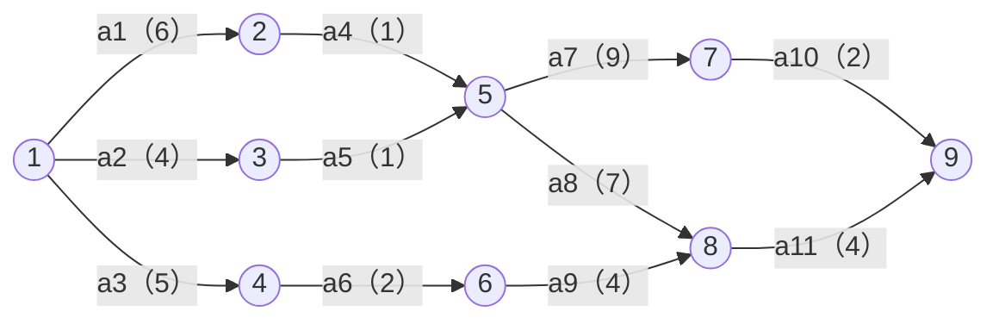
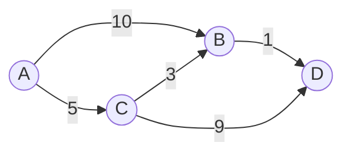
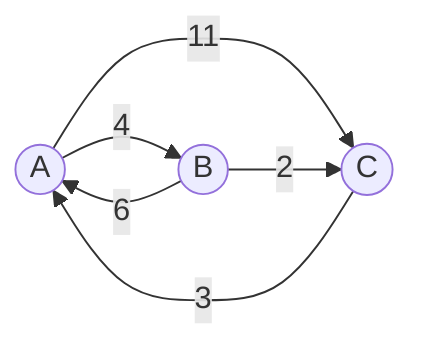

## 一、AOV网(Activity On Vertex Network)

### 1.1 定义

&emsp;AOV 网是一种有向无环图（DAG，Directed Acyclic Graph）用顶点表示活动，用有向边表示活动之间的优先关系的有向图。
它是一种用有向图来描述工程或系统各子任务（活动）之间优先关系的有力工具。

- **顶点（Vertex）**：表示一个**活动**（Activity）或子任务。例如：课程教学中的“先修课程”，产品生产中的“组装零件”。
- **有向边（Edge）**：表示活动之间的**先后次序关系**或**制约关系**。若存在有向边 `<i, j>`，则表示活动 `i` 必须完成后，活动 `j` 才能开始。此时称 `i` 是 `j` 的**直接前驱**，`j` 是 `i` 的**直接后继**。

### 1.2 核心特性

1.  **有向性**：边有方向，表示次序不可逆。
2.  **无环性**：AOV网中**绝对不能存在有向环（回路）**。如果存在环，则意味着某项活动必须以自身的完成为先决条件，这在逻辑上是荒谬的，工程也无法进行。

### 1.3 拓扑排序（Topological Sort） - AOV网的核心算法

&emsp;拓扑排序是解决AOV网问题的核心算法，其目的是**将AOV网中的所有顶点排成一个线性序列，使得任何一对顶点 `u` 和 `v`，若 `<u, v>` 是网中的边（即 `u` 领先于 `v`），则在序列中 `u` 也必须排在 `v` 的前面**。

#### 1.3.1 拓扑排序的算法步骤（常考过程描述）：

1.  **初始化**：从AOV网中选择一个**没有前驱**（即**入度为0>**）的顶点并输出。
2.  **删除顶点及以其为尾的弧**：从网中删除该顶点和所有以它为起点的有向边（即将其直接后继顶点的入度减1）。
3.  **重复执行**：重复上述两步，直到：
    - 当前网中**不存在无前驱的顶点**（说明图中还有未输出的顶点，但已找不到入度为0的点，意味着图中**存在环**，拓扑排序失败）。
    - 或所有的顶点均已输出，得到一个**拓扑序列**。
4. **拓扑排序示意图**：对于图中`(a)`所示的有向无环图进行拓扑排序,得到的拓扑序列为: `6、1、4、3、2、5`
 

5. **拓扑排序序列不唯一**：拓扑排序的序列不唯一，存在多个入度为 `0` 的顶点时，根据选择的不同可能会出现多个拓扑序列，例：示意图中可能得到的序列还有： `1、6、4、3、2、5`

## 二、AOE网 (Activity On Edge) 

### 2.1 定义
**AOE网（Activity On Edge Network）**，即**边表示活动的网络**。它是一种用于估算项目工期的带权有向无环图（DAG）。
- **顶点（Vertex）**：表示**事件**（Event），即某个**时刻**或**状态**，例如“某项活动开始”或“某项活动结束”。顶点不消耗时间。
- **有向边（Edge）**：表示**活动**（Activity），即一个子任务或工序。边有权值，表示完成该活动所需的**持续时间**。
- **源点与汇点**：AOE网中仅有一个**入度为0**的顶点，称为**源点**（Source），代表整个工程的开始；仅有一个**出度为0**的顶点，称为**汇点**（Sink），代表整个工程的结束。

### 2.2 AOE网要研究的问题
1.  完成整个工程至少需要多少时间？
2.  哪些活动是影响工程进度的**关键活动**？如何找到它们？

### 2.3 关键路径（Critical Path）法

关键路径法是求解AOE网问题的核心算法。**关键路径**是从源点到汇点的**最长路径**（不是最短路径！），其长度决定了整个工程的最短工期。路径上的活动称为**关键活动**。

### 2.3.1 关键路径算法的核心参数

为了找到关键路径，需要为每个事件（顶点）和每个活动（边）定义4个关键参数：

| 符号            | 名称           | 定义                                                             |
|:--------------|:-------------|:---------------------------------------------------------------|
| **ve(j)**     | **事件最早发生时间** | 从源点到顶点 `j` 的**最长路径**长度。决定了以该事件为始点的活动的最早开始时间。                   |
| **vl(j)**     | **事件最晚发生时间** | 在不拖延整个工期的前提下，该事件最迟必须发生的时间。                                     |
| **e(i)**      | **活动最早开始时间** | 该活动**弧尾事件（起点）** 的最早发生时间，即 `e(i) = ve(j)`。                      |
| **l(i)**      | **活动最晚开始时间** | 该活动**弧头事件（终点）** 的最晚发生时间减去活动持续时间，即 `l(i) = vl(k) - dut(<j,k>)`。 |
| **l(i)-e(i)** | **活动时间余量**   | 该活动可以拖延的时间。如果时间余量为**0**，则该活动为**关键活动**。                         |

### 2.3.2 算法步骤（非常重要！）

1.  **正向计算事件最早发生时间 `ve(j)`** (从源点走向汇点)
    - `ve(源点) = 0`
    - `ve(j) = Max{ ve(i) + dut(<i, j>) }` （`i` 是 `j` 的所有前驱顶点）
    - 计算顺序：按**拓扑排序**的顺序推进。

2.  **反向计算事件最晚发生时间 `vl(i)`** (从汇点倒推向源点)
    - `vl(汇点) = ve(汇点)`
    - `vl(i) = Min{ vl(j) - dut(<i, j>) }` （`j` 是 `i` 的所有后继顶点）
    - 计算顺序：按**逆拓扑排序**的顺序推进。

3.  **计算活动的最早/最晚开始时间 `e(k)` 和 `l(k)`**
    - 设活动 `k` 用边 `<i, j>` 表示，其持续时间为 `dut`。
    - `e(k) = ve(i)` （活动最早开始时间 = 其起点事件的最早时间）
    - `l(k) = vl(j) - dut` （活动最晚开始时间 = 其终点事件的最晚时间 - 活动耗时）

4.  **确定关键活动和关键路径**
    - 找出所有 `l(k) == e(k)` 的活动，这些就是**关键活动**。
    - 由**关键活动**首尾连接形成的从源点到汇点的路径，就是**关键路径**。
    
### 2.3.3 经典示例与手工计算（软考大题形式）

假设有一个AOE网，其结构如下所示。我们将一步步计算其关键路径。

**AOE网结构（活动及其持续时间）**： 顶点1为源点，顶点9为汇点。

**计算事件最早发生时间 `ve(j)`**  
从源点（事件 1）开始，按照拓扑顺序计算：
- ve(1) = 0
- ve(2) = ve(1) + 6 = 6
- ve(3) = ve(1) + 4 = 4
- ve(4) = ve(1) + 5 = 5
- ve(5) = max{ve(2)+1, ve(3)+1} = max{7, 5} = 7
- ve(6) = ve(4) + 2 = 7
- ve(7) = ve(5) + 9 = 16
- ve(8) = max{ve(5)+7, ve(6)+4} = max{14, 11} = 14
- ve(9) = max{ve(7)+2, ve(8)+4} = max{18, 18} = 18

**计算事件最晚发生时间 `vl(j)`**  
从汇点（事件 9）开始，按照逆拓扑顺序计算：
- vl(9) = ve(9) = 18
- vl(8) = vl(9) - 4 = 14
- vl(7) = vl(9) - 2 = 16
- vl(6) = vl(8) - 4 = 10
- vl(5) = min{vl(7)-9, vl(8)-7} = min{7, 7} = 7
- vl(4) = vl(6) - 2 = 8
- vl(3) = vl(5) - 1 = 6
- vl(2) = vl(5) - 1 = 6
- vl(1) = min{vl(2)-6, vl(3)-4, vl(4)-5} = min{0, 2, 3} = 0

**计算活动的最早开始时间 `e(i)` 和最晚开始时间 `l(i)`**  
对于每个活动，计算其时间余量（l(i) - e(i)）：
- a1: e = ve(1) = 0, l = vl(2)-6 = 0, 余量 = 0
- a2: e = ve(1) = 0, l = vl(3)-4 = 2, 余量 = 2
- a3: e = ve(1) = 0, l = vl(4)-5 = 3, 余量 = 3
- a4: e = ve(2) = 6, l = vl(5)-1 = 6, 余量 = 0
- a5: e = ve(3) = 4, l = vl(5)-1 = 6, 余量 = 2
- a6: e = ve(4) = 5, l = vl(6)-2 = 8, 余量 = 3
- a7: e = ve(5) = 7, l = vl(7)-9 = 7, 余量 = 0
- a8: e = ve(5) = 7, l = vl(8)-7 = 7, 余量 = 0
- a9: e = ve(6) = 7, l = vl(8)-4 = 10, 余量 = 3
- a10: e = ve(7) = 16, l = vl(9)-2 = 16, 余量 = 0
- a11: e = ve(8) = 14, l = vl(9)-4 = 14, 余量 = 0

**计算过程用表格表示**：

|  事件   | ve (最早) | vl (最晚) | 活动  | e (最早) | l (最晚) | l - e |  关键活动   |
|:-----:|:-------:|:-------:|:---:|:------:|:------:|:-----:|:-------:|
| **1** |    0    |    0    | a1  |   0    |   0    | **0** | **Yes** |
| **2** |    6    |    6    | a2  |   0    |   2    |   2   |         |
| **3** |    4    |    6    | a3  |   0    |   3    |   3   |         |
| **4** |    5    |    8    | a4  |   6    |   6    | **0** | **Yes** |
| **5** |    7    |    7    | a5  |   4    |   6    |   2   |         |
| **6** |    7    |   10    | a6  |   5    |   8    |   3   |         |
| **7** |   16    |   16    | a7  |   7    |   7    | **0** | **Yes** |
| **8** |   14    |   14    | a8  |   7    |   7    | **0** | **Yes** |
| **9** |   18    |   18    | a9  |   7    |   10   |   3   |         |
|       |         |         | a10 |   16   |   16   | **0** | **Yes** |
|       |         |         | a11 |   14   |   14   | **0** | **Yes** |

**确定关键活动和关键路径**  
时间余量为 `0` 的活动是关键活动：`a1, a4, a7, a8, a10, a11`

**关键路径有两条**：
1. 1 → 2 → 5 → 7 → 9 (a1 → a4 → a7 → a10)
2. 1 → 2 → 5 → 8 → 9 (a1 → a4 → a8 → a11)

总工期为 `18` 个单位时间。

>[!DANGER] 总工期  
> 总工期由从源点（顶点1）到汇点（顶点9）的最长路径（即关键路径）的长度（权值之和）决定。

## 三、AOE网 vs. AOV网（对比记忆）

| 特性       | **AOV网 (Activity On Vertex)** | **AOE网 (Activity On Edge)** |
|:---------|:------------------------------|:----------------------------|
| **顶点表示** | **活动**                        | **事件**（状态、时刻）               |
| **边表示**  | **优先关系**（无权）                  | **活动**（有权，表时间）              |
| **关注点**  | 活动的**先后顺序**（拓扑排序）             | 工程的**最短工期**（关键路径）           |
| **核心算法** | **拓扑排序**                      | **关键路径法（CPM）**              |
| **应用**   | 课程先修关系、任务调度依赖                 | 项目工期估算、关键任务识别               |

## 四、最短路径

在**带权图**（或称**网**）中，寻找两个顶点之间**所有通路中边权值之和最小**的那条路径，就是最短路径问题。
- **路径长度**：路径上所有边的**权值之和**。
- **最短路径**：所有可能路径中长度**最短**的那一条（注意：不是边数最少，而是权值和最小）。
- **源点（Source）**：路径的起始顶点。
- **终点（Destination）**：路径的结束顶点。

根据问题范围，分为两类：
1.  **单源最短路径**：求从一个**源点**到图中**所有其他顶点**的最短路径。
2.  **多源最短路径**：求图中**任意两个顶点对**之间的最短路径。

### 4.1 单源最短路径

单源最短路径主要采用迪杰斯特拉算法 (**Dijkstra**'s Algorithm),是典型的**贪心算法**策略

#### 4.1.1 算法特点与使用场景
- **使用场景**：路由算法、地图导航、网络流量优化等所有需要求一点到其余各点最短路径的场景。
- **前提要求**：图中**边的权值必须为非负数**（>=0）。这是该算法能正确工作的前提。
- **算法思想**：设置一个顶点集合 $S$，存放已找到最短路径的顶点。每次从剩余顶点中选择一个离源点最近的顶点加入 $S$ ，并松弛其邻接边，直到所有顶点都加入 $S$。

#### 4.1.2 示例图与分步解题

我们以下面的带权有向图为例，求从源点 `A` 到其他各顶点的最短路径。

**邻接矩阵**

$$
\begin{Bmatrix}
0 & 10 & 5 & ∞ \\
∞ & 0 & ∞ & 1 \\
∞ & 3 & 0 & 9 \\
∞ & ∞ & ∞ & 0 \\
\end{Bmatrix}
$$

**算法步骤（使用三个数组：`S`, `dist`, `path`）**：

1.  **初始化**：
    - `S[]`（已确定集合）：`{A}`
    - `dist[]`（最短距离）：
        - `dist[A] = 0`
        - `dist[B] = 10` (A→B)
        - `dist[C] = 5` (A→C)
        - `dist[D] = ∞` (暂无路径)
    - `path[]`（前驱顶点）：
        - `path[B] = A`
        - `path[C] = A`
        - `path[D] = -` (未知)

    | 顶点 | dist  | path | S |
    |:--:|:-----:|:----:|:-:|
    | A  | **0** |  -   | ✅ |
    | B  |  10   |  A   |   |
    | C  |   5   |  A   |   |
    | D  |   ∞   |  -   |   |

2.  **第一轮迭代**：
    - 从 `V-S` (`B, C, D`) 中选出 `dist` 最小的顶点 `C` (`dist[C]=5`)。
    - 将 `C` 加入 `S`。
    - **松弛操作**：检查 `C` 的所有邻接点 (`B`, `D`)。
        - 对于 `B`：`dist[C] + weight(C,B) = 5 + 3 = 8`。`8 < 10` (当前`dist[B]`)，所以更新 `dist[B] = 8`, `path[B] = C`。
        - 对于 `D`：`dist[C] + weight(C,D) = 5 + 9 = 14`。`14 < ∞`，所以更新 `dist[D] = 14`, `path[D] = C`。

    | 顶点 | dist  | path | S |
    |:--:|:-----:|:----:|:-:|
    | A  |   0   |  -   | ✅ |
    | B  | **8** |  C   |   |
    | C  |   5   |  A   | ✅ |
    | D  |  14   |  C   |   |

3.  **第二轮迭代**：
    - 从 `V-S` (`B, D`) 中选出 `dist` 最小的顶点 `B` (`dist[B]=8`)。
    - 将 `B` 加入 `S`。
    - **松弛操作**：检查 `B` 的所有邻接点 (`D`)。
        - 对于 `D`：`dist[B] + weight(B,D) = 8 + 1 = 9`。`9 < 14` (当前`dist[D]`)，所以更新 `dist[D] = 9`, `path[D] = B`。

    | 顶点 | dist  | path | S |
    |:--:|:-----:|:----:|:-:|
    | A  |   0   |  -   | ✅ |
    | B  |   8   |  C   | ✅ |
    | C  |   5   |  A   | ✅ |
    | D  | **9** |  B   |   |

4.  **第三轮迭代**：
    - 将最后一个顶点 `D` 加入 `S`。无需松弛操作。

    | 顶点 | dist | path | S |
    |:--:|:----:|:----:|:-:|
    | A  |  0   |  -   | ✅ |
    | B  |  8   |  C   | ✅ |
    | C  |  5   |  A   | ✅ |
    | D  |  9   |  B   | ✅ |

5. **最终结果**：
   - `A->B`：`A->C->B`，长度 8
   - `A->C`：`A->C`，长度 5
   - `A->D`：`A->C->B->D`，长度 9

6. **路径还原技巧**：从终点 `D` 的 `path[D]=B` 开始，找 `B` 的前驱 `path[B]=C`，再找 `C` 的前驱 `path[C]=A`，反向得到路径 `A->C->B->D`。

### 4.2 多源最短路径

&emsp;**多源最短路径**一般采用，弗洛伊德算法 (**Floyd**-Warshall Algorithm)，是典型的**动态规划**的策略。

#### 4.2.1 算法特点与使用场景
- **使用场景**：需要计算任意两点间最短距离的场景，如城市交通规划、网络中的最短时延路由、游戏中的AI路径计算。
- **前提要求**：可以处理**负权边**，但**不能处理包含负权回路**的图（因为负权回路可以无限绕行，使路径长度无限小）。
- **算法思想**：对于任意两点 `(i, j)`，考虑所有其他顶点 `k` 作为中间点，检查是否存在一条经过 `k` 的路径比已知路径更短。

#### 4.2.2 示例图与分步解题

我们使用一个更简单的图来演示 **Floyd** 算法的矩阵迭代过程。

**算法步骤（使用距离矩阵 `D`）**：

1.  **初始化距离矩阵 $D^{(-1)}$** (即邻接矩阵)：

    |       | A  | B  | C  |
    |:-----:|:--:|:--:|:--:|
    | **A** | 0  | 4  | 11 |
    | **B** | 6  | 0  | 2  |
    | **C** | 3  | ∞  | 0  |

2.  **第一轮迭代 ($k=0$，允许借助顶点 $A$ 中转)**：
    - 检查所有 `i->j`，看 `i->A->j` 是否更短。
    - `D[B][C]`：`min( D[B][C]=2, D[B][A]+D[A][C]=6+11=17 )` -> **2** (不变)
    - `D[C][B]`：`min( D[C][B]=∞, D[C][A]+D[A][B]=3+4=7 )` -> **7** (更新！)

    |       | A  |   B   | C  |
    |:-----:|:--:|:-----:|:--:|
    | **A** | 0  |   4   | 11 |
    | **B** | 6  |   0   | 2  |
    | **C** | 3  | **7** | 0  |

3.  **第二轮迭代 ($k=1$，允许借助顶点 $A$, $B$ 中转)**：
    - 检查所有 `i->j`，看 `i->B->j` 是否更短。
    - `D[A][C]`：`min( D[A][C]=11, D[A][B]+D[B][C]=4+2=6 )` -> **6** (更新！)
    - `D[C][A]`：`min( D[C][A]=3, D[C][B]+D[B][A]=7+6=13 )` -> **3** (不变)

    |       | A  | B  |   C   |
    |:--:|:----:|:----:|:-----:|
    | **A** | 0  | 4  | **6** |
    | **B** | 6  | 0  |   2   |
    | **C** | 3  | 7  |   0   |

4.  **第三轮迭代 ($k=2$，允许借助顶点 $A$, $B$, $C$ 中转)**：
    - 检查所有 `i->j`，看 `i->C->j` 是否更短。
    - `D[B][A]`：`min( D[B][A]=6, D[B][C]+D[C][A]=2+3=5 )` -> **5**(更新！)
    - `D[A][B]`：`min( D[A][B]=4, D[A][C]+D[C][B]=6+7=13 )` -> **4** (不变)

    **最终距离矩阵 $D^{(2)}$**：

    |       |   A   |  B  |  C  |
    |:-----:|:-----:|:---:|:---:|
    | **A** |   0   |  4  |  6  |
    | **B** | **5** |  0  |  2  |
    | **C** |   3   |  7  |  0  |

**结论**：从上表可知：
- `A` 到 `C` 的最短路径长度为 `6` (路径: `A->B->C`)
- `B` 到 `A` 的最短路径长度为 `5` (路径: `B->C->A`)
- `C` 到 `B` 的最短路径长度为 `7` (路径: `C->A->B`)

### 4.3 总结与对比

| 特性         | **Dijkstra (迪杰斯特拉)**                   | **Floyd (弗洛伊德)**              |
|:-----------|:---------------------------------------|:------------------------------|
| **解决问题**   | **单源**最短路径                             | **多源**最短路径（任意两点）              |
| **算法思想**   | **贪心算法**                               | **动态规划**                      |
| **图的要求**   | **边权值非负**                              | 可处理负权边，**不能有负权回路**            |
| **时间复杂度**  | $O(n^2)$                               | **$O(n^3)$**                  |
| **空间复杂度**  | $O(n)$                                 | $O(n^2)$                      |
| **常见考查形式** | **手工模拟**计算过程，填写 `dist[]` 和 `path[]` 数组 | **手工模拟**矩阵迭代过程，填写距离矩阵 `D[][]` |

>[!DANGER] 应试技巧与常见陷阱：
>1.  **Dijkstra 算法不能处理负权边**。这是最常考的陷阱！
>2.  在手工模拟 Dijkstra 算法时，**一旦一个顶点被加入集合 $S$ ，它的 `dist` 值就不会再被更新**。
>3.  Floyd 算法的**迭代次序是固定的**（中间点 `k` 从 0 到 n-1），每次更新整个矩阵。
>4.  下午大题中，很可能会给一个简单的图，让你**手工执行一遍两种算法的步骤**，并写出结果。务必清晰展示每一步的中间结果。
