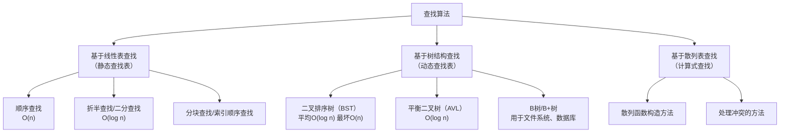

下图从宏观上展示了查找算法的分类体系，帮助您建立清晰的知识结构：




### 一、查找的基本概念

1.  **查找表**：由<font color='red'>同一类型</font>的数据元素（或记录）<font color='red'>构成的集合</font>。
2.  **关键字**：数据元素中<font color='red'>某个数据项的值</font>，用于标识该数据元素。
3.  **主关键字**：<font color='red'>能唯一标识一个记录的关键字</font>。
4.  **静态查找**：<font color='red'>只进行查找</font>操作，<font color='red'>不改变</font>集合内的<font color='red'>数据</font>。对应上图的“基于线性表查找”。
5.  **动态查找**：在<font color='red'>查找</font>过程中<font color='red'>同时插入不存在的记录</font>，或<font color='red'>删除已存在的记录</font>。查找表本身是动态变化的。对应上图的“基于树结构查找”。
6.  **平均查找长度（ASL）**：<font color='red'>衡量查找算法效率的最主要指标</font>。为<font color='red'>**确定记录在查找表中的位置，需和给定值进行比较的关键字的个数的期望值**</font>。
    - **计算公式**：$ASL = \sum_{i=1}^{n} P_i C_i$
    - $P_i$：查找第 $i$ 个记录的概率（通常<font color='red'>假设为 $1/n$</font>）。
    - $C_i$：找到第 $i$ 个记录<font color='red'>所需的比较次数</font>。

### 二、静态查找（线性表的查找）

#### 2.1 顺序查找

- **方法**：从表的一端开始，<font color='red'>依次</font>将记录的关键字与给定值进行<font color='red'>比较</font>。
- **适用性**：适用于<font color='red'>**顺序存储**</font>和<font color='red'>**链式存储**</font>的线性表。
- 平均查找长度**ASL**：
  - 成功情况：$ASL_{success} = \frac{n+1}{2}$
  - 失败情况： $ASL_{failure} = (n+1) × (\frac{1}{(n+1)}× n)  = n$
- **示例**：在数组 `[5, 3, 8, 1, 2]` 中查找 `8`。
  - 步骤：`5` (不等于8) -> `3` (不等于8) -> `8` (等于8，查找成功)。
- **性能指标**：
  - **时间复杂度**：
    - <font color='red'>最好情况</font> $O(1)$：目标在<font color='red'>表头</font>。
    - <font color='red'>最坏情况</font> $O(n)$：目标在<font color='red'>表尾或不存在</font>。
    - <font color='red'>平均情况</font> $O(n)$。
  - **空间复杂度**：<font color='red'>$O(1)$</font>。无需额外空间。
  - **稳定性**：<font color='red'>**稳定**</font>。因为是从前向后顺序比较，不会改变相同关键字的相对位置（但查找算法本身通常不涉及数据移动，这里的“稳定”指查找过程本身）。
- **特点**：
  - 对<font color='red'>存储结构没有要求</font>（顺序或链式均可）。
  - 对元素<font color='red'>有序性没有要求</font>。
  - 算法简单，但效率低下（$O(n)$）。
- **哨兵技巧**：在表头设置“哨兵”元素，可以避免每次循环都需要检查数组是否越界，能略微减少比较次数。

#### 2.2 折半查找（二分查找） - **重中之重**

- **方法**：要求线性表必须采用<font color='red'>**顺序存储结构**</font>，且表中元素按关键字<font color='red'>**有序排列**</font>，<font color='red'>每次比较中间元素</font>，根据比较结果将查找范围缩小一半，<font color='red'>直到找到或范围为空</font>。
- **步骤**：
    1.  设置一个区间 `[low, high]`，初始 `low=1`, `high=n`。
    2.  取中间位置 `mid = ⌊(low + high) / 2⌋`。
    3.  比较给定值 `key` 与 `mid` 位置的值：
        - 若相等，则查找成功。
        - 若 `key` 较小，则 `high = mid - 1`，在左半区继续查找。
        - 若 `key` 较大，则 `low = mid + 1`，在右半区继续查找。
    4.  重复步骤2-3，直到 `low > high`（查找失败）。
- **示例**：在有序数组 `[1, 3, 5, 8, 12, 16]` 中查找 `12`。
    - `low=0, high=5 -> mid=(0+5)/2=2 -> arr[2]=5 < 12 -> low=mid+1=3`
    - `low=3, high=5 -> mid=(3+5)/2=4 -> arr[4]=12 == 12` (查找成功)
- **性能指标**：
  - **时间复杂度**：$O(log n)$。<font color='red'>效率非常高</font>。
  - **空间复杂度**：$O(1)$。<font color='red'>迭代实现只需常数空间；递归实现因栈深度为 $O(log n)$。</font>
  - **稳定性**：<font color='red'>**稳定**</font>。在遇到相同关键字时，会继续向一侧收缩，最终定位到某个特定元素。
- **特点**：
  - **要求**：<font color='red'>必须采用**顺序存储**</font>结构，且<font color='red'>元素必须**有序**</font>。
  - 查找过程可用**判定树**来描述，其树高最大为 $(log_2n) + 1$。
- **判定树**：二分查找的过程可以用一棵<font color='red'>**平衡的二叉排序树**</font>来描述，树中每个结点对应一个中间位置。<font color='red'>**成功的查找**恰好是走了一条从根到该结点的路径</font>。
- 平均查找长度**ASL**：
  -  $ASL = \frac{n+1}{n}log_2(n+1)-1$
  - **当 $n$ 足够大时**：$ASL \approx log_2(n+1) - 1$。
- **适用场景**
  - 折半查找适用于<font color='red'>表不易变动</font>,且又<font color='red'>经常进行查找</font>的情况。
- **考点**：
  - 给定一个有序序列，**手工模拟**二分查找的过程，写出比较的中间位置 `mid`。
  - 计算给定序列的二分查找**判定树**，并计算成功和不成功情况下的ASL。

#### 2.3 分块查找（索引顺序查找）


- **方法**：结合顺序查找与二分查找的优点，将数据分为若干块
  - 块内元素可以<font color='red'>无序</font>，但<font color='red'>**块间有序**</font>（即第 `i` 块的所有关键字均大于第 `i-1` 块的最大关键字）。
  - 再建立一个<font color='red'>**索引表**</font>（存储每块的最大值和起始地址），定位目标所在块，再在块内<font color='red'>顺序/折半</font>查找。
- **示例**：表 `[5, 3, 8, 1, 12, 10, 15, 18]`，分成三块：`[5,3,8,1]`, `[12,10]`, `[15,18]`。索引表为 `[8, 0]`, `[12, 4]`, `[18, 6]`。查找 `10`：
    - 确定块：`10 > 8 && 10 <= 12` -> 在第二块。
    - 在第二块 `[12,10]` 内顺序查找，找到 `10`。
- **性能指标**：
  - **时间复杂度**：
    - **平均**：$O(log(m)+\frac{n}{m})$ <Badge text="注1" type="warning"/>
    - **最坏**：$O(n)$
  - **空间复杂度**：$O(n)$。需要额外空间存储索引表。
  - **稳定性**：<font color='red'>**稳定**</font>。取决于块内查找所用的方法（通常是顺序查找，故稳定）。
- - **特点**：<font color='red'>是顺序查找和折半查找的折中</font>，适合<font color='red'>动态变化</font>且<font color='red'>无法整体排序的线性表</font>。
- 平均查找长度**ASL**：$ASL = \frac{1}{2}(\frac{n}{s}+s)+1$ 
  - 其平均查找长度不仅与表长 $n$ 有关,而且与每一块的记录数 $s$ 有关。
  - 当 $s$ 取 $\sqrt{n}$ 时，$ASL$ 取最小值 $\sqrt{n}+1$ 时的查找效率较顺序查找要好得多,但远不及折半查找。  

<Badge text="注1" type="danger"/>: <font color='red'>$m$ 为分块数， $\frac{n}{m}$ 为块内平均长度</font>。

### 三、动态查找（树表的查找）

#### 3.1 二叉排序树（BST）

- **定义**：一棵<font color='red'>空树</font>，或者<font color='red'>是具有以下性质的二叉树</font>：
  - 若左子树不空，则<font color='red'>左子树上所有结点</font>的值<font color='red'>均小于它的根结点的值</font>。
  - 若右子树不空，则<font color='red'>右子树上所有结点</font>的值<font color='red'>均大于它的根结点的值</font>。
  - 左、右子树也分别为二叉排序树。
- **查找**：从<font color='red'>根开始</font>，与当前结点比较，<font color='red'>小则查左子树，大则查右子树，等于则成功</font>。
- **插入**：查找<font color='red'>不成功</font>时，<font color='red'>插入</font>位置即为查找路径上<font color='red'>最后一个结点的左孩子或右孩子</font>。
- **删除**：**软考难点**。分三种情况：
  - 删除叶子结点：直接删除。
  - 删除只有一棵子树的结点：用其子树顶替。
  - 删除有两棵子树的结点：用其<font color='red'>**中序遍历的直接前驱（或后继）**</font> 顶替，<font color='red'>再删除那个前驱（或后继）</font>。
- **示例**：在BST中查找 `12`。
    ```
         8
        / \
       3   10
      / \   \
     1   6   14
           /
          12
    ```
  - 步骤：`8` -> `10` -> `14` -> `12` (查找成功)。
- **性能指标**：
  - **时间复杂度**：
    - 平均情况：$O(log n)$ (树比较平衡时)。
    - 最坏情况：$O(n)$ (树退化为单支链表，如插入序列为 `1,3,6,8,10,14,12`)。
  - **空间复杂度**：$O(n)$。存储n个节点。
  - **稳定性**：<font color='red'>**不稳定**</font>。插入顺序不同，生成的树结构不同。查找过程不影响结构，但树本身不保持相同关键字记录的原始插入顺序。
- **特点**：
  - 是**动态查找表**，支持高效的插入和删除操作。
  - 性能取决于树的形态，可能退化为 $O(n)$。
  
>[!WARNING] 备注  
> 从二叉排序树的定义可知,中序遍历二叉排序树可得到一个关键字<font color='red'>有序的序列</font>。这也说明,
>一个<font color='red'>无序序列</font>可以<font color='red'>通过构造一棵二叉排序树而得到一个有序序列</font>,构造二叉排序树的过程就是
>对无序序列进行排序的过程。

#### 3.2 平衡二叉树（AVL）

- **目的**：解决BST可能<font color='red'>退化为单支树</font>的问题，提高查找效率。
- **定义**：树上<font color='red'>**任意结点的左右子树高度差（平衡因子）的绝对值不超过1**</font>。
- **平衡调整**：插入或删除破坏平衡后，需要通过<font color='red'>**旋转**</font>来调整。分为四种基本类型：
  - **LL型（<font color='red'>右单旋</font>）**
    
  - **RR型（<font color='red'>左单旋</font>）**
    
  - **LR型（<font color='red'>先左后右双旋</font>）**
    
  - **RL型（<font color='red'>先右后左双旋</font>）**
    
- **性能指标**：
  - **时间复杂度**：<font color='red'>始终保持</font>查找效率为 <font color='red'>$O(log n)$</font>。
  - **空间复杂度**：$O(n)$。
  - **稳定性**：<font color='red'>**不稳定**</font>。旋转操作会完全改变树的结构和节点的相对位置。
- **特点**：
  - 解决了BST可能退化的问题，但维护平衡（旋转操作）增加了插入和删除的开销。
  - 是BST的优化版本。

#### 3.3 B树和B+树（简介）

- **B树**：一种<font color='red'>平衡的**多路**查找树</font>，用于磁盘等直接存取设备上的文件组织和数据库索引。
  - 结点中多个<font color='red'>关键字有序排列</font>。
  - 叶子结点都在<font color='red'>同一层次</font>上。
- **B+树**：B树的变型，所有<font color='red'>关键字记录都出现在叶子结点中</font>，并<font color='red'>按顺序链接成一个链表</font>。非叶子结点仅起索引作用。更适合文件系统和数据库的<font color='red'>**范围查询**</font>。


### 四、散列表（哈希表）查找（计算式查找）

#### 4.1 基本概念

- **散列函数**：根据关键字 `key`，通过散列函数 `H(key)` 直接<font color='red'>计算出其存储地址</font>。
- **示例**：`H(key) = key % 7`。将关键字 `[5, 3, 8, 1, 12]` 存入表长 `m=7` 的散列表中。
  - `5%7=5` -> 存入地址5。
  - `3%7=3` -> 存入地址3。
  - `8%7=1` -> 存入地址1。
  - `1%7=1` -> **冲突**！使用线性探测法 `H₁=(1+1)%7=2` -> 存入地址2。
  - 查找 `1`：`H(1)=1`，比较发现地址1是 `8`，不等于 `1`，继续线性探测下一个地址 `2`，找到 `1`。
 **散列表**：根据关键字直接进行访问的数据结构。它通过散列函数建立了关键字到存储地址的映射。

#### 4.2 散列函数的构造方法（考点）

- **直接定址法**：$H(key) = a \times key + b$。简单、无冲突，但地址空间需与关键字大小一致。
- **除留余数法**：$H(key) = key \% p$。**最常用**。$p$ 通常取**小于表长 $m$ 的最大质数**，以减少冲突。
- **数字分析法**：取关键字的某些取值较均匀的数码位作为地址。
- **平方取中法**：关键字平方后，取中间的几位作为散列地址。

#### 4.3 处理冲突的方法（核心考点）

- **开放地址法**：开放地址法是在哈希表的线性存储空间内，当发生冲突时，通过特定的探测规则<font color='red'>寻找下一个空闲位置</font>存储数据。
  - 核心公式为：$H_i=(H(key)+d_i)\%m$ $i= 1,2,\dots,k$ $(k \le m-1)$ ，其中 $H(key)$ 是原哈希函数，$d_i$ 是增量序列，$m$ 是哈希表长度。
  - **线性探测法**：$H_i = (H(key) + d_i) \% m$，$d_i = 1, 2, 3, ..., m-1$。容易产生“堆积”现象。
  - **二次探测法**：$d_i = 1^2, -1^2, 2^2, -2^2, ...$。<font color='red'>可避免堆积</font>，但<font color='red'>不易探测到整个散列表</font>。
- **链地址法(拉链法)**：链地址法(或拉链法)是一种经常使用且很有效的方法。它在查找表的每一个记录中<font color='red'>增加一个链域</font>,链域中存放下一个<font color='red'>具有相同哈希函数值的记录的存储地址</font>。
  利用链域,就把若干个发生冲突的记录<font color='red'>链接在一个链表内</font>。当链域的值为 $NULL$ 时,表示已没有后继记录了。因此,对于<font color='red'>发生冲突时</font>的<font color='red'>查找和插入操作就跟线性表一样了</font>。
  - 优点：无堆积现象；动态申请结点，适用于<font color='red'>表长不确定</font>的情况；<font color='red'>删除操作简单</font>。
- **再哈希**：使用<font color='red'>多个哈希函数</font>，当第一个函数冲突时，依次调用后续函数计算地址，<font color='red'>直到找到空闲位置</font>。公式为 $H_i=RH_i(key) （i=1,2,...,k）$

💡[**详细解决方法**](/ruankao/hashConflictResolution)

#### 4.4 散列表的查找性能分析

- **决定因素**：散列函数、处理冲突的方法、**装填因子 α**。
- **装填因子**：$α = \frac{表中填入的记录数}{散列表的长度}$。$α$ 越大，表越满，发生冲突的可能性越大。
- **ASL**：散列表的查找效率**与表中元素个数 $n$ 无关**，只与装填因子 $α$ 有关。$α$ 越小，冲突可能性越小，ASL越小。

---

### 五、总结与软考考点聚焦

| 查找技术      | 适用场景  | 平均时间复杂度             | 软考重点                        |
|:----------|:------|:--------------------|:----------------------------|
| **顺序查找**  | 无序线性表 | $O(n)$              | 算法简单，ASL计算                  |
| **折半查找**  | 有序顺序表 | $O(log n)$          | **手工模拟过程**，画判定树，计算ASL       |
| **二叉排序树** | 动态查找表 | $O(log n)$ ~ $O(n)$ | BST性质，**删除操作**，查找效率         |
| **平衡二叉树** | 动态查找表 | $O(log n)$          | **平衡调整（四种旋转）**              |
| **散列查找**  | 快速访问  | $O(1)$              | **散列函数构造**，**处理冲突方法**，ASL分析 |

**备考建议**：
1.  **必会手工模拟**：二分查找的过程、BST的查找/插入/删除过程、AVL的旋转调整过程、散列表的构造和冲突解决过程。
2.  **掌握ASL计算**：特别是二分查找判定树和散列表的ASL计算。
3.  **理解本质**：理解各种查找技术的适用场景和优缺点，特别是BST、AVL、B树、哈希表之间的区别。