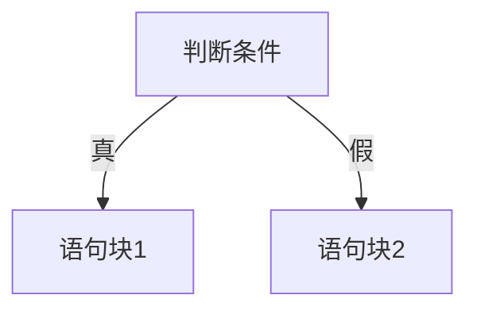
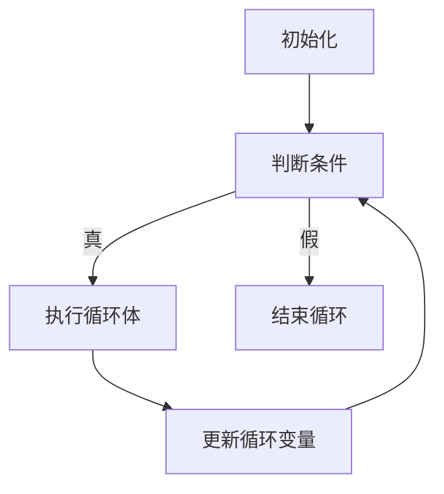
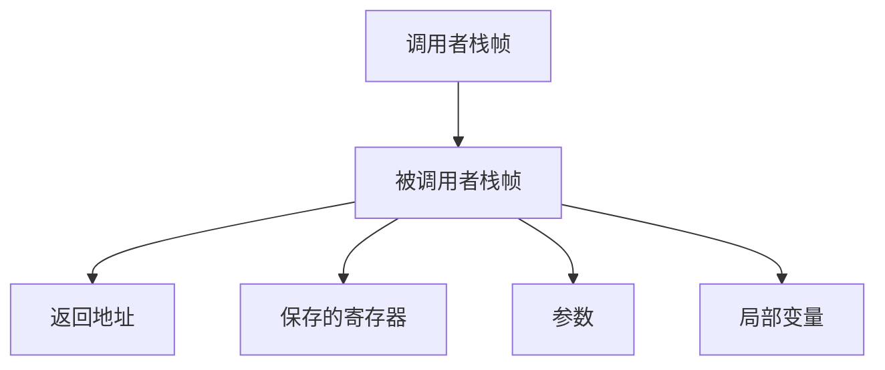
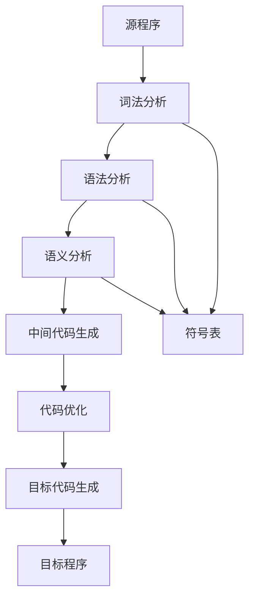
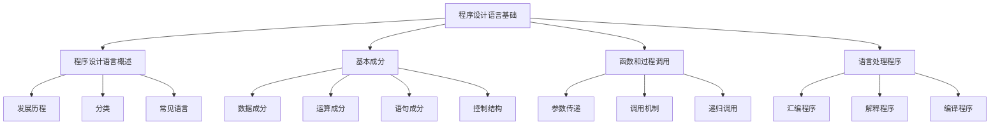

&emsp;程序设计语言（Programming Language）是人与计算机进行交流的工具，是软件开发的基础。了解程序设计语言的基本原理和语言处理程序的工作机制，对于软件设计师来说至关重要。本章主要介绍程序设计语言的基础知识、编译原理以及相关的考试要点。

## 一、考纲要求

1. 掌握程序设计语言的基本概念和分类
2. 理解程序设计语言的基本成分（数据、运算、语句、控制结构）
3. 掌握函数和过程调用的原理
4. 了解语言处理程序的基础知识（编译、解释、汇编）
5. 理解编译程序的基本工作原理

## 二、程序设计语言概述

### 2.1 程序设计语言的发展

&emsp;程序设计语言按照其发展历程，主要分为以下几类：

#### 2.1.1 机器语言
&emsp;机器语言是计算机硬件直接识别和执行的语言，由二进制代码（0和1）组成。机器语言是**第一代编程语言**。

- **优点**：执行效率高，不需要翻译
- **缺点**：难于阅读、理解和维护，编写程序工作量大
- **特点**：与硬件紧密相关，不同型号的计算机有不同的机器语言

#### 2.1.2 汇编语言
&emsp;汇编语言是机器语言的符号化表示，使用助记符（Mnemonic）来代替二进制指令。汇编语言是**第二代编程语言**。

- **优点**：比机器语言易读、易写、易维护
- **缺点**：仍然与硬件紧密相关，移植性差
- **需要汇编器**：将汇编语言程序翻译成机器语言

#### 2.1.3 高级语言
&emsp;高级语言是接近自然语言的编程语言，与硬件无关，移植性好。高级语言是**第三代编程语言**。

- **优点**：易读、易写、易维护，移植性好
- **缺点**：执行效率相对较低（需要翻译）
- **代表语言**：C、Java、Python、JavaScript、C++等

#### 2.1.4 第四代语言
&emsp;第四代语言（4GL）是面向特定应用领域的语言，主要用于数据库查询和应用开发。

- **代表语言**：SQL、MATLAB、R
- **特点**：更高的抽象层次，更接近业务需求

### 2.2 程序设计语言的分类

#### 2.2.1 按编程范式分类

| 编程范式 | 特点 | 代表语言 |
|---------|------|---------|
| **过程式语言** | 通过语句序列完成任务 | C、Pascal、Fortran |
| **面向对象语言** | 以对象为中心，强调封装、继承、多态 | Java、C++、Python |
| **函数式语言** | 以函数为基本计算单位 | Haskell、Lisp、Scheme |
| **逻辑式语言** | 基于逻辑推理 | Prolog |

#### 2.2.2 按执行方式分类

- **编译型语言**：程序源代码经过编译器一次性翻译成目标代码（C、C++）
- **解释型语言**：程序源代码逐行解释执行（Python、JavaScript）
- **混合型语言**：先编译成字节码，再解释执行（Java、C#）

### 2.3 常见程序设计语言特点

#### 2.3.1 C语言
- **特点**：结构化语言，执行效率高，指针操作灵活
- **应用**：系统编程、嵌入式开发、操作系统
- **考纲地位**：2010年前是必考语言，现已取消

#### 2.3.2 C++语言
- **特点**：兼容C语言，支持面向对象和泛型编程
- **应用**：系统软件开发、游戏开发、高性能应用

#### 2.3.3 Java语言
- **特点**：平台无关性（Write Once, Run Anywhere），纯面向对象
- **应用**：企业级应用、Android开发、Web应用

#### 2.3.4 Python语言
- **特点**：简洁易读，丰富的库支持，动态类型
- **应用**：数据分析、人工智能、Web开发、自动化脚本

## 三、程序设计语言的基本成分

&emsp;任何程序设计语言都包含以下四种基本成分：数据成分、运算成分、语句成分和控制结构。

### 3.1 数据成分

&emsp;数据是程序操作的对象，数据成分指的是程序中所用到的数据的类型和定义方式。

#### 3.1.1 数据类型

| 数据类型 | 说明 | 示例 |
|---------|------|------|
| **基本数据类型** | 不可再分的数据类型 | 整数、浮点数、字符、布尔值 |
| **构造数据类型** | 由基本数据类型组合而成 | 数组、结构体、联合体 |
| **指针类型** | 存储变量地址的类型 | 指针、引用 |
| **空类型** | 表示无返回值或无类型 | void |

#### 3.1.2 常量与变量

- **常量**：程序运行过程中值不改变的数据
  - 符号常量：`#define PI 3.14`
  - 字面常量：`100`、`3.14`、`'A'`
- **变量**：程序运行过程中值可以改变的数据
  - 变量名：标识符
  - 变量值：存储的数据
  - 变量类型：决定数据的存储方式和操作

#### 3.1.3 数据存储

- **静态存储**：程序运行期间分配固定存储空间
- **动态存储**：程序运行期间根据需要动态分配存储空间

### 3.2 运算成分

&emsp;运算成分指的是程序中用于操作数据的运算符和表达式。

#### 3.2.1 算术运算符
- 加法：`+`
- 减法：`-`
- 乘法：`*`
- 除法：`/`
- 取余：`%`

#### 3.2.2 关系运算符
- 大于：`>`
- 小于：`<`
- 大于等于：`>=`
- 小于等于：`<=`
- 等于：`==`
- 不等于：`!=`

#### 3.2.3 逻辑运算符
- 逻辑与：`&&`
- 逻辑或：`||`
- 逻辑非：`!`

#### 3.2.4 位运算符
- 按位与：`&`
- 按位或：`|`
- 按位异或：`^`
- 左移：`<<`
- 右移：`>>`

### 3.3 语句成分

&emsp;语句是程序的基本执行单元，控制程序的执行流程。

#### 3.3.1 赋值语句
```c
int a = 10;
a = a + 5;
```

#### 3.3.2 输入输出语句
```c
// C语言
scanf("%d", &a);
printf("%d\n", a);

// Java
Scanner scanner = new Scanner(System.in);
int a = scanner.nextInt();
System.out.println(a);
```

#### 3.3.3 条件语句
```c
if (condition) {
    // 执行语句
} else {
    // 执行其他语句
}

// switch语句
switch (expression) {
    case value1:
        // 语句
        break;
    case value2:
        // 语句
        break;
    default:
        // 默认语句
}
```

#### 3.3.4 循环语句
```c
// for循环
for (int i = 0; i < n; i++) {
    // 循环体
}

// while循环
while (condition) {
    // 循环体
}

// do-while循环
do {
    // 循环体
} while (condition);
```

#### 3.3.5 跳转语句
- `break`：跳出循环或switch
- `continue`：结束本次循环，进入下一次循环
- `return`：函数返回
- `goto`：无条件跳转（慎用）

### 3.4 控制结构

&emsp;程序的控制结构决定了程序的执行顺序，主要分为以下三种：

#### 3.4.1 顺序结构
&emsp;程序按照语句的书写顺序依次执行，是最基本的控制结构。


#### 3.4.2 选择结构
&emsp;根据条件选择不同的执行路径。



#### 3.4.3 循环结构
&emsp;重复执行某段代码直到满足退出条件。



## 四、函数和过程调用

### 4.1 函数的基本概念

&emsp;函数（Function）是程序设计语言中实现代码复用和模块化的基本单位。函数将一段具有特定功能的代码封装起来，可以被多次调用。

#### 4.1.1 函数的定义
```c
// 函数返回类型 函数名(参数列表)
// {
    // 函数体
// }

// 示例：求两个整数的最大公约数
int gcd(int a, int b) {
    if (b == 0) {
        return a;
    }
    return gcd(b, a % b);
}
```

#### 4.1.2 函数的调用
```c
// 函数调用
int result = gcd(48, 18);  // result = 6
```

### 4.2 参数传递

&emsp;参数传递是函数间数据交换的主要方式，主要有以下几种方式：

#### 4.2.1 值传递
&emsp;将实参的值复制一份给形参，函数内对形参的修改不会影响实参。

```c
void swap(int a, int b) {
    int temp = a;
    a = b;
    b = temp;
}

int main() {
    int x = 10, y = 20;
    swap(x, y);  // x和y的值不变
    return 0;
}
```

#### 4.2.2 引用传递
&emsp;将实参的地址传递给形参，函数内对形参的修改会影响实参。

```c++
void swap(int &a, int &b) {
    int temp = a;
    a = b;
    b = temp;
}

int main() {
    int x = 10, y = 20;
    swap(x, y);  // x=20, y=10
    return 0;
}
```

#### 4.2.3 指针传递
&emsp;通过指针传递实参的地址。

```c
void swap(int *a, int *b) {
    int temp = *a;
    *a = *b;
    *b = temp;
}

int main() {
    int x = 10, y = 20;
    swap(&x, &y);  // x=20, y=10
    return 0;
}
```

### 4.3 函数调用机制

#### 4.3.1 调用过程
1. **参数传递**：将实参值传递给形参
2. **保存现场**：保存调用函数的返回地址和寄存器值
3. **执行函数**：跳转到被调用函数执行
4. **返回结果**：将返回值传递给调用者
5. **恢复现场**：恢复调用函数的寄存器和状态

#### 4.3.2 栈帧结构
&emsp;函数调用时，系统会在调用栈（Call Stack）中创建一个栈帧（Stack Frame），包含：
- 返回地址
- 参数
- 局部变量
- 保存的寄存器值



### 4.4 递归调用

&emsp;递归是指函数直接或间接地调用自身。递归算法通常将问题分解为规模更小的子问题。

#### 4.4.1 递归条件
- **递归终止条件**：当满足某个条件时，停止递归
- **递归步**：将问题规模缩小，继续递归

#### 4.4.2 递归示例：阶乘
```c
int factorial(int n) {
    if (n <= 1) {  // 递归终止条件
        return 1;
    }
    return n * factorial(n - 1);  // 递归调用
}
```

#### 4.4.3 递归示例：斐波那契数列
```c
int fibonacci(int n) {
    if (n <= 1) {
        return n;
    }
    return fibonacci(n - 1) + fibonacci(n - 2);
}
```

#### 4.4.4 递归调用深度
- **时间复杂度**：递归的层数决定时间复杂度
- **空间复杂度**：递归调用栈的深度决定空间复杂度
- **注意**：递归调用过深可能导致栈溢出

### 4.5 过程与函数

| 特性 | 过程（Procedure） | 函数（Function） |
|------|------------------|-----------------|
| 返回值 | 无返回值 | 有返回值 |
| 调用方式 | 作为语句调用 | 作为表达式调用 |
| C语言 | void函数 | 有返回值的函数 |
| Pascal | procedure | function |

## 五、语言处理程序基础

&emsp;语言处理程序是将源代码程序转换为机器可执行代码的程序系统。根据处理方式的不同，可分为汇编程序、解释程序和编译程序。

### 5.1 汇编程序

&emsp;汇编程序（Assembler）将汇编语言程序翻译成机器语言程序。

#### 5.1.1 工作流程


#### 5.1.2 汇编方式
- **直接汇编**：为特定计算机汇编
- **交叉汇编**：在宿主机上为目标计算机汇编

### 5.2 解释程序

&emsp;解释程序（Interpreter）逐行读取源代码，将其解释执行，不生成独立的目标程序。

#### 5.2.1 特点
- **优点**：
  - 跨平台性好（只要有解释器）
  - 调试方便（逐行执行）
  - 修改代码即时生效
- **缺点**：
  - 执行效率低（每次都需要解释）
  - 不能生成独立可执行文件

#### 5.2.2 解释过程
```c
// 解释执行示例
while (到达文件末尾) {
    读取一行源代码;
    词法分析;
    语法分析;
    解释执行;
}
```

### 5.3 编译程序

&emsp;编译程序（Compiler）将源代码一次性翻译成目标代码（机器语言或汇编语言）。

#### 5.3.1 编译过程

&emsp;编译过程分为六个阶段：词法分析、语法分析、语义分析、中间代码生成、代码优化、目标代码生成。



##### 5.3.1.1 词法分析（Lexical Analysis）

&emsp;词法分析器读取源程序字符流，识别出单词符号（Token），如关键字、标识符、常量、运算符等。

- **任务**：
  - 识别单词
  - 去除注释和空白符
  - 建立符号表
- **输出**：单词符号序列

```c
// 输入：if (x > 0) y = 1;
// 输出：
// IF    关键字
// (     左括号
// ID    标识符 x
// >     大于运算符
// NUM   常量 0
// )     右括号
// ID    标识符 y
// =     赋值运算符
// NUM   常量 1
// ;     分号
```

###### （1）正规式与正规集

&emsp;正规式（Regular Expression）用于描述单词的构成规则。对于字母表 $\Sigma$，正规式及其表示的正规集可以递归定义如下：

1. $\varepsilon$ 是正规式，它表示集合 $L(\varepsilon) = \{\varepsilon\}$
2. 若 $a \in \Sigma$，则 $a$ 是正规式，它表示集合 $L(a) = \{a\}$
3. 若 $r$ 和 $s$ 分别表示正规集 $L(r)$ 和 $L(s)$，则：
  - $r|s$ 是正规式，表示 $L(r) \cup L(s)$
  - $rs$ 是正规式，表示 $L(r)L(s)$
  - $r^*$ 是正规式，表示 $L(r)^*$

&emsp;**正则表达式**遵循优先级：括号 > 闭包 > 连接 > 或

###### （2）有限自动机

&emsp;有限自动机是识别正规集（正则语言）的数学模型，分为：

- **确定有限自动机（DFA）**：从任何状态出发，对于输入符号只有唯一的后继状态
- **不确定有限自动机（NFA）**：从某状态出发，对于同一输入符号可能有多个后继状态

**DFA的形式定义**：$M = (S, \Sigma, f, s_0, F)$

- $S$：有限状态集
- $\Sigma$：输入字母表
- $f$：状态转换函数 $S \times \Sigma \rightarrow S$
- $s_0$：初始状态
- $F$：终态集

**NFA的形式定义**：$M = (S, \Sigma, f, s_0, F)$

- $f$：$S \times \Sigma \rightarrow 2^S$（幂集）

###### （3）有限自动机与正规式的转换

**NFA转换为DFA**：
- 子集构造法：将NFA的状态集视为DFA的状态

**DFA最小化**：
- 合并等价状态：对于不可区分的状态可以合并
- 状态可区分：若从两个状态出发接受不同的字符串，则可区分

**正规式转换为有限自动机**：
- 为每个基本符号构造状态转换图
- 通过分裂和添加新结点逐步转换

###### （4）词法分析器构造步骤

1. 用正规式描述语言中单词的构成规则
2. 为每个正规式构造一个NFA
3. 将NFA转换为等价的DFA
4. 对DFA进行最小化处理
5. 用DFA构造词法分析器

##### 5.3.1.2 语法分析（Syntax Analysis）

&emsp;语法分析器根据语言的语法规则（文法），对单词符号序列进行分析，识别出语法结构（如表达式、语句、函数等）。

- **任务**：
  - 检查语法错误
  - 生成语法树（Parse Tree）
- **方法**：
  - 自上而下分析法（递归下降、LL(1)）
  - 自下而上分析法（LR分析、算符优先分析）

```c
// 语法树示例
// 语句：if (x > 0) y = 1;
// 
//       if
//      /  \
//    ( )   语句
//    / \    / \
//   x  >  0  =
//            / \
//           y   1
```

###### （1）文法基础

&emsp;文法是描述语言语法结构的规则集合。一个文法 G 可以表示为四元组 $G = (V_N, V_T, P, S)$，其中：

- $V_N$：非终结符集（Vocabulary），非空有限集
- $V_T$：终结符集，每个元素称为终结符
- $P$：产生式的有限集合，每个产生式是形如 $\alpha \rightarrow \beta$ 的规则
- $S$：开始符号，至少要在一条产生式中作为左部出现

&emsp;**终结符**是语言的基本符号，不可再分；**非终结符**是可以被替换的符号。产生式左部至少含有一个非终结符。

###### （2）乔姆斯基文法分类

| 文法类型 | 名称 | 产生式特点 | 对应自动机 |
|---------|------|----------|-----------|
| 0型 | 短语文法 | $\alpha \rightarrow \beta$（无限制） | 图灵机 |
| 1型 | 上下文有关文法 | $\alpha A \beta \rightarrow \alpha \gamma \beta$（$\|\gamma\| \geq 1$） | 线性界限自动机 |
| 2型 | 上下文无关文法 | $A \rightarrow \gamma$ | 下推自动机 |
| 3型 | 正规文法 | $A \rightarrow aB$ 或 $A \rightarrow a$ | 有限自动机 |

- **0型文法**：能力相当于图灵机，任何0型语言都是递归可枚举的
- **1型文法**：对非终结符的替换必须考虑上下文
- **2型文法**：非终结符的替换无须考虑上下文（**程序设计语言语法主要用2型文法描述**）
- **3型文法**：等价于正规式，用于描述词法规则

###### （3）推导与归约

- **推导**：从文法的开始符号 S 出发，反复使用产生式，将产生式左部的非终结符替换为右部的文法符号序列，直到产生一个终结符串
- **规范推导（最右推导）**：每一步都替换最右边的非终结符
- **归约**：推导的逆过程，从终结符串开始，逐步用产生式左部替换右部
- **句型**：从开始符号 S 能推导出的符号串
- **句子**：仅含终结符的句型
- **语言**：从文法 G 的开始符号出发，能推导出的句子的全体，记作 $L(G)$

###### （4）短语、直接短语和句柄

- **短语**：若 $S \Rightarrow^* \alpha A \beta$ 且 $A \Rightarrow^+ \gamma$，则 $\gamma$ 是句型 $\alpha\gamma\beta$ 相对于非终结符 A 的短语
- **直接短语**：若 $A \Rightarrow \gamma$，则 $\gamma$ 是直接短语
- **句柄**：一个句型的最左直接短语

###### （5）语法分析方法

**自上而下分析**：
- **递归下降分析**：从根节点开始，试图推导出输入串
- **LL(1)分析**：从左到右扫描，最左推导，只需向前看1个符号

**自下而上分析**：
- **算符优先分析**：使用"最左素短语"刻画可归约串
- **LR分析**：使用"句柄"刻画可归约串，包括：
  - LR(0)：无需向前看符号
  - SLR：简单的LR分析
  - LALR： lookahead LR分析
  - LR(1)：需要向前看1个符号

&emsp;**LR分析器**由三部分组成：驱动程序（相同）、分析表（ACTION和GOTO）、分析栈

##### 5.3.1.3 语义分析（Semantic Analysis）

&emsp;语义分析器对语法分析后的语法结构进行含义分析，检查语义错误。

- **任务**：
  - 类型检查
  - 作用域分析
  - 含义解释
- **常见语义错误**：
  - 类型不匹配
  - 变量未声明
  - 函数参数个数或类型错误

##### 5.3.1.4 中间代码生成

&emsp;将源代码翻译成一种与目标机器无关的中间表示形式（IR，Intermediate Representation）。

- **常见中间代码形式**：
  - 三地址码（Three-Address Code）
  - 四元式（Quadruple）
  - 逆波兰式（Reverse Polish Notation）

```c
// 示例：y = x + 10;
// 四元式：
// (1) (+) x, 10, t1   // t1 = x + 10
// (2) (=) t1, -, y    // y = t1
```

##### 5.3.1.5 代码优化

&emsp;对中间代码进行优化，生成更高效的目标代码。

- **优化类型**：
  - **局部优化**：基本块内的优化
  - **循环优化**：循环内的优化
  - **全局优化**：整个程序范围的优化
- **常见优化技术**：
  - 常量折叠
  - 删除公共子表达式
  - 循环不变代码外提
  - 强度消弱

##### 5.3.1.6 目标代码生成

&emsp;将优化后的中间代码翻译成目标机器代码（机器语言或汇编语言）。

- **任务**：
  - 寄存器分配
  - 指令选择
  - 地址分配
- **输出**：可重定位目标代码或可执行文件

### 5.4 编译程序的结构

#### 5.4.1 编译前端

&emsp;编译前端主要包括与源语言相关、与目标机器无关的部分：

- 词法分析
- 语法分析
- 语义分析
- 中间代码生成
- 代码优化（部分）

#### 5.4.2 编译后端

&emsp;编译后端主要包括与目标机器相关的部分：

- 代码优化（部分）
- 目标代码生成

### 5.5 解释程序与编译程序的区别

| 特性 | 解释程序 | 编译程序 |
|------|---------|---------|
| 执行方式 | 逐行解释执行 | 一次性翻译 |
| 执行效率 | 低（每次都需要解释） | 高（直接执行目标代码） |
| 空间占用 | 占用源代码空间 | 生成独立目标文件 |
| 跨平台 | 好（只需对应解释器） | 差（需要针对不同平台编译） |
| 调试 | 方便（逐行执行） | 较复杂 |
| 错误诊断 | 运行时发现 | 编译时发现 |

### 5.6 典型考试例题与解析

##### 例题1：编译过程阶段

**【例题】** 编译程序的工作过程一般分为六个阶段：词法分析、语法分析、语义分析、中间代码生成、代码优化和目标代码生成。其中，**进行类型检查**的阶段是 ______。

**【分析与解答】**
- 词法分析：识别单词符号
- 语法分析：识别语法结构
- **语义分析：进行类型检查、作用域分析等**
- 中间代码生成：生成中间代码
- 代码优化：优化代码
- 目标代码生成：生成目标代码

**【答案】** 语义分析阶段

##### 例题2：编译与解释的区别

**【例题】** 以下关于编译和解释的说法中，正确的是 ______。

A. 编译和解释都需要生成目标代码  
B. 编译比解释执行速度快  
C. 编译比解释的跨平台性好  
D. 编译和解释都进行一次即可

**【分析与解答】**
- **A错误**：解释程序不生成目标代码，直接解释执行
- **B正确**：编译生成的目标代码可以直接执行，无需额外解释，所以速度快
- **C错误**：编译生成的目标代码与平台相关，跨平台性差；解释程序只需在不同平台安装解释器即可，跨平台性好
- **D错误**：编译只需一次，但解释每次运行都需要重新解释

**【答案】** **B**

##### 例题6：乔姆斯基文法分类

**【例题】** 下面关于乔姆斯基文法分类的说法中，正确的是 ______。

A. 0型文法产生的语言是递归可枚举集  
B. 1型文法又称为上下文无关文法  
C. 2型文法可以用下推自动机识别  
D. 3型文法可以用有限自动机识别

**【分析与解答】**
- A正确：0型文法（短语文法）的能力相当于图灵机，0型语言都是递归可枚举的
- B错误：1型文法是上下文有关文法，2型文法才是上下文无关文法
- C正确：2型文法（上下文无关文法）可以用下推自动机识别
- D正确：3型文法（正规文法）可以用有限自动机识别

**【答案】** **A、C、D**

##### 例题7：语法分析方法

**【例题】** 以下关于语法分析方法的说法中，错误的是 ______。

A. LL(1)分析法是一种自上而下的分析方法  
B. LR分析法是一种自下而上的分析方法  
C. 算符优先分析法属于自下而上分析法  
D. 递归下降分析法需要消除左递归

**【分析与解答】**
- A正确：LL(1)从左到右扫描，最左推导，只需向前看1个符号，是自上而下分析
- B正确：LR分析是自下而上分析，从句柄开始归约
- C正确：算符优先分析使用"最左素短语"刻画可归约串，是自下而上分析
- D错误：递归下降分析法**不需要**消除左递归，但**需要消除左递归**的是LL(1)分析法

**【答案】** **D**

##### 例题8：有限自动机

**【例题】** 以下关于有限自动机的说法中，正确的是 ______。

A. DFA的转换函数是多值函数  
B. NFA的转换函数是单值函数  
C. 同一个正规式一定等价于唯一的DFA  
D. DFA可以通过子集构造法从NFA构造

**【分析与解答】**
- A错误：DFA（确定有限自动机）的转换函数是单值函数
- B错误：NFA（不确定有限自动机）的转换函数是多值函数（到一个状态集合）
- C错误：同一个正规式可能对应多个等价的DFA，但DFA最小化后唯一
- D正确：子集构造法可以将NFA转换为等价的DFA

**【答案】** **D**

##### 例题9：规范推导

**【例题】** 在编译原理中，规范推导是指 ______。

A. 最左推导  
B. 最右推导  
C. 递归推导  
D. 循环推导

**【分析与解答】**
- 规范推导就是最右推导，每一步都替换最右边的非终结符
- 规范归约是规范推导的逆过程

**【答案】** **B**

##### 例题3：中间代码

**【例题】** 以下哪种表示方法不是中间代码的形式？

A. 三地址码  
B. 语法树  
C. 逆波兰式  
D. 机器码

**【分析与解答】**
- 常见的中间代码形式包括：三地址码、四元式、逆波兰式、语法树等
- 机器码是目标代码，不是中间代码

**【答案】** **D**

##### 例题4：函数调用

**【例题】** 以下关于函数调用的叙述中，错误的是 ______。

A. 函数调用可以分为值传递和引用传递  
B. 递归函数必须设置递归终止条件  
C. 函数调用时，系统通过栈来保存返回地址  
D. C语言中，所有函数都必须有返回值

**【分析与解答】**
- A正确：参数传递方式包括值传递、引用传递、指针传递
- B正确：递归必须有终止条件，否则会导致无限递归
- C正确：调用栈用于保存返回地址、参数、局部变量等
- **D错误**：C语言中，没有返回值的函数应声明为void类型

**【答案】** **D**

##### 例题5：词法分析

**【例题】** 在编译过程中，词法分析器的输入是 ______。

A. 目标代码  
B. 汇编代码  
C. 源代码  
D. 中间代码

**【分析与解答】**
- 词法分析是编译的第一阶段，输入是**源代码**
- 语法分析输入是词法分析的输出（单词符号序列）
- 目标代码生成输出是目标代码

**【答案】** **C**

## 六、高频考点分析

### 6.1 必考题型

1. **编译过程阶段**：各阶段的功能和顺序
2. **编译与解释的区别**：执行方式、效率、跨平台性
3. **中间代码形式**：三地址码、四元式、逆波兰式
4. **参数传递方式**：值传递、引用传递、指针传递
5. **递归调用**：递归条件、时间/空间复杂度
6. **文法分类**：0型、1型、2型、3型文法的特点和对应自动机
7. **语法分析方法**：LL(1)、LR、算符优先分析
8. **有限自动机**：DFA、NFA、正规式转换

### 6.2 常见失分点

1. 混淆编译和解释的执行方式
2. 记错编译过程的六个阶段顺序
3. 不清楚各阶段的主要任务
4. 混淆值传递和引用传递的效果
5. 忽略递归的终止条件
6. 混淆乔姆斯基文法分类（0型、1型、2型、3型）
7. 混淆LL(1)和LR分析法的方向
8. 混淆DFA和NFA的特点

### 6.3 解题技巧

1. **编译过程**：记忆口诀"词-语-义-中-优-目"
2. **参数传递**：记住"值传递改形参，引用/指针改实参"
3. **递归**：画递归调用树帮助理解

## 七、总结与建议

### 7.1 本章知识框架



### 7.2 学习建议

1. **重点掌握**：编译过程的六个阶段及其功能、参数传递方式、递归调用原理
2. **重点理解**：编译与解释的区别、各种中间代码形式
3. **重点练习**：根据语法树/四元式理解程序执行过程
4. **注意区别**：各种编程语言的特点和适用场景

### 7.3 考试提醒

1. 本章在软考软件设计师中考查比例适中，通常会有1-2道选择题
2. 选择题考点：编译阶段顺序、阶段功能、参数传递、编译与解释区别
3. 综合题考点：较少涉及本章内容，但可能与其他章节结合出题
4. 注意区分易混淆概念，如编译与解释、值传递与引用传递

---
> **注**：本博客内容参考《软件设计师教程（第5版）》及相关考试大纲编写，适用于软考软件设计师程序设计语言基础章节的学习和复习。