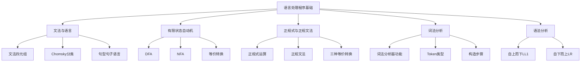

&emsp;语言处理程序是编译原理的核心内容，也是软件设计师考试的重点章节。本节主要介绍文法与语言、有限状态自动机、正规式、词法分析和语法分析等基础知识。这些概念是理解编译器工作原理的基础，也是历年真题的高频考点。

## 一、考纲要求

1. 掌握文法的定义和四元组表示
2. 理解乔姆斯基文法分类（0型、1型、2型、3型）
3. 掌握有限自动机（DFA/NFA）的定义和转换
4. 理解正规式与正规文法的等价性
5. 掌握词法分析器的功能和构造方法
6. 理解语法分析的基本方法（LL(1)、LR分析）

---

## 二、文法与语言基础

### 2.1 文法的定义

&emsp;文法（Grammar）是描述语言语法结构的规则集合。一个文法 G 可以表示为**四元组**：

$$G = (V_N, V_T, P, S)$$

| 组成部分 | 含义 | 说明 |
|---------|------|------|
| $V_N$ | 非终结符集合 | 可以被推导出的符号，又称语法变量 |
| $V_T$ | 终结符集合 | 语言的基本符号，不可再分 |
| $P$ | 产生式集合 | 形如 $\alpha \rightarrow \beta$ 的规则 |
| $S$ | 开始符号 | 至少要在一条产生式中作为左部出现 |

> **考点提示**：区分终结符和非终结符是每年的高频考点。终结符是语言的"基本字符"，非终结符是"语法变量"。

**示例**：设文法 G[S]：
```
S → AB
A → a
B → b
```
则：
- $V_N = \{S, A, B\}$
- $V_T = \{a, b\}$
- $P = \{S \rightarrow AB, A \rightarrow a, B \rightarrow b\}$
- $S = S$

### 2.2 乔姆斯基文法分类

&emsp;乔姆斯基（Chomsky）将文法分为四类，能力从强到弱：

| 文法类型 | 别名 | 产生式特点 | 对应自动机 | 说明 |
|---------|------|------------|-----------|------|
| 0型文法 | 短语文法 | $\alpha \rightarrow \beta$（$\alpha$ 至少含非终结符） | 图灵机 | 能力最强 |
| 1型文法 | 上下文有关文法 | $\alpha A \beta \rightarrow \alpha \gamma \beta$（$\gamma \geq 1$） | 线性界限自动机 | 考虑上下文 |
| 2型文法 | 上下文无关文法 | $A \rightarrow \gamma$ | 下推自动机 | **程序语言语法基础** |
| 3型文法 | 正规文法 | $A \rightarrow aB$ 或 $A \rightarrow a$（右线性） | 有限自动机 | **词法分析基础** |

**考点速记**：
- **包含关系**：**3型 ⊂ 2型 ⊂ 1型 ⊂ 0型**
- 2型文法（上下文无关文法）是编程语言语法的基础
- 3型文法（正则文法）是词法分析的基础

### 2.3 句型、句子与语言

- **句型**：从文法的开始符号 S 经过任意步推导得到的符号串
- **句子**：仅由终结符组成的句型
- **语言**：由该文法产生的所有句子的集合，记作 $L(G)$

**推导示例**：
```
S → AB → aB → ab
```
- S、AB、aB、ab 都是句型
- ab 是句子（仅含终结符）
- L(G) = {ab}

---

## 三、有限状态自动机

&emsp;有限自动机是识别正则语言的数学模型，是词法分析器的理论基础。

### 3.1 确定有限自动机（DFA）

**定义**：$M = (Q, \Sigma, \delta, q_0, F)$

| 组成部分 | 含义 |
|---------|------|
| $Q$ | 有限状态集合 |
| $\Sigma$ | 输入字母表 |
| $\delta$ | 状态转换函数 $Q \times \Sigma \rightarrow Q$ |
| $q_0$ | 初始状态（唯一） |
| $F$ | 接受状态集合 |

**特点**：从任何状态出发，对于每个输入符号只有**唯一**的后继状态。

**状态转换图**：
- 节点表示状态
- 边（有向）表示转移，标注输入符号
- 双圈表示接受状态
- 箭头指向初始状态

**示例**：识别以 "ab" 结尾的字符串的 DFA

```
→(q0) --a--> (q1) --b--> (q2双圈)
       --b--> (q0)
(q1)  --a--> (q1)
(q1)  --b--> (q0)
(q2)  --a--> (q1)
(q2)  --b--> (q0)
```

### 3.2 非确定有限自动机（NFA）

**特点**：
- 一个状态对同一个输入符号可能有**多个**后继状态
- 允许 $\varepsilon$ 转移（空串转移）

**定义**：$M = (Q, \Sigma, \delta, q_0, F)$

- $\delta$：$Q \times \Sigma \rightarrow 2^Q$（幂集，即状态集合）

### 3.3 DFA 与 NFA 的等价性

**定理**：DFA 和 NFA 可以相互转换，是等价的。

**转换方法**：
- **NFA → DFA**：子集构造法
- **DFA 最小化**：Hopcroft 算法，合并等价状态

---

## 四、正规式与正规文法

### 4.1 正规式

&emsp;正规式（Regular Expression）用于描述**正则语言**（3型文法产生的语言）。

**基本运算**：

| 运算 | 符号 | 描述 |
|-----|------|------|
| 或 | `a\|b` | a 或 b |
| 连接 | `ab` | a followed by b |
| 闭包 | `a*` | 零个或多个 a |
| 加号 | `a+` | 一个或多个 a |
| 问号 | `a?` | 零个或一个 a |

**运算优先级**：括号 > 闭包/加号/问号 > 连接 > 或运算

**常见正规式**：

| 正规式       | 描述的语言 |
|-----------|-----------|
| `a`       | 单个字符 a |
| `a        |b` | a 或 b |
| `a*`      | 零个或多个 a |
| `a+`      | 一个或多个 a |
| `(ab)+`   | ab 重复一次或多次 |
| `a{3}`    | 恰好 3 个 a |
| `a{2,5}`  | 2 到 5 个 a |
| `(a\|b)*` | 任意多个 a 或 b 的组合 |

### 4.2 正规文法

&emsp;3型文法（左线性或右线性文法）：

- **右线性文法**：$A \rightarrow aB$ 或 $A \rightarrow a$
- **左线性文法**：$A \rightarrow Ba$ 或 $A \rightarrow a$

### 4.3 正规式 ↔ 正规文法 ↔ 有限自动机 转换

**考点**：这三种表示方式可以相互转换，是软考的重点！

| 转换方向 | 方法 |
|---------|------|
| 正规式 → NFA | Thompson 构造法 |
| NFA → DFA | 子集构造法 |
| DFA → 最小化 | Hopcroft 算法 |
| 正规式 → 正规文法 | 推导/归纳 |
| 正规文法 → 正规式 | 方程求解 |

**正规式运算律**：
- $r|s = s|r$（交换律）
- $r|(s|t) = (r|s)|t$（结合律）
- $(rs)t = r(st)$（结合律）
- $r(s|t) = rs|rt$（分配律）

---

## 五、词法分析

### 5.1 词法分析器功能

&emsp;词法分析器（Lexical Analyzer）是编译过程的第一个阶段。

**主要任务**：
1. 扫描源程序，识别**单词**（Token）
2. 去除空白符、注释
3. 记录行号、列号
4. 符号表管理

**输入**：源程序字符串
**输出**：Token 序列

### 5.2 单词类型

| 单词类型 | 示例 |
|---------|------|
| 关键字 | `if`, `while`, `int`, `return` |
| 标识符 | 变量名、函数名 |
| 常量 | 整型常量、实型常量、字符常量、字符串常量 |
| 运算符 | `+`, `-`, `*`, `/`, `=`, `>` |
| 界符 | `(`, `)`, `{`, `}`, `;`, `,` |

### 5.3 词法分析示例

**输入**：
```c
while (i <= 10) { i++; }
```

**输出 Token 序列**：
```
(关键字, while)
(界符, ()
(标识符, i)
(运算符, <=)
(常量, 10)
(界符, ))
(界符, {)
(标识符, i)
(运算符, ++)
(界符, ;)
(界符, })
```

### 5.4 词法分析器构造步骤

1. 用正规式描述语言中单词的构成规则
2. 为每个正规式构造一个 NFA
3. 将 NFA 转换为等价的 DFA
4. 对 DFA 进行最小化处理
5. 用 DFA 构造词法分析器

---

## 六、语法分析

### 6.1 语法分析器功能

&emsp;语法分析器（Parser）根据语言的语法规则（文法），对 Token 序列进行分析，检查是否符合语法，产生**语法树**（Parse Tree）或**分析表**。

**主要任务**：
1. 检查语法错误
2. 生成语法树
3. 给出错误位置信息

### 6.2 自上而下分析方法

**递归下降分析**：
- 每个非终结符对应一个递归子程序
- 优点：简单直观
- 缺点：效率低，存在回溯

**预测分析**：
- 使用预测分析表
- 需要消除**左递归**和提取**公共左因子**

**LL(1) 文法**：
- 第一个 L：自左向右扫描
- 第二个 L：最左推导
- 1：超前查看 1 个符号

> **考点**：判断一个文法是否是 LL(1) 文法

**消除左递归**：
- 直接左递归：`A → Aα | β` → `A → βA'`, `A' → αA' | ε`

### 6.3 自下而上分析方法

**算符优先分析**：
- 适用于算符优先文法
- 构造优先关系表
- 使用"最左素短语"刻画可归约串

**LR 分析**：
- L：自左向右扫描
- R：最右推导逆过程
- 优点：适用面广，效率高，无回溯

**LR 分析器分类**：

| 类型 | 特点 | 向前看符号 |
|-----|------|-----------|
| LR(0) | 无需向前看 | 0 个 |
| SLR | 简单 LR | 1 个 |
| LALR | lookahead LR | 1 个 |
| LR(1) | 规范 LR | 1 个 |

> **高频考点**：分析 LR(0) 状态机，填写 ACTION 和 GOTO 表

---

## 七、典型考试例题与解析

### 例题1：文法分类

**【例题】** 设有文法 G[S]：`S → S a | a`，该文法是（ ）

A. 0型文法  B. 1型文法  C. 2型文法  D. 3型文法

**【分析与解答】**
- 产生式左部只有一个非终结符 S
- 属于上下文无关文法（2型文法）
- 答案：C

**【答案】** C

### 例题2：DFA 识别

**【例题】** 设计一个 DFA 识别二进制偶数（以 0 结尾），以下正确的是（ ）

**【分析与解答】**
构造 DFA：
- q0：偶数（初始状态，也是接受状态）
- q1：奇数
- 转移规则：
  - q0 输入 0 → q0（偶数）
  - q0 输入 1 → q1（奇数）
  - q1 输入 0 → q0
  - q1 输入 1 → q1

### 例题3：正规式等价

**【例题】** 与正规式 `(a|b)*` 等价的正规式是（ ）

A. `a* b*`  B. `(a*b*)*`  C. `a* | b*`  D. `(a|b)*`

**【分析与解答】**
- `(a|b)*` 表示任意多个 a 或 b 的任意组合
- `a* b*` 表示先任意个 a 再任意个 b，是有序的，不等价
- `(a*b*)*` 表示任意组合，等价
- `a* | b*` 只表示纯 a 串或纯 b 串，不等价

**【答案】** B

### 例题4：LL(1) 文法判断

**【例题】** 文法 G[S]：`S → aSb | ε`，判断是否为 LL(1) 文法。

**【分析与解答】**
- First(aSb) = {a}
- First(ε) = {ε}
- Follow(S) = {b, $}
- Select(S → aSb) = {a}
- Select(S → ε) = {ε}
- 两个选择集合不相交，无冲突
- 是 LL(1) 文法

### 例题5：LR 分析

**【例题】** 在 LR 分析中，状态 0 的项目集为：
```
S' → ·S
S → ·aSb
S → ·a
```
该状态识别到输入 'a' 时，应进行什么操作？

**【分析与解答】**
- 状态 0 是初始项目集
- 识别到 'a' 时，应进行移入（shift）操作
- 移入 'a' 后，状态转移

---

## 八、高频考点总结

### 8.1 历年分值分布

| 知识点 | 常见题型 | 重要程度 |
|--------|---------|---------|
| 文法分类 | 选择题 | ★★★★☆ |
| DFA/NFA 转换 | 选择题 | ★★★★☆ |
| 正规式 | 选择题、填空题 | ★★★★☆ |
| 词法分析 | 选择题 | ★★★☆☆ |
| LL(1) 文法判断 | 选择题 | ★★★★☆ |
| LR 分析 | 综合题 | ★★★★★ |

### 8.2 必备公式

- 文法四元组：$G = (V_N, V_T, P, S)$
- DFA 五元组：$M = (Q, \Sigma, \delta, q_0, F)$
- Chomsky 分类包含关系：3型 ⊂ 2型 ⊂ 1型 ⊂ 0型

---

## 九、备考建议

1. **理解概念**：不要死记，理解有限自动机、正规式、文法的内在联系
2. **多做真题**：特别是历年软考真题，反复练习
3. **画图练习**：DFA/NFA 状态转换图要能画能看懂
4. **重点突破**：LR 分析是难点，建议专项训练

---

## 十、知识框架



---

> **注**：本博客内容参考《软件设计师教程（第5版）》及相关考试大纲编写，适用于软考软件设计师语言处理程序基础章节的学习和复习。
