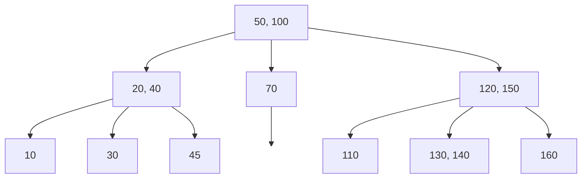
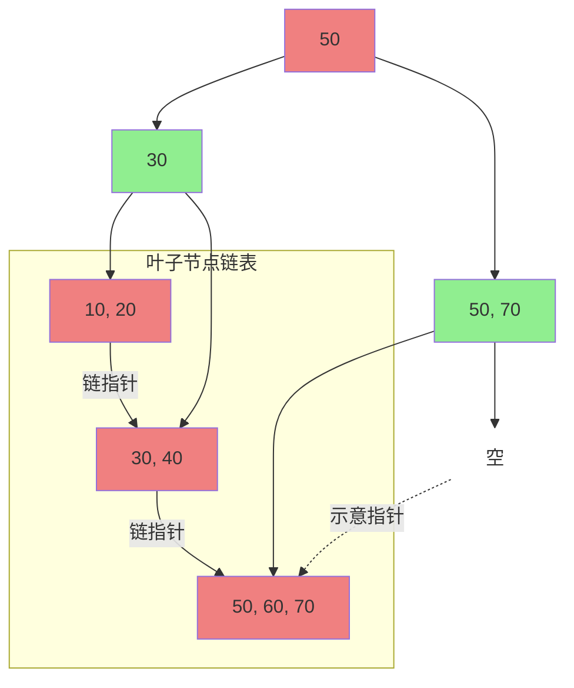

### 一、为什么需要B树和B+树？

二叉排序树（BST）和平衡二叉树（AVL）都是在**内存**中执行的操作。它们的效率是 $O(log_2n)$，这在内存中已经非常高效。

然而，当数据量非常大（比如数据库的记录）无法全部装入内存，必须存放在**磁盘**等外存中时，问题就出现了。**磁盘I/O（读写）操作的速度比内存访问慢几个数量级**。因此，减少磁盘I/O次数就成了设计外部存储数据结构的首要目标。

AVL树虽然是平衡的，但它是“瘦高”的二叉树，树的深度较大。每次查找都需要从根节点到叶子节点路径上的所有节点，如果每个节点都需要一次磁盘I/O，那么查找效率会非常低。

**B树和B+树的核心设计思想**：通过使用**多路平衡查找树**（一个节点可以有多个孩子），让树变得“矮胖”，从而**极大地减少查找过程中所需的磁盘I/O次数**。

---

### 二、B树 (B-Tree)

B树，又称**多路平衡查找树**。

#### 1. 定义与性质

一棵m阶（m≥3）的B树，是满足以下性质的树：
1.  **根结点**：至少有两个孩子（除非它同时也是叶子结点）。
2.  **非根非叶结点**：至少有 ⌈m/2⌉ 个孩子，最多有 m 个孩子。
3.  **所有叶子结点**：都出现在同一层次上，且不带任何信息（实际上，在实现中叶子结点指向数据记录，但考试中常视为空）。
4.  **一个结点结构**：一个结点中包含 n 个关键字 (`k1, k2, ..., kn`) 和 n+1 个指针 (`p0, p1, ..., pn`)，且满足：
    *   `p0` 所指子树中所有关键字均 **<** `k1`
    *   `p1` 所指子树中所有关键字均 **>** `k1` 且 **<** `k2`
    *   ...
    *   `pn` 所指子树中所有关键字均 **>** `kn`

**简单来说，B树的一个节点是多个关键字和多个指针的集合，它像一个有序数组中间插入了指向不同范围的指针。**

#### 2. 示例：3阶B树（又称2-3树）

下图展示了一棵3阶B树，其中每个非叶节点最多有3个孩子（2个关键字），最少有2个孩子（1个关键字）（因为 ⌈3/2⌉ = 2）。

**解读**：
*   **根节点**：包含两个关键字（50, 100）和三个指针。
*   **查找**：例如查找 `45`。
    1.  在根节点 `[50,100]`，`45<50`，进入左子树。
    2.  在节点 `[20,40]`，`45>40`，进入最右边的指针指向的子树。
    3.  在叶子节点 `[45]`，找到目标。
    *   **整个过程只经过了3个节点**。如果这是AVL树，深度会更大，磁盘I/O次数更多。

#### 3. B树的插入与分裂（核心考点）

插入操作总是发生在叶子结点。但如果插入后导致该结点的关键字数量**超过 m-1**，则需要进行**分裂**。

**分裂操作**：
1.  取该结点的中间关键字 `k`。
2.  将原结点分裂成左右两部分，左边包含小于 `k` 的关键字，右边包含大于 `k` 的关键字。
3.  将中间关键字 `k` **提升**到父结点中。
4.  如果父结点也因此溢出，则递归地进行分裂，最坏情况下分裂会一直传到根结点，导致树的高度增加。

**举例**：在上面的3阶B树中插入 `25`。
1.  找到应插入的叶子结点 `[20,40]`。
2.  插入后，结点变为 `[20,25,40]`，关键字数量为3，超过了阶数3-1=2。
3.  **分裂**：取中间关键字 `25`。将原结点分裂为：
    *   左结点：`[20]`
    *   右结点：`[40]`
    *   将 `25` 提升到父结点（根结点）中。
4.  根结点原为 `[50,100]`，插入 `25` 后变为 `[25,50,100]`，也溢出了。
5.  对根结点**分裂**：取中间关键字 `50`。分裂为：
    *   新的左子结点：`[25]`
    *   新的右子结点：`[100]`
    *   将 `50` 提升为新的根结点。
6.  最终，树的高度增加了一层。

---

### 三、B+树 (B+ Tree)

B+树是B树的一种变体，它更适用于数据库的索引结构。

#### 1. 定义与性质（与B树的主要区别）

一棵m阶的B+树与B树的区别在于：
1.  **非叶子结点仅起索引作用**：其关键字只用于指引搜索路径，**不包含该关键字对应的数据记录地址**。
2.  **叶子结点包含全部信息**：所有关键字及其对应的数据记录地址（或指针）都出现在**叶子结点**上，且叶子结点本身按关键字大小顺序链接成一个**有序链表**。
3.  **更严格的指针要求**：非叶子结点有 n 个关键字，就一定有 n 个孩子指针。
4.  **“冗余”出现**：非叶子结点中的关键字，会**在其子结点中再次出现**（并且是作为该子结点关键字范围的最大值或最小值）。

#### 2. 示例：3阶B+树

**解读**：
*   **非叶节点**（绿色）：如 `[50]`, `[30]`, `[50,70]`。它们只是**索引**，不存储实际数据。
*   **叶节点**（红色）：如 `[10,20]`, `[30,40]`, `[50,60,70]`。它们存储了所有关键字及其对应的数据，并且用指针串成了一个**有序链表**。
*   **查找**：
    *   **单值查询**：查找 `40`，从根开始 `40<=50` -> 左子节点 `40>30` -> 找到第二个叶节点 `[30,40]`，找到目标。
    *   **范围查询**（B+树巨大优势）：查找 `[35,65]` 范围的数据。先找到 `35` 所在的叶节点，然后利用叶节点的链表指针，顺序向右遍历直到超过 `65` 即可，无需再从根节点回溯。

---

### 四、B树与B+树的对比（软考必考）

| 特性 | **B树** | **B+树** |
| :--- | :--- | :--- |
| **数据存储** | **每个节点**都存储**关键字和对应的数据地址** | 只有**叶子节点**存储数据地址，**非叶节点纯索引** |
| **叶子节点** | 叶子节点之间没有指针链接 | 叶子节点通过指针**串联成有序链表** |
| **查询性能** | 最好情况O(1)（在根节点找到），平均O(logₘ n) | 每次查询都必须走到叶子节点，**性能稳定**，均为O(logₘ n) |
| **范围查询** | **不支持高效范围查询**，需要中序遍历 | **极其高效**，只需在叶子链表上遍历 |
| **空间利用率** | 每个节点都存储数据，同样大小的节点能容纳的关键字更少 | 非叶节点无数据，**更“瘦高”**，磁盘I/O次数更少 |

### 五、总结与应用场景

*   **B树应用**：主要用于一些**非关系型数据库**（如MongoDB）和**文件系统**（如NTFS, ReiserFS）。因为其每个节点都包含数据，在单一查询时可能更快。
*   **B+树应用**：**几乎是关系型数据库（如MySQL的InnoDB引擎）索引的标准实现**。原因：
    1.  **稳定的查询性能**：任何操作都需要从根走到叶，路径长度稳定。
    2.  **极高的范围查询效率**：链表结构完美支持`BETWEEN`, `>`, `<`等操作。
    3.  **更高的空间利用率**：非叶节点只存索引，使得树更矮，需要的磁盘I/O次数更少。

**软考考点**：
1.  **选择题**：考查B树/B+树的定义、性质（如m阶B树节点最少有几个孩子）、两者的区别。
2.  **大题**：可能要求手工模拟**在B树上插入一个关键字并演示分裂过程**，或者描述为什么数据库索引采用B+树而不是B树。
